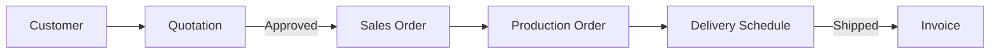

# Sales & Order Management

## Epic Information

- **Epic ID**: TM-33
- **Priority**: High
- **Estimated Story Points**: 34 SP
- **Dependencies**: Production Management System

## Overview

Modul untuk mengelola seluruh proses penjualan dari customer management hingga delivery tracking. Terintegrasi dengan Production Orders untuk perencanaan produksi berdasarkan sales orders.

## Business Flow



## Features

### 1. Customer Management

- Customer master data (nama, alamat, contact info)
- Multiple contacts per customer
- Customer classification (Regular, VIP, New)
- Credit limit management
- Customer history & analytics
- Customer portal access (optional)

### 2. Quotation Management

- Create quotations from scratch or template
- Add line items with pricing
- Discount management (per item, per order)
- Quotation validity period
- Send quotation via email
- Track quotation status (Draft, Sent, Accepted, Rejected, Expired)
- Convert approved quotation to Sales Order

### 3. Sales Order Management

- Create SO from quotation or manually
- Order line items with quantity, price, discount
- Delivery schedule per line item
- Link to Production Orders
- Order status tracking (Confirmed, In Production, Shipped, Completed)
- Partial delivery support
- Order modification history

### 4. Delivery Scheduling

- Planned delivery dates
- Delivery address management
- Shipping method selection
- Delivery notes generation
- Integration with Warehouse module

### 5. Order Tracking Dashboard

- Active orders overview
- Orders by status
- Overdue deliveries
- Customer order history
- Sales performance metrics

## Database Schema

```sql
-- Customers
CREATE TABLE customers (
    id INTEGER PRIMARY KEY,
    code TEXT UNIQUE NOT NULL,
    name TEXT NOT NULL,
    address TEXT,
    city TEXT,
    country TEXT,
    phone TEXT,
    email TEXT,
    tax_id TEXT,
    classification TEXT DEFAULT 'regular',
    credit_limit REAL DEFAULT 0,
    payment_terms INTEGER DEFAULT 30,
    is_active BOOLEAN DEFAULT 1,
    created_at DATETIME DEFAULT CURRENT_TIMESTAMP,
    updated_at DATETIME DEFAULT CURRENT_TIMESTAMP
);

-- Customer Contacts
CREATE TABLE customer_contacts (
    id INTEGER PRIMARY KEY,
    customer_id INTEGER REFERENCES customers(id),
    name TEXT NOT NULL,
    position TEXT,
    phone TEXT,
    email TEXT,
    is_primary BOOLEAN DEFAULT 0,
    created_at DATETIME DEFAULT CURRENT_TIMESTAMP
);

-- Quotations
CREATE TABLE quotations (
    id INTEGER PRIMARY KEY,
    quotation_number TEXT UNIQUE NOT NULL,
    customer_id INTEGER REFERENCES customers(id),
    contact_id INTEGER REFERENCES customer_contacts(id),
    quotation_date DATE NOT NULL,
    valid_until DATE,
    subtotal REAL DEFAULT 0,
    discount_percent REAL DEFAULT 0,
    discount_amount REAL DEFAULT 0,
    tax_percent REAL DEFAULT 0,
    tax_amount REAL DEFAULT 0,
    total REAL DEFAULT 0,
    currency TEXT DEFAULT 'IDR',
    status TEXT DEFAULT 'draft',
    notes TEXT,
    created_by INTEGER REFERENCES users(id),
    created_at DATETIME DEFAULT CURRENT_TIMESTAMP,
    updated_at DATETIME DEFAULT CURRENT_TIMESTAMP
);

-- Quotation Items
CREATE TABLE quotation_items (
    id INTEGER PRIMARY KEY,
    quotation_id INTEGER REFERENCES quotations(id),
    product_name TEXT NOT NULL,
    description TEXT,
    quantity REAL NOT NULL,
    unit TEXT DEFAULT 'pcs',
    unit_price REAL NOT NULL,
    discount_percent REAL DEFAULT 0,
    line_total REAL NOT NULL,
    sort_order INTEGER DEFAULT 0
);

-- Sales Orders
CREATE TABLE sales_orders (
    id INTEGER PRIMARY KEY,
    so_number TEXT UNIQUE NOT NULL,
    quotation_id INTEGER REFERENCES quotations(id),
    customer_id INTEGER REFERENCES customers(id),
    contact_id INTEGER REFERENCES customer_contacts(id),
    order_date DATE NOT NULL,
    required_date DATE,
    subtotal REAL DEFAULT 0,
    discount_percent REAL DEFAULT 0,
    discount_amount REAL DEFAULT 0,
    tax_percent REAL DEFAULT 0,
    tax_amount REAL DEFAULT 0,
    total REAL DEFAULT 0,
    currency TEXT DEFAULT 'IDR',
    status TEXT DEFAULT 'confirmed',
    shipping_address TEXT,
    shipping_method TEXT,
    notes TEXT,
    created_by INTEGER REFERENCES users(id),
    created_at DATETIME DEFAULT CURRENT_TIMESTAMP,
    updated_at DATETIME DEFAULT CURRENT_TIMESTAMP
);

-- Sales Order Items
CREATE TABLE sales_order_items (
    id INTEGER PRIMARY KEY,
    sales_order_id INTEGER REFERENCES sales_orders(id),
    product_name TEXT NOT NULL,
    description TEXT,
    quantity REAL NOT NULL,
    unit TEXT DEFAULT 'pcs',
    unit_price REAL NOT NULL,
    discount_percent REAL DEFAULT 0,
    line_total REAL NOT NULL,
    delivered_qty REAL DEFAULT 0,
    production_order_id INTEGER REFERENCES production_orders(id),
    planned_delivery_date DATE,
    sort_order INTEGER DEFAULT 0
);

-- Delivery Schedules
CREATE TABLE delivery_schedules (
    id INTEGER PRIMARY KEY,
    sales_order_id INTEGER REFERENCES sales_orders(id),
    planned_date DATE NOT NULL,
    actual_date DATE,
    status TEXT DEFAULT 'planned',
    delivery_note_number TEXT,
    notes TEXT,
    created_at DATETIME DEFAULT CURRENT_TIMESTAMP
);
```

## API Endpoints

```
Customers:
POST   /api/sales/customers           - Create customer
GET    /api/sales/customers           - List customers
GET    /api/sales/customers/:id       - Get customer detail
PUT    /api/sales/customers/:id       - Update customer
DELETE /api/sales/customers/:id       - Delete customer
GET    /api/sales/customers/:id/orders - Get customer orders

Quotations:
POST   /api/sales/quotations          - Create quotation
GET    /api/sales/quotations          - List quotations
GET    /api/sales/quotations/:id      - Get quotation detail
PUT    /api/sales/quotations/:id      - Update quotation
DELETE /api/sales/quotations/:id      - Delete quotation
POST   /api/sales/quotations/:id/send - Send to customer
POST   /api/sales/quotations/:id/convert - Convert to SO

Sales Orders:
POST   /api/sales/orders              - Create sales order
GET    /api/sales/orders              - List sales orders
GET    /api/sales/orders/:id          - Get order detail
PUT    /api/sales/orders/:id          - Update order
POST   /api/sales/orders/:id/confirm  - Confirm order
POST   /api/sales/orders/:id/ship     - Mark as shipped
GET    /api/sales/orders/:id/deliveries - Get deliveries

Reports:
GET    /api/sales/reports/summary     - Sales summary
GET    /api/sales/reports/by-customer - Sales by customer
GET    /api/sales/reports/pending     - Pending orders
```

## UI Pages

| Page | Route | Description |

|------|-------|-------------|

| Customers List | `/sales/customers` | List all customers with search/filter |

| Customer Detail | `/sales/customers/:id` | Customer info, contacts, order history |

| Quotations List | `/sales/quotations` | All quotations with status filter |

| Quotation Form | `/sales/quotations/new` | Create/edit quotation |

| Quotation Detail | `/sales/quotations/:id` | View quotation, actions |

| Sales Orders List | `/sales/orders` | All orders with status filter |

| Order Form | `/sales/orders/new` | Create/edit order |

| Order Detail | `/sales/orders/:id` | Order info, items, deliveries |

| Sales Dashboard | `/sales` | KPIs, charts, pending items |

## Child Tickets

| Ticket | Title | Story Points |

|--------|-------|--------------|

| TM-34 | Setup Database Schema | 5 |

| TM-35 | Customer Management API & UI | 8 |

| TM-36 | Quotation API & UI | 8 |

| TM-37 | Sales Order API & UI | 8 |

| TM-38 | Order Tracking Dashboard | 5 |

## Acceptance Criteria

1. User dapat membuat dan mengelola customer master data
2. User dapat membuat quotation dan mengirim ke customer
3. Quotation yang disetujui dapat dikonversi ke Sales Order
4. Sales Order terhubung dengan Production Order
5. Delivery schedule dapat ditrack per order
6. Dashboard menampilkan KPI penjualan