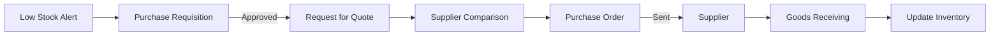

# Procurement / Purchasing

## Epic Information

- **Epic ID**: TM-39
- **Priority**: High
- **Estimated Story Points**: 34 SP
- **Dependencies**: Production Management, Inventory

## Overview

Modul untuk mengelola proses pembelian dari supplier management hingga goods receiving. Terintegrasi dengan inventory untuk reorder alerts dan production untuk material requirements.

## Business Flow



## Features

### 1. Supplier Management

- Supplier master data
- Multiple contacts per supplier
- Product/material catalog per supplier
- Supplier rating & evaluation
- Payment terms & conditions
- Supplier performance history

### 2. Purchase Requisition (PR)

- Create PR manually or from low stock alert
- Multi-item requisition
- Required by date
- Approval workflow (if needed)
- Convert approved PR to PO

### 3. Purchase Order (PO)

- Create PO from PR or manually
- Multi-supplier comparison
- Price negotiation tracking
- Terms & conditions
- PO approval workflow
- Send PO to supplier via email
- Track PO status

### 4. Goods Receiving

- Receive against PO
- Partial receiving support
- Quality inspection at receiving
- Discrepancy handling
- Update inventory automatically
- Generate GR document

### 5. Supplier Performance

- On-time delivery rate
- Quality rating
- Price competitiveness
- Response time
- Overall score

## Database Schema

```sql
-- Suppliers
CREATE TABLE suppliers (
    id INTEGER PRIMARY KEY,
    code TEXT UNIQUE NOT NULL,
    name TEXT NOT NULL,
    address TEXT,
    city TEXT,
    country TEXT,
    phone TEXT,
    email TEXT,
    tax_id TEXT,
    payment_terms INTEGER DEFAULT 30,
    currency TEXT DEFAULT 'IDR',
    rating REAL DEFAULT 0,
    is_active BOOLEAN DEFAULT 1,
    notes TEXT,
    created_at DATETIME DEFAULT CURRENT_TIMESTAMP,
    updated_at DATETIME DEFAULT CURRENT_TIMESTAMP
);

-- Supplier Contacts
CREATE TABLE supplier_contacts (
    id INTEGER PRIMARY KEY,
    supplier_id INTEGER REFERENCES suppliers(id),
    name TEXT NOT NULL,
    position TEXT,
    phone TEXT,
    email TEXT,
    is_primary BOOLEAN DEFAULT 0,
    created_at DATETIME DEFAULT CURRENT_TIMESTAMP
);

-- Supplier Products (Price List)
CREATE TABLE supplier_products (
    id INTEGER PRIMARY KEY,
    supplier_id INTEGER REFERENCES suppliers(id),
    material_id INTEGER REFERENCES materials(id),
    supplier_part_number TEXT,
    unit_price REAL NOT NULL,
    min_order_qty REAL DEFAULT 1,
    lead_time_days INTEGER DEFAULT 7,
    is_preferred BOOLEAN DEFAULT 0,
    valid_from DATE,
    valid_until DATE,
    created_at DATETIME DEFAULT CURRENT_TIMESTAMP
);

-- Purchase Requisitions
CREATE TABLE purchase_requisitions (
    id INTEGER PRIMARY KEY,
    pr_number TEXT UNIQUE NOT NULL,
    request_date DATE NOT NULL,
    required_date DATE,
    status TEXT DEFAULT 'draft',
    requested_by INTEGER REFERENCES users(id),
    approved_by INTEGER REFERENCES users(id),
    approved_at DATETIME,
    notes TEXT,
    created_at DATETIME DEFAULT CURRENT_TIMESTAMP,
    updated_at DATETIME DEFAULT CURRENT_TIMESTAMP
);

-- PR Items
CREATE TABLE pr_items (
    id INTEGER PRIMARY KEY,
    pr_id INTEGER REFERENCES purchase_requisitions(id),
    material_id INTEGER REFERENCES materials(id),
    description TEXT,
    quantity REAL NOT NULL,
    unit TEXT,
    estimated_price REAL,
    notes TEXT
);

-- Purchase Orders
CREATE TABLE purchase_orders (
    id INTEGER PRIMARY KEY,
    po_number TEXT UNIQUE NOT NULL,
    supplier_id INTEGER REFERENCES suppliers(id),
    pr_id INTEGER REFERENCES purchase_requisitions(id),
    order_date DATE NOT NULL,
    expected_date DATE,
    subtotal REAL DEFAULT 0,
    tax_percent REAL DEFAULT 0,
    tax_amount REAL DEFAULT 0,
    total REAL DEFAULT 0,
    currency TEXT DEFAULT 'IDR',
    status TEXT DEFAULT 'draft',
    payment_terms TEXT,
    shipping_address TEXT,
    notes TEXT,
    created_by INTEGER REFERENCES users(id),
    approved_by INTEGER REFERENCES users(id),
    approved_at DATETIME,
    sent_at DATETIME,
    created_at DATETIME DEFAULT CURRENT_TIMESTAMP,
    updated_at DATETIME DEFAULT CURRENT_TIMESTAMP
);

-- PO Items
CREATE TABLE po_items (
    id INTEGER PRIMARY KEY,
    po_id INTEGER REFERENCES purchase_orders(id),
    material_id INTEGER REFERENCES materials(id),
    description TEXT,
    quantity REAL NOT NULL,
    unit TEXT,
    unit_price REAL NOT NULL,
    line_total REAL NOT NULL,
    received_qty REAL DEFAULT 0
);

-- Goods Receipts
CREATE TABLE goods_receipts (
    id INTEGER PRIMARY KEY,
    gr_number TEXT UNIQUE NOT NULL,
    po_id INTEGER REFERENCES purchase_orders(id),
    receipt_date DATE NOT NULL,
    status TEXT DEFAULT 'pending',
    received_by INTEGER REFERENCES users(id),
    notes TEXT,
    created_at DATETIME DEFAULT CURRENT_TIMESTAMP
);

-- GR Items
CREATE TABLE gr_items (
    id INTEGER PRIMARY KEY,
    gr_id INTEGER REFERENCES goods_receipts(id),
    po_item_id INTEGER REFERENCES po_items(id),
    material_id INTEGER REFERENCES materials(id),
    quantity_received REAL NOT NULL,
    quantity_accepted REAL NOT NULL,
    quantity_rejected REAL DEFAULT 0,
    reject_reason TEXT,
    lot_number TEXT,
    expiry_date DATE
);

-- Supplier Ratings
CREATE TABLE supplier_ratings (
    id INTEGER PRIMARY KEY,
    supplier_id INTEGER REFERENCES suppliers(id),
    po_id INTEGER REFERENCES purchase_orders(id),
    delivery_rating INTEGER,
    quality_rating INTEGER,
    price_rating INTEGER,
    service_rating INTEGER,
    overall_rating REAL,
    comments TEXT,
    rated_by INTEGER REFERENCES users(id),
    rated_at DATETIME DEFAULT CURRENT_TIMESTAMP
);
```

## API Endpoints

```
Suppliers:
POST   /api/procurement/suppliers           - Create supplier
GET    /api/procurement/suppliers           - List suppliers
GET    /api/procurement/suppliers/:id       - Get supplier detail
PUT    /api/procurement/suppliers/:id       - Update supplier
DELETE /api/procurement/suppliers/:id       - Delete supplier
GET    /api/procurement/suppliers/:id/products - Get price list
POST   /api/procurement/suppliers/:id/rate  - Rate supplier

Purchase Requisitions:
POST   /api/procurement/requisitions        - Create PR
GET    /api/procurement/requisitions        - List PRs
GET    /api/procurement/requisitions/:id    - Get PR detail
PUT    /api/procurement/requisitions/:id    - Update PR
POST   /api/procurement/requisitions/:id/approve - Approve PR
POST   /api/procurement/requisitions/:id/convert - Convert to PO

Purchase Orders:
POST   /api/procurement/orders              - Create PO
GET    /api/procurement/orders              - List POs
GET    /api/procurement/orders/:id          - Get PO detail
PUT    /api/procurement/orders/:id          - Update PO
POST   /api/procurement/orders/:id/approve  - Approve PO
POST   /api/procurement/orders/:id/send     - Send to supplier

Goods Receiving:
POST   /api/procurement/receipts            - Create GR
GET    /api/procurement/receipts            - List GRs
GET    /api/procurement/receipts/:id        - Get GR detail
POST   /api/procurement/receipts/:id/confirm - Confirm GR

Reports:
GET    /api/procurement/reports/summary     - Purchase summary
GET    /api/procurement/reports/by-supplier - By supplier
GET    /api/procurement/reports/pending     - Pending POs
```

## UI Pages

| Page | Route | Description |

|------|-------|-------------|

| Suppliers List | `/procurement/suppliers` | All suppliers |

| Supplier Detail | `/procurement/suppliers/:id` | Supplier info, products, ratings |

| PR List | `/procurement/requisitions` | All requisitions |

| PR Form | `/procurement/requisitions/new` | Create/edit PR |

| PO List | `/procurement/orders` | All purchase orders |

| PO Form | `/procurement/orders/new` | Create/edit PO |

| PO Detail | `/procurement/orders/:id` | PO info, receiving |

| Goods Receiving | `/procurement/receiving` | Receive goods |

| Procurement Dashboard | `/procurement` | KPIs, pending items |

## Child Tickets

| Ticket | Title | Story Points |

|--------|-------|--------------|

| TM-40 | Setup Database Schema | 5 |

| TM-41 | Supplier Management API & UI | 8 |

| TM-42 | Purchase Requisition API & UI | 8 |

| TM-43 | Purchase Order API & UI | 8 |

| TM-44 | Goods Receiving API & UI | 5 |

## Acceptance Criteria

1. User dapat mengelola supplier master data
2. Low stock alert otomatis generate PR suggestion
3. PR dapat diapprove dan dikonversi ke PO
4. PO dapat dikirim ke supplier via email
5. Goods receiving update inventory otomatis
6. Supplier rating tersimpan per transaksi