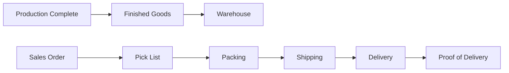

# Warehouse & Logistics

## Epic Information

- **Epic ID**: TM-45
- **Priority**: High
- **Estimated Story Points**: 34 SP
- **Dependencies**: Production Management, Sales Order

## Overview

Modul untuk mengelola warehouse operations dari stock management hingga shipping. Mencakup warehouse locations, finished goods inventory, pick-pack-ship process, dan delivery tracking.

## Business Flow



## Features

### 1. Warehouse Location Management

- Multiple warehouse support
- Location hierarchy (Warehouse > Zone > Rack > Bin)
- Location capacity management
- Location types (Receiving, Storage, Shipping, Quarantine)
- Barcode/QR for locations

### 2. Stock Management

- Stock items by location
- Stock movements (receive, transfer, issue, adjust)
- Stock take / cycle counting
- Inventory valuation (FIFO, LIFO, Average)
- Stock aging report
- Reserved stock for orders

### 3. Pick, Pack, Ship

- Generate pick list from SO
- Wave picking support
- Packing slip generation
- Shipping label printing
- Carrier selection
- Shipping cost calculation

### 4. Delivery Management

- Delivery orders
- Delivery scheduling
- Route optimization (basic)
- Proof of delivery capture
- Customer delivery notifications

### 5. Inventory Reports

- Stock on hand report
- Stock movement history
- Inventory aging
- Stock valuation
- Warehouse utilization

## Database Schema

```sql
-- Warehouses
CREATE TABLE warehouses (
    id INTEGER PRIMARY KEY,
    code TEXT UNIQUE NOT NULL,
    name TEXT NOT NULL,
    address TEXT,
    type TEXT DEFAULT 'general',
    is_active BOOLEAN DEFAULT 1,
    created_at DATETIME DEFAULT CURRENT_TIMESTAMP
);

-- Warehouse Locations
CREATE TABLE warehouse_locations (
    id INTEGER PRIMARY KEY,
    warehouse_id INTEGER REFERENCES warehouses(id),
    code TEXT NOT NULL,
    name TEXT,
    type TEXT DEFAULT 'storage',
    zone TEXT,
    rack TEXT,
    bin TEXT,
    capacity REAL,
    capacity_unit TEXT,
    is_active BOOLEAN DEFAULT 1,
    barcode TEXT UNIQUE,
    UNIQUE(warehouse_id, code)
);

-- Stock Items
CREATE TABLE stock_items (
    id INTEGER PRIMARY KEY,
    material_id INTEGER REFERENCES materials(id),
    location_id INTEGER REFERENCES warehouse_locations(id),
    lot_number TEXT,
    serial_number TEXT,
    quantity REAL NOT NULL DEFAULT 0,
    reserved_qty REAL DEFAULT 0,
    unit TEXT,
    unit_cost REAL,
    received_date DATE,
    expiry_date DATE,
    status TEXT DEFAULT 'available',
    created_at DATETIME DEFAULT CURRENT_TIMESTAMP,
    updated_at DATETIME DEFAULT CURRENT_TIMESTAMP
);

-- Stock Movements
CREATE TABLE stock_movements (
    id INTEGER PRIMARY KEY,
    movement_type TEXT NOT NULL,
    material_id INTEGER REFERENCES materials(id),
    from_location_id INTEGER REFERENCES warehouse_locations(id),
    to_location_id INTEGER REFERENCES warehouse_locations(id),
    quantity REAL NOT NULL,
    unit TEXT,
    reference_type TEXT,
    reference_id INTEGER,
    lot_number TEXT,
    reason TEXT,
    notes TEXT,
    moved_by INTEGER REFERENCES users(id),
    moved_at DATETIME DEFAULT CURRENT_TIMESTAMP
);

-- Stock Takes
CREATE TABLE stock_takes (
    id INTEGER PRIMARY KEY,
    stock_take_number TEXT UNIQUE NOT NULL,
    warehouse_id INTEGER REFERENCES warehouses(id),
    location_id INTEGER REFERENCES warehouse_locations(id),
    start_date DATE NOT NULL,
    end_date DATE,
    status TEXT DEFAULT 'draft',
    created_by INTEGER REFERENCES users(id),
    created_at DATETIME DEFAULT CURRENT_TIMESTAMP
);

-- Stock Take Items
CREATE TABLE stock_take_items (
    id INTEGER PRIMARY KEY,
    stock_take_id INTEGER REFERENCES stock_takes(id),
    material_id INTEGER REFERENCES materials(id),
    location_id INTEGER REFERENCES warehouse_locations(id),
    system_qty REAL,
    counted_qty REAL,
    variance_qty REAL,
    variance_reason TEXT,
    counted_by INTEGER REFERENCES users(id),
    counted_at DATETIME
);

-- Pick Lists
CREATE TABLE pick_lists (
    id INTEGER PRIMARY KEY,
    pick_list_number TEXT UNIQUE NOT NULL,
    sales_order_id INTEGER REFERENCES sales_orders(id),
    warehouse_id INTEGER REFERENCES warehouses(id),
    status TEXT DEFAULT 'pending',
    assigned_to INTEGER REFERENCES users(id),
    picked_at DATETIME,
    created_at DATETIME DEFAULT CURRENT_TIMESTAMP
);

-- Pick List Items
CREATE TABLE pick_list_items (
    id INTEGER PRIMARY KEY,
    pick_list_id INTEGER REFERENCES pick_lists(id),
    so_item_id INTEGER REFERENCES sales_order_items(id),
    material_id INTEGER REFERENCES materials(id),
    location_id INTEGER REFERENCES warehouse_locations(id),
    quantity_to_pick REAL NOT NULL,
    quantity_picked REAL DEFAULT 0,
    status TEXT DEFAULT 'pending'
);

-- Shipments
CREATE TABLE shipments (
    id INTEGER PRIMARY KEY,
    shipment_number TEXT UNIQUE NOT NULL,
    sales_order_id INTEGER REFERENCES sales_orders(id),
    pick_list_id INTEGER REFERENCES pick_lists(id),
    carrier TEXT,
    tracking_number TEXT,
    shipping_cost REAL,
    weight REAL,
    dimensions TEXT,
    ship_date DATE,
    estimated_delivery DATE,
    actual_delivery DATE,
    status TEXT DEFAULT 'pending',
    proof_of_delivery TEXT,
    signed_by TEXT,
    notes TEXT,
    created_by INTEGER REFERENCES users(id),
    created_at DATETIME DEFAULT CURRENT_TIMESTAMP
);

-- Delivery Orders
CREATE TABLE delivery_orders (
    id INTEGER PRIMARY KEY,
    do_number TEXT UNIQUE NOT NULL,
    shipment_id INTEGER REFERENCES shipments(id),
    customer_id INTEGER REFERENCES customers(id),
    delivery_address TEXT,
    delivery_date DATE,
    status TEXT DEFAULT 'scheduled',
    driver_name TEXT,
    vehicle_number TEXT,
    notes TEXT,
    created_at DATETIME DEFAULT CURRENT_TIMESTAMP
);
```

## API Endpoints

```
Warehouses:
POST   /api/warehouse/warehouses           - Create warehouse
GET    /api/warehouse/warehouses           - List warehouses
GET    /api/warehouse/warehouses/:id       - Get warehouse detail
PUT    /api/warehouse/warehouses/:id       - Update warehouse

Locations:
POST   /api/warehouse/locations            - Create location
GET    /api/warehouse/locations            - List locations
GET    /api/warehouse/locations/:id        - Get location detail
PUT    /api/warehouse/locations/:id        - Update location

Stock:
GET    /api/warehouse/stock                - Get stock on hand
GET    /api/warehouse/stock/:materialId    - Get stock by material
POST   /api/warehouse/stock/transfer       - Transfer stock
POST   /api/warehouse/stock/adjust         - Adjust stock
GET    /api/warehouse/stock/movements      - Movement history

Stock Takes:
POST   /api/warehouse/stock-takes          - Create stock take
GET    /api/warehouse/stock-takes          - List stock takes
GET    /api/warehouse/stock-takes/:id      - Get stock take detail
POST   /api/warehouse/stock-takes/:id/count - Record count
POST   /api/warehouse/stock-takes/:id/complete - Complete stock take

Pick Pack Ship:
POST   /api/warehouse/pick-lists           - Generate pick list
GET    /api/warehouse/pick-lists/:id       - Get pick list
POST   /api/warehouse/pick-lists/:id/pick  - Record picks
POST   /api/warehouse/shipments            - Create shipment
GET    /api/warehouse/shipments/:id        - Get shipment
POST   /api/warehouse/shipments/:id/ship   - Mark shipped
POST   /api/warehouse/shipments/:id/deliver - Record delivery

Reports:
GET    /api/warehouse/reports/stock        - Stock report
GET    /api/warehouse/reports/movements    - Movement report
GET    /api/warehouse/reports/aging        - Aging report
```

## UI Pages

| Page | Route | Description |

|------|-------|-------------|

| Warehouses | `/warehouse/locations` | Warehouse & locations |

| Stock On Hand | `/warehouse/stock` | Current stock levels |

| Stock Movements | `/warehouse/movements` | Movement history |

| Stock Take | `/warehouse/stock-take` | Cycle counting |

| Pick Lists | `/warehouse/picking` | Pick list management |

| Shipments | `/warehouse/shipping` | Shipment tracking |

| Deliveries | `/warehouse/deliveries` | Delivery management |

| Warehouse Dashboard | `/warehouse` | KPIs, alerts |

## Child Tickets

| Ticket | Title | Story Points |

|--------|-------|--------------|

| TM-46 | Setup Database Schema | 5 |

| TM-47 | Warehouse Location Management API & UI | 5 |

| TM-48 | Stock Management API & UI | 8 |

| TM-49 | Pick Pack Ship API & UI | 8 |

| TM-50 | Delivery Tracking API & UI | 8 |

## Acceptance Criteria

1. User dapat setup warehouse dengan multiple locations
2. Stock movements terecord dengan history lengkap
3. Stock take dapat dilakukan per location atau warehouse
4. Pick list tergenerate otomatis dari Sales Order
5. Shipment tracking dengan update status
6. Proof of delivery dapat di-capture