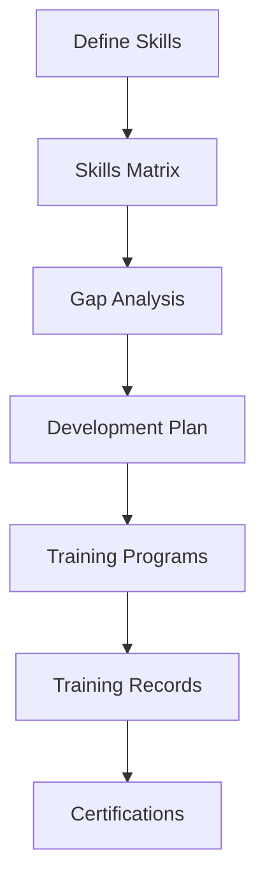

# HR & Training Management

## Epic Information

- **Epic ID**: TM-51
- **Priority**: Medium
- **Estimated Story Points**: 31 SP
- **Dependencies**: Core Users

## Overview

Modul untuk mengelola skills matrix, certifications, training programs, dan competency assessment karyawan. Memastikan workforce memiliki kompetensi yang diperlukan untuk operasional pabrik.

## Business Flow



## Features

### 1. Skills Management

- Define skill categories (Technical, Soft Skills, Safety)
- Skill levels (1-5 or Beginner to Expert)
- Skill requirements per role/position
- Skills matrix view

### 2. Employee Skills

- Assign skills to employees
- Skill level assessment
- Skill history tracking
- Skills gap analysis per employee
- Skills search across organization

### 3. Certification Management

- Certification types (Internal, External, Regulatory)
- Certification requirements per role
- Expiry date tracking
- Renewal reminders
- Certification documents upload

### 4. Training Programs

- Training catalog
- Training types (Classroom, OJT, Online)
- Training schedule/calendar
- Trainer management
- Training materials

### 5. Training Records

- Employee enrollment
- Attendance tracking
- Assessment/test results
- Training completion status
- Training effectiveness evaluation

### 6. Competency Assessment

- Competency matrix per role
- Assessment scheduling
- Multi-rater assessment (optional)
- Performance reviews integration
- Development plans

## Database Schema

```sql
-- Skill Categories
CREATE TABLE skill_categories (
    id INTEGER PRIMARY KEY,
    name TEXT NOT NULL,
    description TEXT,
    sort_order INTEGER DEFAULT 0,
    created_at DATETIME DEFAULT CURRENT_TIMESTAMP
);

-- Skills
CREATE TABLE skills (
    id INTEGER PRIMARY KEY,
    category_id INTEGER REFERENCES skill_categories(id),
    code TEXT UNIQUE,
    name TEXT NOT NULL,
    description TEXT,
    max_level INTEGER DEFAULT 5,
    is_active BOOLEAN DEFAULT 1,
    created_at DATETIME DEFAULT CURRENT_TIMESTAMP
);

-- Employee Skills
CREATE TABLE employee_skills (
    id INTEGER PRIMARY KEY,
    user_id INTEGER REFERENCES users(id),
    skill_id INTEGER REFERENCES skills(id),
    current_level INTEGER DEFAULT 1,
    target_level INTEGER,
    assessed_date DATE,
    assessed_by INTEGER REFERENCES users(id),
    notes TEXT,
    created_at DATETIME DEFAULT CURRENT_TIMESTAMP,
    updated_at DATETIME DEFAULT CURRENT_TIMESTAMP,
    UNIQUE(user_id, skill_id)
);

-- Skill Requirements (per role)
CREATE TABLE skill_requirements (
    id INTEGER PRIMARY KEY,
    role_name TEXT NOT NULL,
    skill_id INTEGER REFERENCES skills(id),
    required_level INTEGER NOT NULL,
    is_mandatory BOOLEAN DEFAULT 1,
    created_at DATETIME DEFAULT CURRENT_TIMESTAMP,
    UNIQUE(role_name, skill_id)
);

-- Certification Types
CREATE TABLE certification_types (
    id INTEGER PRIMARY KEY,
    code TEXT UNIQUE,
    name TEXT NOT NULL,
    description TEXT,
    issuing_body TEXT,
    validity_months INTEGER,
    is_external BOOLEAN DEFAULT 0,
    is_mandatory BOOLEAN DEFAULT 0,
    created_at DATETIME DEFAULT CURRENT_TIMESTAMP
);

-- Employee Certifications
CREATE TABLE employee_certifications (
    id INTEGER PRIMARY KEY,
    user_id INTEGER REFERENCES users(id),
    certification_type_id INTEGER REFERENCES certification_types(id),
    certificate_number TEXT,
    issue_date DATE NOT NULL,
    expiry_date DATE,
    status TEXT DEFAULT 'active',
    document_url TEXT,
    notes TEXT,
    created_at DATETIME DEFAULT CURRENT_TIMESTAMP,
    updated_at DATETIME DEFAULT CURRENT_TIMESTAMP
);

-- Training Programs
CREATE TABLE training_programs (
    id INTEGER PRIMARY KEY,
    code TEXT UNIQUE,
    name TEXT NOT NULL,
    description TEXT,
    category TEXT,
    type TEXT DEFAULT 'classroom',
    duration_hours REAL,
    max_participants INTEGER,
    prerequisites TEXT,
    objectives TEXT,
    materials_url TEXT,
    is_active BOOLEAN DEFAULT 1,
    created_at DATETIME DEFAULT CURRENT_TIMESTAMP
);

-- Training Skills (training program develops these skills)
CREATE TABLE training_skills (
    id INTEGER PRIMARY KEY,
    training_program_id INTEGER REFERENCES training_programs(id),
    skill_id INTEGER REFERENCES skills(id),
    level_gained INTEGER DEFAULT 1,
    UNIQUE(training_program_id, skill_id)
);

-- Training Sessions
CREATE TABLE training_sessions (
    id INTEGER PRIMARY KEY,
    training_program_id INTEGER REFERENCES training_programs(id),
    session_date DATE NOT NULL,
    start_time TIME,
    end_time TIME,
    location TEXT,
    trainer_id INTEGER REFERENCES users(id),
    external_trainer TEXT,
    max_participants INTEGER,
    status TEXT DEFAULT 'scheduled',
    notes TEXT,
    created_at DATETIME DEFAULT CURRENT_TIMESTAMP
);

-- Training Enrollments
CREATE TABLE training_enrollments (
    id INTEGER PRIMARY KEY,
    session_id INTEGER REFERENCES training_sessions(id),
    user_id INTEGER REFERENCES users(id),
    status TEXT DEFAULT 'enrolled',
    attendance_status TEXT,
    assessment_score REAL,
    passed BOOLEAN,
    completion_date DATE,
    feedback TEXT,
    created_at DATETIME DEFAULT CURRENT_TIMESTAMP,
    UNIQUE(session_id, user_id)
);

-- Competency Assessments
CREATE TABLE competency_assessments (
    id INTEGER PRIMARY KEY,
    user_id INTEGER REFERENCES users(id),
    assessor_id INTEGER REFERENCES users(id),
    assessment_date DATE NOT NULL,
    period TEXT,
    overall_rating REAL,
    strengths TEXT,
    areas_for_improvement TEXT,
    development_plan TEXT,
    status TEXT DEFAULT 'draft',
    created_at DATETIME DEFAULT CURRENT_TIMESTAMP
);

-- Assessment Items
CREATE TABLE assessment_items (
    id INTEGER PRIMARY KEY,
    assessment_id INTEGER REFERENCES competency_assessments(id),
    skill_id INTEGER REFERENCES skills(id),
    expected_level INTEGER,
    actual_level INTEGER,
    comments TEXT
);
```

## API Endpoints

```
Skills:
POST   /api/hr/skills                  - Create skill
GET    /api/hr/skills                  - List skills
GET    /api/hr/skills/:id              - Get skill detail
PUT    /api/hr/skills/:id              - Update skill
GET    /api/hr/skills/matrix           - Skills matrix view

Employee Skills:
GET    /api/hr/employees/:id/skills    - Get employee skills
POST   /api/hr/employees/:id/skills    - Assign skill
PUT    /api/hr/employees/:id/skills/:skillId - Update skill level
GET    /api/hr/employees/:id/skills/gap - Skills gap analysis

Certifications:
POST   /api/hr/certifications          - Create certification type
GET    /api/hr/certifications          - List certification types
GET    /api/hr/employees/:id/certifications - Employee certs
POST   /api/hr/employees/:id/certifications - Add certification
GET    /api/hr/certifications/expiring - Expiring certs

Training:
POST   /api/hr/training/programs       - Create program
GET    /api/hr/training/programs       - List programs
POST   /api/hr/training/sessions       - Create session
GET    /api/hr/training/sessions       - List sessions
GET    /api/hr/training/calendar       - Training calendar
POST   /api/hr/training/sessions/:id/enroll - Enroll employee
POST   /api/hr/training/sessions/:id/attendance - Record attendance

Assessments:
POST   /api/hr/assessments             - Create assessment
GET    /api/hr/assessments             - List assessments
GET    /api/hr/employees/:id/assessments - Employee assessments
PUT    /api/hr/assessments/:id         - Update assessment
```

## UI Pages

| Page | Route | Description |

|------|-------|-------------|

| Skills Matrix | `/hr/skills` | All skills & matrix view |

| Employee Skills | `/hr/employees/:id/skills` | Employee skill profile |

| Certifications | `/hr/certifications` | Certification types |

| Employee Certs | `/hr/employees/:id/certifications` | Employee certificates |

| Training Programs | `/hr/training/programs` | Training catalog |

| Training Calendar | `/hr/training/calendar` | Session schedule |

| Training Session | `/hr/training/sessions/:id` | Session detail & enrollment |

| Assessments | `/hr/assessments` | Competency assessments |

| HR Dashboard | `/hr` | KPIs, expiring certs, training stats |

## Child Tickets

| Ticket | Title | Story Points |

|--------|-------|--------------|

| TM-52 | Setup Database Schema | 5 |

| TM-53 | Skills Matrix API & UI | 8 |

| TM-54 | Certification Tracking API & UI | 5 |

| TM-55 | Training Management API & UI | 8 |

| TM-56 | Competency Assessment API & UI | 5 |

## Acceptance Criteria

1. Skills matrix dapat di-define per kategori dan level
2. Employee skills dapat diassign dan dilacak progressnya
3. Certifications dengan expiry date dan reminder
4. Training calendar dengan enrollment process
5. Competency assessment dengan development plan