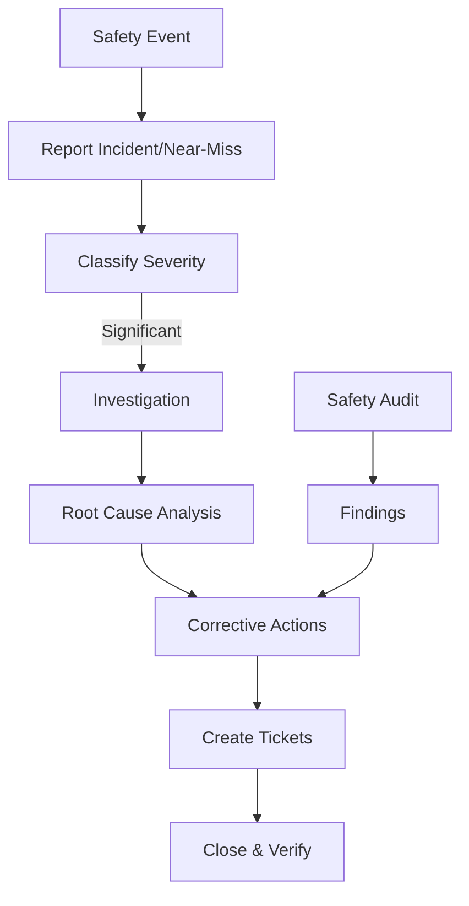

# Safety & Incident Management

## Epic Information
- **Epic ID**: TM-57
- **Priority**: Medium
- **Estimated Story Points**: 31 SP
- **Dependencies**: Core Users, Assets (MMS)

## Overview

Modul untuk mengelola workplace safety termasuk incident reporting, near-miss tracking, safety observations, investigations, dan safety KPIs. Memastikan lingkungan kerja yang aman dan compliance dengan regulasi.

## Business Flow



## Features

### 1. Incident Reporting
- Quick incident report form
- Incident types (Injury, Property Damage, Environmental, Fire)
- Severity classification (Minor, Moderate, Major, Critical)
- Injury details (body part, treatment, lost time)
- Photos/evidence upload
- Witness statements
- Immediate actions taken

### 2. Near-Miss Reporting
- Simplified near-miss form
- Quick categorization
- Location tracking
- Anonymous reporting option
- Recognition program integration

### 3. Safety Observations
- Positive safety observations (Safe behaviors)
- At-risk behaviors
- Hazard identification
- Quick reporting from mobile

### 4. Investigation Workflow
- Investigation assignment
- Investigation team
- 5-Why analysis tool
- Fishbone diagram (optional)
- Root cause identification
- Evidence collection
- Timeline reconstruction

### 5. Corrective Actions
- Action items from investigations
- Link to TaskFlow tickets
- Due dates & responsibility
- Effectiveness verification
- CAPA (Corrective & Preventive Actions)

### 6. Safety Audits
- Audit schedules
- Checklist-based audits
- Finding categorization
- Compliance scoring
- Audit reports

### 7. Safety KPIs Dashboard
- TRIR (Total Recordable Incident Rate)
- LTIR (Lost Time Incident Rate)
- Near-miss reporting rate
- Days since last incident
- Safety observation trends
- Audit compliance scores

## Database Schema

```sql
-- Incident Types
CREATE TABLE incident_types (
    id INTEGER PRIMARY KEY,
    code TEXT UNIQUE,
    name TEXT NOT NULL,
    description TEXT,
    requires_investigation BOOLEAN DEFAULT 0,
    is_active BOOLEAN DEFAULT 1
);

-- Incidents
CREATE TABLE incidents (
    id INTEGER PRIMARY KEY,
    incident_number TEXT UNIQUE NOT NULL,
    incident_type_id INTEGER REFERENCES incident_types(id),
    incident_date DATETIME NOT NULL,
    reported_date DATETIME DEFAULT CURRENT_TIMESTAMP,
    location TEXT,
    area TEXT,
    department_id INTEGER REFERENCES departments(id),
    description TEXT NOT NULL,
    severity TEXT DEFAULT 'minor',
    status TEXT DEFAULT 'reported',
    immediate_actions TEXT,
    reported_by INTEGER REFERENCES users(id),
    created_at DATETIME DEFAULT CURRENT_TIMESTAMP,
    updated_at DATETIME DEFAULT CURRENT_TIMESTAMP
);

-- Incident Injuries
CREATE TABLE incident_injuries (
    id INTEGER PRIMARY KEY,
    incident_id INTEGER REFERENCES incidents(id),
    injured_person_id INTEGER REFERENCES users(id),
    injured_person_name TEXT,
    injury_type TEXT,
    body_part TEXT,
    treatment_type TEXT,
    medical_facility TEXT,
    lost_time_days INTEGER DEFAULT 0,
    restricted_duty_days INTEGER DEFAULT 0,
    return_to_work_date DATE,
    notes TEXT
);

-- Incident Evidence
CREATE TABLE incident_evidence (
    id INTEGER PRIMARY KEY,
    incident_id INTEGER REFERENCES incidents(id),
    evidence_type TEXT,
    file_url TEXT,
    description TEXT,
    uploaded_by INTEGER REFERENCES users(id),
    uploaded_at DATETIME DEFAULT CURRENT_TIMESTAMP
);

-- Incident Witnesses
CREATE TABLE incident_witnesses (
    id INTEGER PRIMARY KEY,
    incident_id INTEGER REFERENCES incidents(id),
    witness_id INTEGER REFERENCES users(id),
    witness_name TEXT,
    statement TEXT,
    statement_date DATE,
    contact_info TEXT
);

-- Near Misses
CREATE TABLE near_misses (
    id INTEGER PRIMARY KEY,
    near_miss_number TEXT UNIQUE NOT NULL,
    reported_date DATETIME DEFAULT CURRENT_TIMESTAMP,
    location TEXT,
    area TEXT,
    department_id INTEGER REFERENCES departments(id),
    description TEXT NOT NULL,
    potential_severity TEXT,
    category TEXT,
    immediate_actions TEXT,
    reported_by INTEGER REFERENCES users(id),
    is_anonymous BOOLEAN DEFAULT 0,
    status TEXT DEFAULT 'reported',
    created_at DATETIME DEFAULT CURRENT_TIMESTAMP
);

-- Safety Observations
CREATE TABLE safety_observations (
    id INTEGER PRIMARY KEY,
    observation_date DATETIME DEFAULT CURRENT_TIMESTAMP,
    location TEXT,
    area TEXT,
    observation_type TEXT,
    description TEXT NOT NULL,
    observed_person_id INTEGER REFERENCES users(id),
    observed_by INTEGER REFERENCES users(id),
    recognition_given BOOLEAN DEFAULT 0,
    follow_up_required BOOLEAN DEFAULT 0,
    created_at DATETIME DEFAULT CURRENT_TIMESTAMP
);

-- Investigations
CREATE TABLE investigations (
    id INTEGER PRIMARY KEY,
    investigation_number TEXT UNIQUE NOT NULL,
    incident_id INTEGER REFERENCES incidents(id),
    near_miss_id INTEGER REFERENCES near_misses(id),
    lead_investigator_id INTEGER REFERENCES users(id),
    start_date DATE NOT NULL,
    target_completion_date DATE,
    actual_completion_date DATE,
    status TEXT DEFAULT 'in_progress',
    summary TEXT,
    root_causes TEXT,
    contributing_factors TEXT,
    created_at DATETIME DEFAULT CURRENT_TIMESTAMP,
    updated_at DATETIME DEFAULT CURRENT_TIMESTAMP
);

-- Investigation Team
CREATE TABLE investigation_team (
    id INTEGER PRIMARY KEY,
    investigation_id INTEGER REFERENCES investigations(id),
    user_id INTEGER REFERENCES users(id),
    role TEXT DEFAULT 'member',
    UNIQUE(investigation_id, user_id)
);

-- Five Why Analysis
CREATE TABLE five_why_analysis (
    id INTEGER PRIMARY KEY,
    investigation_id INTEGER REFERENCES investigations(id),
    problem_statement TEXT NOT NULL,
    why_1 TEXT,
    why_2 TEXT,
    why_3 TEXT,
    why_4 TEXT,
    why_5 TEXT,
    root_cause TEXT,
    created_at DATETIME DEFAULT CURRENT_TIMESTAMP
);

-- Corrective Actions
CREATE TABLE safety_corrective_actions (
    id INTEGER PRIMARY KEY,
    investigation_id INTEGER REFERENCES investigations(id),
    action_type TEXT,
    description TEXT NOT NULL,
    responsible_id INTEGER REFERENCES users(id),
    due_date DATE,
    completion_date DATE,
    status TEXT DEFAULT 'open',
    effectiveness_verified BOOLEAN DEFAULT 0,
    verification_date DATE,
    verified_by INTEGER REFERENCES users(id),
    ticket_id INTEGER REFERENCES tickets(id),
    created_at DATETIME DEFAULT CURRENT_TIMESTAMP
);

-- Safety Audits
CREATE TABLE safety_audits (
    id INTEGER PRIMARY KEY,
    audit_number TEXT UNIQUE NOT NULL,
    audit_type TEXT,
    audit_date DATE NOT NULL,
    area TEXT,
    department_id INTEGER REFERENCES departments(id),
    auditor_id INTEGER REFERENCES users(id),
    score REAL,
    max_score REAL,
    compliance_percent REAL,
    status TEXT DEFAULT 'scheduled',
    notes TEXT,
    created_at DATETIME DEFAULT CURRENT_TIMESTAMP
);

-- Audit Findings
CREATE TABLE audit_findings (
    id INTEGER PRIMARY KEY,
    audit_id INTEGER REFERENCES safety_audits(id),
    finding_type TEXT,
    category TEXT,
    description TEXT NOT NULL,
    severity TEXT,
    corrective_action_id INTEGER REFERENCES safety_corrective_actions(id),
    status TEXT DEFAULT 'open'
);

-- Safety Metrics (calculated/stored)
CREATE TABLE safety_metrics (
    id INTEGER PRIMARY KEY,
    period_start DATE NOT NULL,
    period_end DATE NOT NULL,
    total_hours_worked REAL,
    recordable_incidents INTEGER DEFAULT 0,
    lost_time_incidents INTEGER DEFAULT 0,
    lost_days INTEGER DEFAULT 0,
    near_misses INTEGER DEFAULT 0,
    observations INTEGER DEFAULT 0,
    trir REAL,
    ltir REAL,
    created_at DATETIME DEFAULT CURRENT_TIMESTAMP
);
```

## API Endpoints

```
Incidents:
POST   /api/safety/incidents           - Report incident
GET    /api/safety/incidents           - List incidents
GET    /api/safety/incidents/:id       - Get incident detail
PUT    /api/safety/incidents/:id       - Update incident
POST   /api/safety/incidents/:id/evidence - Upload evidence

Near Misses:
POST   /api/safety/near-misses         - Report near-miss
GET    /api/safety/near-misses         - List near-misses
GET    /api/safety/near-misses/:id     - Get detail
PUT    /api/safety/near-misses/:id     - Update

Observations:
POST   /api/safety/observations        - Record observation
GET    /api/safety/observations        - List observations

Investigations:
POST   /api/safety/investigations      - Start investigation
GET    /api/safety/investigations      - List investigations
GET    /api/safety/investigations/:id  - Get investigation
PUT    /api/safety/investigations/:id  - Update investigation
POST   /api/safety/investigations/:id/five-why - Add 5-Why analysis
POST   /api/safety/investigations/:id/actions - Add corrective action

Audits:
POST   /api/safety/audits              - Create audit
GET    /api/safety/audits              - List audits
GET    /api/safety/audits/:id          - Get audit detail
POST   /api/safety/audits/:id/findings - Add findings
PUT    /api/safety/audits/:id/complete - Complete audit

KPIs:
GET    /api/safety/kpis                - Safety KPIs
GET    /api/safety/kpis/trends         - KPI trends
GET    /api/safety/dashboard           - Dashboard data
```

## UI Pages

| Page | Route | Description |
|------|-------|-------------|
| Incidents List | `/safety/incidents` | All incidents |
| Report Incident | `/safety/incidents/new` | Incident form |
| Incident Detail | `/safety/incidents/:id` | Full incident info |
| Near Misses | `/safety/near-misses` | Near-miss list |
| Observations | `/safety/observations` | Safety observations |
| Investigations | `/safety/investigations` | Investigation list |
| Investigation Detail | `/safety/investigations/:id` | 5-Why, actions |
| Audits | `/safety/audits` | Audit schedule |
| Audit Detail | `/safety/audits/:id` | Audit checklist |
| Safety Dashboard | `/safety` | KPIs, charts, alerts |

## Child Tickets

| Ticket | Title | Story Points |
|--------|-------|--------------|
| TM-58 | Setup Database Schema | 5 |
| TM-59 | Incident Reporting API & UI | 8 |
| TM-60 | Near-Miss Tracking API & UI | 5 |
| TM-61 | Investigation Workflow API & UI | 8 |
| TM-62 | Safety Audit & KPI Dashboard | 5 |

## Acceptance Criteria

1. Incidents dapat dilaporkan dengan detail lengkap
2. Near-miss dapat dilaporkan dengan cepat (termasuk anonymous)
3. Investigation dengan 5-Why analysis tool
4. Corrective actions terhubung dengan TaskFlow tickets
5. Safety KPIs ter-calculate otomatis (TRIR, LTIR)
6. Dashboard menampilkan days since last incident

