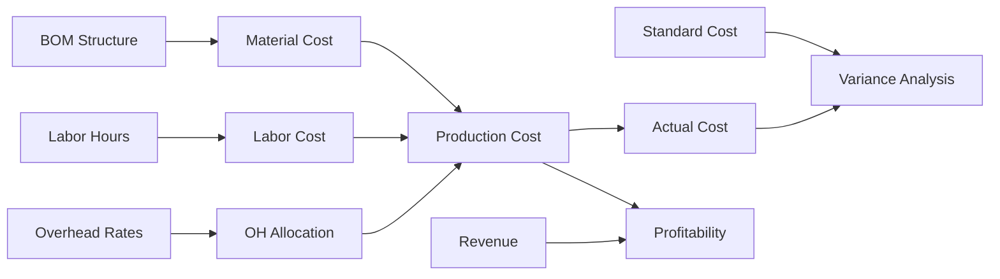

# Costing & Finance

## Epic Information

- **Epic ID**: TM-63
- **Priority**: Medium
- **Estimated Story Points**: 34 SP
- **Dependencies**: Production Management, Procurement

## Overview

Modul untuk menghitung dan melacak production costs termasuk BOM costing, material cost, labor cost, overhead allocation, dan profitability analysis.

## Business Flow



## Features

### 1. Cost Centers

- Define cost centers
- Department-based cost allocation
- Cost center hierarchy
- Budget vs actual tracking

### 2. BOM Costing

- Bill of Materials structure
- Multi-level BOM support
- Material cost rollup
- Cost version management
- What-if analysis

### 3. Labor Costing

- Labor rates by skill level
- Labor rates by shift
- Overtime rates
- Labor cost per production order
- Standard vs actual labor hours

### 4. Overhead Allocation

- Overhead rate definition
- Allocation bases (machine hours, labor hours, units)
- Fixed vs variable overhead
- Overhead absorption calculation

### 5. Production Cost Tracking

- Actual cost per production order
- Cost per unit calculation
- Standard cost maintenance
- Variance analysis (Material, Labor, Overhead)
- Cost trends

### 6. Profitability Analysis

- Product profitability
- Customer profitability
- Order profitability
- Margin analysis
- Break-even analysis

## Database Schema

```sql
-- Cost Centers
CREATE TABLE cost_centers (
    id INTEGER PRIMARY KEY,
    code TEXT UNIQUE NOT NULL,
    name TEXT NOT NULL,
    parent_id INTEGER REFERENCES cost_centers(id),
    department_id INTEGER REFERENCES departments(id),
    type TEXT DEFAULT 'production',
    budget_amount REAL DEFAULT 0,
    is_active BOOLEAN DEFAULT 1,
    created_at DATETIME DEFAULT CURRENT_TIMESTAMP
);

-- Cost Elements
CREATE TABLE cost_elements (
    id INTEGER PRIMARY KEY,
    code TEXT UNIQUE NOT NULL,
    name TEXT NOT NULL,
    type TEXT NOT NULL,
    category TEXT,
    is_active BOOLEAN DEFAULT 1,
    created_at DATETIME DEFAULT CURRENT_TIMESTAMP
);

-- BOM (Bill of Materials)
CREATE TABLE bom_headers (
    id INTEGER PRIMARY KEY,
    product_code TEXT NOT NULL,
    product_name TEXT NOT NULL,
    version TEXT DEFAULT '1.0',
    status TEXT DEFAULT 'active',
    effective_date DATE,
    base_quantity REAL DEFAULT 1,
    base_unit TEXT DEFAULT 'pcs',
    notes TEXT,
    created_by INTEGER REFERENCES users(id),
    created_at DATETIME DEFAULT CURRENT_TIMESTAMP,
    updated_at DATETIME DEFAULT CURRENT_TIMESTAMP
);

-- BOM Items
CREATE TABLE bom_items (
    id INTEGER PRIMARY KEY,
    bom_id INTEGER REFERENCES bom_headers(id),
    material_id INTEGER REFERENCES materials(id),
    quantity REAL NOT NULL,
    unit TEXT,
    scrap_percent REAL DEFAULT 0,
    is_phantom BOOLEAN DEFAULT 0,
    sort_order INTEGER DEFAULT 0,
    notes TEXT
);

-- BOM Costs (calculated/cached)
CREATE TABLE bom_costs (
    id INTEGER PRIMARY KEY,
    bom_id INTEGER REFERENCES bom_headers(id),
    cost_version TEXT DEFAULT 'standard',
    material_cost REAL DEFAULT 0,
    labor_cost REAL DEFAULT 0,
    overhead_cost REAL DEFAULT 0,
    total_cost REAL DEFAULT 0,
    calculated_at DATETIME DEFAULT CURRENT_TIMESTAMP
);

-- Labor Rates
CREATE TABLE labor_rates (
    id INTEGER PRIMARY KEY,
    skill_level TEXT NOT NULL,
    shift_type TEXT DEFAULT 'regular',
    hourly_rate REAL NOT NULL,
    overtime_multiplier REAL DEFAULT 1.5,
    effective_date DATE NOT NULL,
    end_date DATE,
    created_at DATETIME DEFAULT CURRENT_TIMESTAMP
);

-- Overhead Rates
CREATE TABLE overhead_rates (
    id INTEGER PRIMARY KEY,
    cost_center_id INTEGER REFERENCES cost_centers(id),
    rate_type TEXT NOT NULL,
    allocation_base TEXT NOT NULL,
    rate_amount REAL NOT NULL,
    effective_date DATE NOT NULL,
    end_date DATE,
    created_at DATETIME DEFAULT CURRENT_TIMESTAMP
);

-- Production Costs
CREATE TABLE production_costs (
    id INTEGER PRIMARY KEY,
    production_order_id INTEGER REFERENCES production_orders(id),
    cost_type TEXT NOT NULL,
    cost_element_id INTEGER REFERENCES cost_elements(id),
    planned_amount REAL DEFAULT 0,
    actual_amount REAL DEFAULT 0,
    variance_amount REAL DEFAULT 0,
    quantity REAL,
    rate REAL,
    notes TEXT,
    created_at DATETIME DEFAULT CURRENT_TIMESTAMP
);

-- Cost Variances
CREATE TABLE cost_variances (
    id INTEGER PRIMARY KEY,
    production_order_id INTEGER REFERENCES production_orders(id),
    variance_type TEXT NOT NULL,
    standard_cost REAL,
    actual_cost REAL,
    variance_amount REAL,
    variance_percent REAL,
    analysis TEXT,
    calculated_at DATETIME DEFAULT CURRENT_TIMESTAMP
);

-- Standard Costs
CREATE TABLE standard_costs (
    id INTEGER PRIMARY KEY,
    product_code TEXT NOT NULL,
    cost_version TEXT DEFAULT 'current',
    material_cost REAL DEFAULT 0,
    labor_cost REAL DEFAULT 0,
    overhead_cost REAL DEFAULT 0,
    total_cost REAL DEFAULT 0,
    effective_date DATE NOT NULL,
    end_date DATE,
    created_by INTEGER REFERENCES users(id),
    created_at DATETIME DEFAULT CURRENT_TIMESTAMP
);

-- Product Profitability
CREATE TABLE product_profitability (
    id INTEGER PRIMARY KEY,
    product_code TEXT NOT NULL,
    period_start DATE NOT NULL,
    period_end DATE NOT NULL,
    units_sold REAL DEFAULT 0,
    revenue REAL DEFAULT 0,
    cost_of_goods REAL DEFAULT 0,
    gross_margin REAL DEFAULT 0,
    gross_margin_percent REAL DEFAULT 0,
    calculated_at DATETIME DEFAULT CURRENT_TIMESTAMP
);
```

## API Endpoints

```
Cost Centers:
POST   /api/costing/cost-centers       - Create cost center
GET    /api/costing/cost-centers       - List cost centers
GET    /api/costing/cost-centers/:id   - Get detail
PUT    /api/costing/cost-centers/:id   - Update

BOM:
POST   /api/costing/bom                - Create BOM
GET    /api/costing/bom                - List BOMs
GET    /api/costing/bom/:id            - Get BOM with items
PUT    /api/costing/bom/:id            - Update BOM
POST   /api/costing/bom/:id/calculate  - Calculate BOM cost
GET    /api/costing/bom/:id/cost       - Get BOM cost

Labor Rates:
POST   /api/costing/labor-rates        - Create rate
GET    /api/costing/labor-rates        - List rates
PUT    /api/costing/labor-rates/:id    - Update rate

Overhead:
POST   /api/costing/overhead-rates     - Create rate
GET    /api/costing/overhead-rates     - List rates
PUT    /api/costing/overhead-rates/:id - Update rate

Production Costs:
GET    /api/costing/production/:orderId - Get production costs
POST   /api/costing/production/:orderId/record - Record cost
GET    /api/costing/production/:orderId/variance - Variance analysis

Standard Costs:
POST   /api/costing/standard-costs     - Set standard cost
GET    /api/costing/standard-costs     - List standard costs
PUT    /api/costing/standard-costs/:id - Update

Profitability:
GET    /api/costing/profitability/products - Product profitability
GET    /api/costing/profitability/orders   - Order profitability
GET    /api/costing/profitability/trends   - Profitability trends

Reports:
GET    /api/costing/reports/cost-summary   - Cost summary
GET    /api/costing/reports/variances      - Variance report
GET    /api/costing/reports/margins        - Margin report
```

## UI Pages

| Page | Route | Description |

|------|-------|-------------|

| Cost Centers | `/costing/cost-centers` | Cost center setup |

| BOM List | `/costing/bom` | Bill of Materials |

| BOM Detail | `/costing/bom/:id` | BOM structure & cost |

| Labor Rates | `/costing/labor-rates` | Labor rate setup |

| Overhead Rates | `/costing/overhead-rates` | Overhead setup |

| Standard Costs | `/costing/standard-costs` | Standard cost maintenance |

| Production Costs | `/costing/production/:orderId` | Order cost detail |

| Profitability | `/costing/profitability` | Profitability analysis |

| Costing Dashboard | `/costing` | KPIs, variances, trends |

## Child Tickets

| Ticket | Title | Story Points |

|--------|-------|--------------|

| TM-64 | Setup Database Schema | 5 |

| TM-65 | BOM Costing API & UI | 8 |

| TM-66 | Labor Cost API & UI | 5 |

| TM-67 | Production Cost API & UI | 8 |

| TM-68 | Profitability Dashboard | 8 |

## Acceptance Criteria

1. BOM dapat di-setup dengan multi-level structure
2. Material cost ter-rollup dari BOM items
3. Labor cost terhitung dari actual hours x rates
4. Overhead ter-alokasi berdasarkan allocation base
5. Variance analysis per production order
6. Profitability dashboard per product/customer