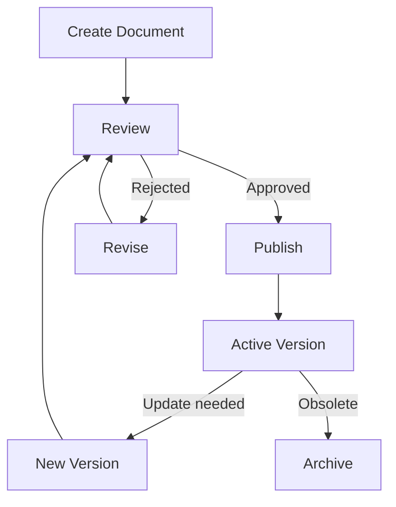

# Document Management

## Epic Information

- **Epic ID**: TM-69
- **Priority**: Low
- **Estimated Story Points**: 26 SP
- **Dependencies**: Core System

## Overview

Modul untuk mengelola dokumen operasional pabrik termasuk SOPs (Standard Operating Procedures), work instructions, engineering drawings, forms, dan document control dengan version management.

## Business Flow



## Features

### 1. Document Categories

- SOPs (Standard Operating Procedures)
- Work Instructions
- Engineering Drawings
- Forms & Templates
- Policies
- Training Materials
- Specifications
- Quality Documents

### 2. Document Control

- Document numbering system
- Version control
- Revision history
- Approval workflow
- Controlled distribution
- Master copy management

### 3. Document Lifecycle

- Draft → Review → Approved → Published → Obsolete
- Effective dates
- Review reminders
- Periodic review schedule
- Document retirement

### 4. Access Control

- Role-based access
- Department-based access
- Document-level permissions
- View vs Edit vs Approve rights

### 5. Search & Retrieval

- Full-text search
- Filter by category, department, status
- Tag-based organization
- Frequently accessed documents
- Recent documents

### 6. Compliance

- Audit trail
- Electronic signatures
- Regulatory compliance tracking
- Training acknowledgment

## Database Schema

```sql
-- Document Categories
CREATE TABLE document_categories (
    id INTEGER PRIMARY KEY,
    code TEXT UNIQUE NOT NULL,
    name TEXT NOT NULL,
    description TEXT,
    parent_id INTEGER REFERENCES document_categories(id),
    prefix TEXT,
    sort_order INTEGER DEFAULT 0,
    created_at DATETIME DEFAULT CURRENT_TIMESTAMP
);

-- Documents
CREATE TABLE documents (
    id INTEGER PRIMARY KEY,
    document_number TEXT UNIQUE NOT NULL,
    title TEXT NOT NULL,
    category_id INTEGER REFERENCES document_categories(id),
    department_id INTEGER REFERENCES departments(id),
    description TEXT,
    current_version TEXT DEFAULT '1.0',
    status TEXT DEFAULT 'draft',
    security_level TEXT DEFAULT 'internal',
    retention_years INTEGER DEFAULT 7,
    review_frequency_months INTEGER DEFAULT 12,
    next_review_date DATE,
    tags TEXT,
    created_by INTEGER REFERENCES users(id),
    created_at DATETIME DEFAULT CURRENT_TIMESTAMP,
    updated_at DATETIME DEFAULT CURRENT_TIMESTAMP
);

-- Document Versions
CREATE TABLE document_versions (
    id INTEGER PRIMARY KEY,
    document_id INTEGER REFERENCES documents(id),
    version_number TEXT NOT NULL,
    file_url TEXT NOT NULL,
    file_name TEXT,
    file_size INTEGER,
    file_type TEXT,
    change_description TEXT,
    status TEXT DEFAULT 'draft',
    effective_date DATE,
    obsolete_date DATE,
    created_by INTEGER REFERENCES users(id),
    created_at DATETIME DEFAULT CURRENT_TIMESTAMP,
    UNIQUE(document_id, version_number)
);

-- Document Approvals
CREATE TABLE document_approvals (
    id INTEGER PRIMARY KEY,
    version_id INTEGER REFERENCES document_versions(id),
    approver_id INTEGER REFERENCES users(id),
    approval_type TEXT DEFAULT 'approve',
    status TEXT DEFAULT 'pending',
    comments TEXT,
    approved_at DATETIME,
    created_at DATETIME DEFAULT CURRENT_TIMESTAMP
);

-- Document Access
CREATE TABLE document_access (
    id INTEGER PRIMARY KEY,
    document_id INTEGER REFERENCES documents(id),
    access_type TEXT NOT NULL,
    user_id INTEGER REFERENCES users(id),
    role_name TEXT,
    department_id INTEGER REFERENCES departments(id),
    can_view BOOLEAN DEFAULT 1,
    can_edit BOOLEAN DEFAULT 0,
    can_approve BOOLEAN DEFAULT 0,
    created_at DATETIME DEFAULT CURRENT_TIMESTAMP
);

-- Document Views (audit trail)
CREATE TABLE document_views (
    id INTEGER PRIMARY KEY,
    document_id INTEGER REFERENCES documents(id),
    version_id INTEGER REFERENCES document_versions(id),
    user_id INTEGER REFERENCES users(id),
    action TEXT DEFAULT 'view',
    viewed_at DATETIME DEFAULT CURRENT_TIMESTAMP
);

-- Document Downloads
CREATE TABLE document_downloads (
    id INTEGER PRIMARY KEY,
    document_id INTEGER REFERENCES documents(id),
    version_id INTEGER REFERENCES document_versions(id),
    user_id INTEGER REFERENCES users(id),
    purpose TEXT,
    downloaded_at DATETIME DEFAULT CURRENT_TIMESTAMP
);

-- Document Acknowledgments
CREATE TABLE document_acknowledgments (
    id INTEGER PRIMARY KEY,
    document_id INTEGER REFERENCES documents(id),
    version_id INTEGER REFERENCES document_versions(id),
    user_id INTEGER REFERENCES users(id),
    acknowledged_at DATETIME DEFAULT CURRENT_TIMESTAMP,
    notes TEXT
);

-- Document Links (related documents)
CREATE TABLE document_links (
    id INTEGER PRIMARY KEY,
    document_id INTEGER REFERENCES documents(id),
    linked_document_id INTEGER REFERENCES documents(id),
    link_type TEXT,
    notes TEXT,
    created_at DATETIME DEFAULT CURRENT_TIMESTAMP
);

-- Document Tags
CREATE TABLE document_tags (
    id INTEGER PRIMARY KEY,
    name TEXT UNIQUE NOT NULL,
    color TEXT,
    created_at DATETIME DEFAULT CURRENT_TIMESTAMP
);

-- Document Tag Assignments
CREATE TABLE document_tag_map (
    id INTEGER PRIMARY KEY,
    document_id INTEGER REFERENCES documents(id),
    tag_id INTEGER REFERENCES document_tags(id),
    UNIQUE(document_id, tag_id)
);
```

## API Endpoints

```
Categories:
POST   /api/documents/categories       - Create category
GET    /api/documents/categories       - List categories
PUT    /api/documents/categories/:id   - Update category

Documents:
POST   /api/documents                  - Create document
GET    /api/documents                  - List documents
GET    /api/documents/:id              - Get document detail
PUT    /api/documents/:id              - Update document
DELETE /api/documents/:id              - Delete document
GET    /api/documents/search           - Search documents

Versions:
POST   /api/documents/:id/versions     - Upload new version
GET    /api/documents/:id/versions     - List versions
GET    /api/documents/:id/versions/:versionId - Get version
POST   /api/documents/:id/versions/:versionId/submit - Submit for approval
POST   /api/documents/:id/versions/:versionId/publish - Publish

Approvals:
GET    /api/documents/approvals/pending - Pending approvals
POST   /api/documents/approvals/:id/approve - Approve
POST   /api/documents/approvals/:id/reject  - Reject

Access:
GET    /api/documents/:id/access       - Get access list
POST   /api/documents/:id/access       - Grant access
DELETE /api/documents/:id/access/:accessId - Revoke access

Acknowledgments:
POST   /api/documents/:id/acknowledge  - Acknowledge document
GET    /api/documents/:id/acknowledgments - List acknowledgments

Reports:
GET    /api/documents/reports/review-due   - Documents due for review
GET    /api/documents/reports/pending-approval - Pending approvals
GET    /api/documents/reports/activity     - Activity report
```

## UI Pages

| Page | Route | Description |

|------|-------|-------------|

| Documents List | `/documents` | All documents with filters |

| Document Detail | `/documents/:id` | Document info, versions, history |

| Upload Document | `/documents/new` | Create/upload new document |

| Edit Document | `/documents/:id/edit` | Edit document metadata |

| Version History | `/documents/:id/versions` | All versions |

| Pending Approvals | `/documents/approvals` | Documents awaiting approval |

| My Documents | `/documents/my` | Created by me |

| Categories | `/documents/categories` | Category management |

| Document Dashboard | `/documents/dashboard` | Stats, due reviews |

## Child Tickets

| Ticket | Title | Story Points |

|--------|-------|--------------|

| TM-70 | Setup Database Schema | 5 |

| TM-71 | Document CRUD API & UI | 8 |

| TM-72 | Version Control API & UI | 5 |

| TM-73 | Approval Workflow API & UI | 8 |

## Acceptance Criteria

1. Documents dapat di-upload dengan categorization
2. Version control dengan revision history lengkap
3. Approval workflow dengan electronic signature
4. Search documents dengan full-text search
5. Access control per document atau per kategori
6. Audit trail untuk semua document activities