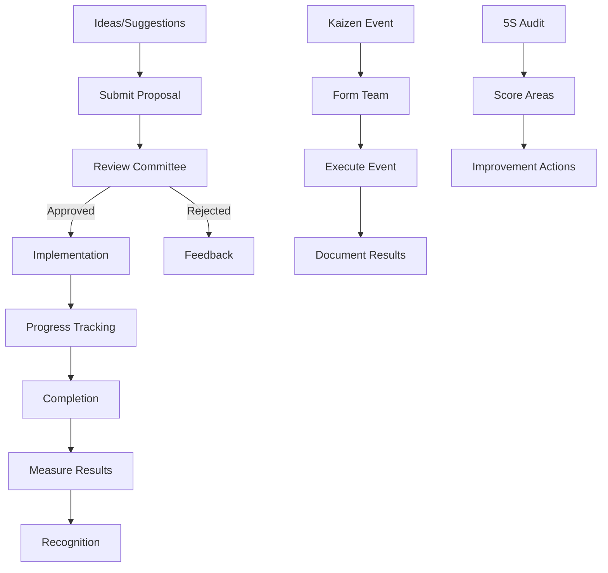

# Continuous Improvement

## Epic Information

- **Epic ID**: TM-74
- **Priority**: Low
- **Estimated Story Points**: 23 SP
- **Dependencies**: Core System, Production

## Overview

Modul untuk mengelola continuous improvement initiatives termasuk Kaizen events, employee suggestions, 5S audits, dan improvement tracking. Mendorong budaya perbaikan berkelanjutan di shop floor.

## Business Flow



## Features

### 1. Suggestion System

- Employee suggestions
- Suggestion categories (Safety, Quality, Productivity, Cost, Environment)
- Before/after description
- Expected benefits
- Simple submission form
- Status tracking
- Feedback mechanism

### 2. Kaizen Events

- Event planning
- Team formation
- Event scheduling
- Objectives & scope
- Results documentation
- Before/after photos
- Savings calculation

### 3. 5S Program

- 5S audit checklist
- Area scoring
- Photo documentation
- Trend tracking
- Action items
- 5S scores dashboard

### 4. Improvement Projects

- Project registration
- Project phases
- Resource allocation
- Timeline tracking
- Benefits tracking
- ROI calculation

### 5. Recognition & Rewards

- Points system
- Recognition levels
- Award tracking
- Leaderboard
- Team vs Individual recognition

### 6. CI Dashboard

- Suggestions metrics
- Implementation rate
- Cost savings
- 5S trends
- Top contributors

## Database Schema

```sql
-- Suggestion Categories
CREATE TABLE ci_categories (
    id INTEGER PRIMARY KEY,
    name TEXT NOT NULL,
    description TEXT,
    icon TEXT,
    color TEXT,
    is_active BOOLEAN DEFAULT 1,
    created_at DATETIME DEFAULT CURRENT_TIMESTAMP
);

-- Employee Suggestions
CREATE TABLE ci_suggestions (
    id INTEGER PRIMARY KEY,
    suggestion_number TEXT UNIQUE NOT NULL,
    title TEXT NOT NULL,
    category_id INTEGER REFERENCES ci_categories(id),
    department_id INTEGER REFERENCES departments(id),
    area TEXT,
    current_situation TEXT NOT NULL,
    proposed_improvement TEXT NOT NULL,
    expected_benefits TEXT,
    estimated_savings REAL,
    status TEXT DEFAULT 'submitted',
    priority TEXT DEFAULT 'medium',
    submitted_by INTEGER REFERENCES users(id),
    submitted_at DATETIME DEFAULT CURRENT_TIMESTAMP,
    reviewed_by INTEGER REFERENCES users(id),
    reviewed_at DATETIME,
    review_comments TEXT,
    implemented_at DATETIME,
    actual_savings REAL,
    created_at DATETIME DEFAULT CURRENT_TIMESTAMP,
    updated_at DATETIME DEFAULT CURRENT_TIMESTAMP
);

-- Suggestion Attachments
CREATE TABLE ci_suggestion_attachments (
    id INTEGER PRIMARY KEY,
    suggestion_id INTEGER REFERENCES ci_suggestions(id),
    file_type TEXT,
    file_url TEXT NOT NULL,
    description TEXT,
    uploaded_by INTEGER REFERENCES users(id),
    uploaded_at DATETIME DEFAULT CURRENT_TIMESTAMP
);

-- Kaizen Events
CREATE TABLE kaizen_events (
    id INTEGER PRIMARY KEY,
    event_number TEXT UNIQUE NOT NULL,
    title TEXT NOT NULL,
    category_id INTEGER REFERENCES ci_categories(id),
    department_id INTEGER REFERENCES departments(id),
    area TEXT,
    objective TEXT NOT NULL,
    scope TEXT,
    start_date DATE NOT NULL,
    end_date DATE,
    status TEXT DEFAULT 'planned',
    leader_id INTEGER REFERENCES users(id),
    before_state TEXT,
    after_state TEXT,
    results TEXT,
    lessons_learned TEXT,
    estimated_savings REAL,
    actual_savings REAL,
    created_by INTEGER REFERENCES users(id),
    created_at DATETIME DEFAULT CURRENT_TIMESTAMP,
    updated_at DATETIME DEFAULT CURRENT_TIMESTAMP
);

-- Kaizen Team Members
CREATE TABLE kaizen_team (
    id INTEGER PRIMARY KEY,
    event_id INTEGER REFERENCES kaizen_events(id),
    user_id INTEGER REFERENCES users(id),
    role TEXT DEFAULT 'member',
    UNIQUE(event_id, user_id)
);

-- Kaizen Actions
CREATE TABLE kaizen_actions (
    id INTEGER PRIMARY KEY,
    event_id INTEGER REFERENCES kaizen_events(id),
    description TEXT NOT NULL,
    responsible_id INTEGER REFERENCES users(id),
    due_date DATE,
    status TEXT DEFAULT 'pending',
    completed_at DATETIME,
    notes TEXT
);

-- 5S Audit Areas
CREATE TABLE five_s_areas (
    id INTEGER PRIMARY KEY,
    code TEXT UNIQUE NOT NULL,
    name TEXT NOT NULL,
    department_id INTEGER REFERENCES departments(id),
    description TEXT,
    responsible_id INTEGER REFERENCES users(id),
    audit_frequency_days INTEGER DEFAULT 7,
    is_active BOOLEAN DEFAULT 1,
    created_at DATETIME DEFAULT CURRENT_TIMESTAMP
);

-- 5S Audits
CREATE TABLE five_s_audits (
    id INTEGER PRIMARY KEY,
    audit_number TEXT UNIQUE NOT NULL,
    area_id INTEGER REFERENCES five_s_areas(id),
    audit_date DATE NOT NULL,
    auditor_id INTEGER REFERENCES users(id),
    sort_score INTEGER DEFAULT 0,
    set_in_order_score INTEGER DEFAULT 0,
    shine_score INTEGER DEFAULT 0,
    standardize_score INTEGER DEFAULT 0,
    sustain_score INTEGER DEFAULT 0,
    total_score INTEGER DEFAULT 0,
    max_score INTEGER DEFAULT 25,
    percentage REAL,
    notes TEXT,
    created_at DATETIME DEFAULT CURRENT_TIMESTAMP
);

-- 5S Audit Items
CREATE TABLE five_s_audit_items (
    id INTEGER PRIMARY KEY,
    audit_id INTEGER REFERENCES five_s_audits(id),
    category TEXT NOT NULL,
    item_description TEXT NOT NULL,
    score INTEGER DEFAULT 0,
    max_score INTEGER DEFAULT 5,
    finding TEXT,
    photo_url TEXT
);

-- 5S Actions
CREATE TABLE five_s_actions (
    id INTEGER PRIMARY KEY,
    audit_id INTEGER REFERENCES five_s_audits(id),
    item_id INTEGER REFERENCES five_s_audit_items(id),
    description TEXT NOT NULL,
    responsible_id INTEGER REFERENCES users(id),
    due_date DATE,
    status TEXT DEFAULT 'open',
    completed_at DATETIME
);

-- CI Projects (larger improvement projects)
CREATE TABLE ci_projects (
    id INTEGER PRIMARY KEY,
    project_number TEXT UNIQUE NOT NULL,
    title TEXT NOT NULL,
    category_id INTEGER REFERENCES ci_categories(id),
    department_id INTEGER REFERENCES departments(id),
    description TEXT,
    objectives TEXT,
    scope TEXT,
    start_date DATE,
    target_end_date DATE,
    actual_end_date DATE,
    status TEXT DEFAULT 'planning',
    sponsor_id INTEGER REFERENCES users(id),
    leader_id INTEGER REFERENCES users(id),
    estimated_investment REAL,
    actual_investment REAL,
    estimated_annual_savings REAL,
    actual_annual_savings REAL,
    payback_months REAL,
    created_by INTEGER REFERENCES users(id),
    created_at DATETIME DEFAULT CURRENT_TIMESTAMP,
    updated_at DATETIME DEFAULT CURRENT_TIMESTAMP
);

-- CI Recognition Points
CREATE TABLE ci_points (
    id INTEGER PRIMARY KEY,
    user_id INTEGER REFERENCES users(id),
    points INTEGER NOT NULL,
    reason TEXT NOT NULL,
    reference_type TEXT,
    reference_id INTEGER,
    awarded_by INTEGER REFERENCES users(id),
    awarded_at DATETIME DEFAULT CURRENT_TIMESTAMP
);

-- CI Rewards
CREATE TABLE ci_rewards (
    id INTEGER PRIMARY KEY,
    user_id INTEGER REFERENCES users(id),
    reward_type TEXT NOT NULL,
    description TEXT,
    points_redeemed INTEGER,
    awarded_at DATETIME DEFAULT CURRENT_TIMESTAMP
);
```

## API Endpoints

```
Suggestions:
POST   /api/ci/suggestions             - Submit suggestion
GET    /api/ci/suggestions             - List suggestions
GET    /api/ci/suggestions/:id         - Get suggestion detail
PUT    /api/ci/suggestions/:id         - Update suggestion
POST   /api/ci/suggestions/:id/review  - Review suggestion
POST   /api/ci/suggestions/:id/implement - Mark implemented

Kaizen:
POST   /api/ci/kaizen                  - Create Kaizen event
GET    /api/ci/kaizen                  - List events
GET    /api/ci/kaizen/:id              - Get event detail
PUT    /api/ci/kaizen/:id              - Update event
POST   /api/ci/kaizen/:id/team         - Add team member
POST   /api/ci/kaizen/:id/actions      - Add action item
POST   /api/ci/kaizen/:id/complete     - Complete event

5S:
POST   /api/ci/five-s/areas            - Create area
GET    /api/ci/five-s/areas            - List areas
POST   /api/ci/five-s/audits           - Create audit
GET    /api/ci/five-s/audits           - List audits
GET    /api/ci/five-s/audits/:id       - Get audit detail
POST   /api/ci/five-s/audits/:id/items - Add audit items
GET    /api/ci/five-s/trends           - 5S trends

Projects:
POST   /api/ci/projects                - Create project
GET    /api/ci/projects                - List projects
GET    /api/ci/projects/:id            - Get project detail
PUT    /api/ci/projects/:id            - Update project

Recognition:
GET    /api/ci/points/:userId          - Get user points
GET    /api/ci/leaderboard             - Points leaderboard
POST   /api/ci/points/award            - Award points

Dashboard:
GET    /api/ci/dashboard               - CI metrics
GET    /api/ci/reports/savings         - Savings report
```

## UI Pages

| Page | Route | Description |

|------|-------|-------------|

| Suggestions | `/ci/suggestions` | All suggestions |

| Submit Suggestion | `/ci/suggestions/new` | Submit form |

| Suggestion Detail | `/ci/suggestions/:id` | Suggestion info |

| Kaizen Events | `/ci/kaizen` | All events |

| Kaizen Detail | `/ci/kaizen/:id` | Event detail |

| 5S Areas | `/ci/five-s/areas` | Manage areas |

| 5S Audit | `/ci/five-s/audit` | Conduct audit |

| 5S Dashboard | `/ci/five-s` | 5S scores & trends |

| Projects | `/ci/projects` | CI projects |

| Leaderboard | `/ci/leaderboard` | Recognition |

| CI Dashboard | `/ci` | Overall CI metrics |

## Child Tickets

| Ticket | Title | Story Points |

|--------|-------|--------------|

| TM-75 | Setup Database Schema | 5 |

| TM-76 | Suggestion System API & UI | 5 |

| TM-77 | Kaizen Events API & UI | 5 |

| TM-78 | 5S Audit API & UI | 5 |

| TM-79 | CI Dashboard | 3 |

## Acceptance Criteria

1. Karyawan dapat submit suggestions dengan mudah
2. Suggestions dapat di-review dan di-track implementasinya
3. Kaizen events ter-dokumentasi dengan before/after
4. 5S audits dengan scoring system
5. Points/recognition system untuk mendorong partisipasi
6. Dashboard menampilkan savings dan metrics