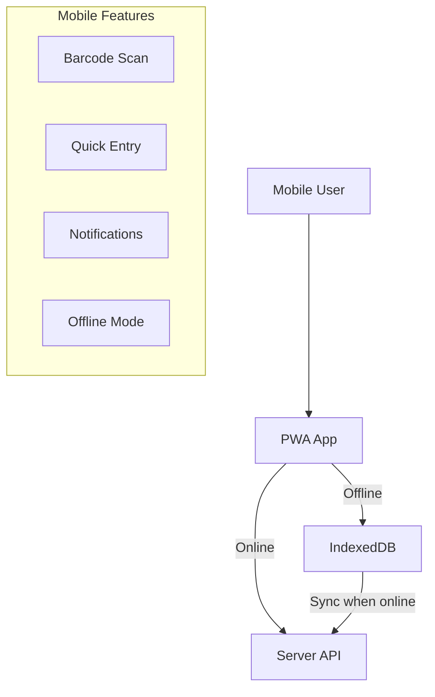

# Mobile App (PWA)

## Epic Information
- **Epic ID**: TM-80
- **Priority**: Medium
- **Estimated Story Points**: 47 SP
- **Dependencies**: All Core Modules

## Overview

Progressive Web App untuk akses shop floor dengan fitur offline capability, barcode scanning, quick data entry, dan push notifications. Memungkinkan operator dan supervisor untuk mengakses dan input data langsung dari lantai produksi.

## Business Flow



## Features

### 1. PWA Setup
- Service Worker for caching
- Web App Manifest
- Install prompt
- Offline fallback page
- App shell architecture
- Workbox integration

### 2. Mobile-Optimized UI
- Responsive components
- Touch-friendly interactions
- Bottom navigation
- Swipe gestures
- Pull-to-refresh
- Loading skeletons
- Large touch targets

### 3. Offline Capability
- IndexedDB storage
- Offline data sync
- Sync queue management
- Conflict resolution
- Background sync
- Offline indicators

### 4. Barcode/QR Scanning
- Camera access
- Barcode formats (Code128, QR, EAN)
- Asset lookup by barcode
- Inventory scan
- Work order scan
- Quick actions from scan

### 5. Quick Data Entry Forms
- Production output entry
- Downtime recording
- Quality check entry
- Time clock (clock in/out)
- Safety observations
- 5S quick audit

### 6. Push Notifications
- Browser push API
- Notification preferences
- Urgent alerts (safety, breakdown)
- Assignment notifications
- Reminder notifications
- Action buttons in notifications

### 7. Mobile-Specific Features
- Location tracking (optional)
- Photo capture with annotation
- Voice notes (optional)
- Haptic feedback
- Device orientation handling

## Technical Architecture

### PWA Configuration

```javascript
// manifest.json
{
  "name": "TaskFlow Mobile",
  "short_name": "TaskFlow",
  "description": "Factory Management System",
  "start_url": "/",
  "display": "standalone",
  "background_color": "#0a0a0b",
  "theme_color": "#3b82f6",
  "icons": [
    {
      "src": "/icons/icon-192.png",
      "sizes": "192x192",
      "type": "image/png"
    },
    {
      "src": "/icons/icon-512.png",
      "sizes": "512x512",
      "type": "image/png"
    }
  ]
}
```

### Service Worker Strategy

```javascript
// Caching strategies
- App Shell: Cache First
- API Responses: Network First with Cache Fallback
- Static Assets: Cache First with Network Update
- User Data: Network First, Store in IndexedDB
```

### Offline Data Schema (IndexedDB)

```javascript
// Databases
const DB_STORES = {
  // Reference data (synced periodically)
  'assets': { keyPath: 'id', indexes: ['barcode', 'name'] },
  'users': { keyPath: 'id', indexes: ['name'] },
  'workOrders': { keyPath: 'id', indexes: ['status', 'scheduled_date'] },
  
  // Pending submissions (synced when online)
  'pendingDowntime': { keyPath: 'localId', autoIncrement: true },
  'pendingOutput': { keyPath: 'localId', autoIncrement: true },
  'pendingQualityCheck': { keyPath: 'localId', autoIncrement: true },
  
  // Sync metadata
  'syncMeta': { keyPath: 'storeName' }
};
```

### Sync Queue System

```javascript
// Sync queue entry structure
{
  id: 'uuid',
  store: 'pendingDowntime',
  action: 'create',
  data: { ... },
  createdAt: timestamp,
  retryCount: 0,
  status: 'pending' // pending, syncing, failed, synced
}
```

## Database Schema (Server-side additions)

```sql
-- Push Subscriptions
CREATE TABLE push_subscriptions (
    id INTEGER PRIMARY KEY,
    user_id INTEGER REFERENCES users(id),
    endpoint TEXT NOT NULL,
    p256dh TEXT NOT NULL,
    auth TEXT NOT NULL,
    user_agent TEXT,
    is_active BOOLEAN DEFAULT 1,
    created_at DATETIME DEFAULT CURRENT_TIMESTAMP,
    updated_at DATETIME DEFAULT CURRENT_TIMESTAMP,
    UNIQUE(user_id, endpoint)
);

-- Notification Preferences
CREATE TABLE notification_preferences (
    id INTEGER PRIMARY KEY,
    user_id INTEGER REFERENCES users(id),
    notification_type TEXT NOT NULL,
    push_enabled BOOLEAN DEFAULT 1,
    email_enabled BOOLEAN DEFAULT 0,
    created_at DATETIME DEFAULT CURRENT_TIMESTAMP,
    UNIQUE(user_id, notification_type)
);

-- Device Sessions
CREATE TABLE device_sessions (
    id INTEGER PRIMARY KEY,
    user_id INTEGER REFERENCES users(id),
    device_id TEXT NOT NULL,
    device_name TEXT,
    device_type TEXT,
    last_sync_at DATETIME,
    is_active BOOLEAN DEFAULT 1,
    created_at DATETIME DEFAULT CURRENT_TIMESTAMP
);

-- Offline Sync Log
CREATE TABLE sync_log (
    id INTEGER PRIMARY KEY,
    user_id INTEGER REFERENCES users(id),
    device_id TEXT,
    sync_type TEXT NOT NULL,
    records_synced INTEGER,
    conflicts_resolved INTEGER,
    started_at DATETIME,
    completed_at DATETIME,
    status TEXT,
    error_message TEXT
);
```

## API Endpoints

```
PWA:
GET    /api/mobile/manifest.json      - Web manifest
GET    /api/mobile/sw.js              - Service worker

Sync:
GET    /api/mobile/sync/reference     - Get reference data
POST   /api/mobile/sync/upload        - Upload pending data
GET    /api/mobile/sync/status        - Sync status
POST   /api/mobile/sync/resolve       - Resolve conflicts

Push Notifications:
POST   /api/mobile/push/subscribe     - Subscribe to push
DELETE /api/mobile/push/subscribe     - Unsubscribe
GET    /api/mobile/notifications/preferences - Get preferences
PUT    /api/mobile/notifications/preferences - Update preferences
POST   /api/mobile/push/test          - Test notification

Quick Entry:
POST   /api/mobile/quick/downtime     - Record downtime
POST   /api/mobile/quick/output       - Record output
POST   /api/mobile/quick/quality      - Quality check
POST   /api/mobile/quick/clock        - Clock in/out
POST   /api/mobile/quick/observation  - Safety observation

Barcode:
GET    /api/mobile/scan/:barcode      - Lookup by barcode
POST   /api/mobile/scan/action        - Execute scan action
```

## Mobile UI Components

### Bottom Navigation

```
┌─────────────────────────────────────┐
│                                     │
│           [Content Area]            │
│                                     │
├─────────────────────────────────────┤
│ 🏠     📋     📷     🔔     👤      │
│ Home  Tasks  Scan  Alerts Profile   │
└─────────────────────────────────────┘
```

### Quick Action Cards

```
┌─────────────────────────────────────┐
│ Quick Actions                       │
├────────┬────────┬────────┬─────────┤
│ ⏱️     │ 📊     │ ✓      │ 🔧     │
│Downtime│ Output │Quality │ Clock   │
└────────┴────────┴────────┴─────────┘
```

### Scan Result Actions

```
┌─────────────────────────────────────┐
│ 🔍 Asset Found: CNC-001             │
├─────────────────────────────────────┤
│ CNC Milling Machine                 │
│ Location: Production Line 1         │
│ Status: 🟢 Running                  │
├─────────────────────────────────────┤
│ [Record Downtime] [View History]    │
│ [Create Work Order] [Check Asset]   │
└─────────────────────────────────────┘
```

## UI Pages

| Page | Route | Description |
|------|-------|-------------|
| Mobile Home | `/m/` | Dashboard with quick actions |
| My Tasks | `/m/tasks` | Assigned tickets/work orders |
| Task Detail | `/m/tasks/:id` | Task info with actions |
| Scanner | `/m/scan` | Barcode scanner |
| Quick Downtime | `/m/downtime` | Record downtime |
| Quick Output | `/m/output` | Record production output |
| Quick Quality | `/m/quality` | Quality check entry |
| Clock In/Out | `/m/clock` | Time attendance |
| Notifications | `/m/notifications` | All notifications |
| Profile | `/m/profile` | User profile & settings |
| Offline Queue | `/m/queue` | Pending sync items |

## Child Tickets

| Ticket | Title | Story Points |
|--------|-------|--------------|
| TM-81 | Setup PWA Configuration | 8 |
| TM-82 | Buat Mobile-Optimized UI Components | 13 |
| TM-83 | Buat Offline Sync Mechanism | 13 |
| TM-84 | Buat Barcode/QR Scanner | 8 |
| TM-85 | Buat Push Notifications | 5 |

## Implementation Notes

### Recommended Libraries

```json
{
  "dependencies": {
    "workbox-webpack-plugin": "^7.0.0",
    "idb": "^7.1.0",
    "@nicedayforty/modern-barcode-scanner": "^1.0.0",
    "web-push": "^3.6.0"
  }
}
```

### Browser Support

- Chrome/Edge 90+
- Firefox 85+
- Safari 15.4+ (limited PWA support)
- Samsung Internet 15+

### Performance Targets

- First Contentful Paint: < 1.5s
- Time to Interactive: < 3s
- Lighthouse PWA Score: > 90
- Offline load time: < 500ms

## Acceptance Criteria

1. App dapat di-install di home screen
2. App berfungsi offline dengan data cached
3. Data entry tersimpan offline dan sync saat online
4. Barcode scanner berfungsi untuk asset lookup
5. Push notifications diterima untuk urgent alerts
6. UI responsive dan touch-friendly di mobile

