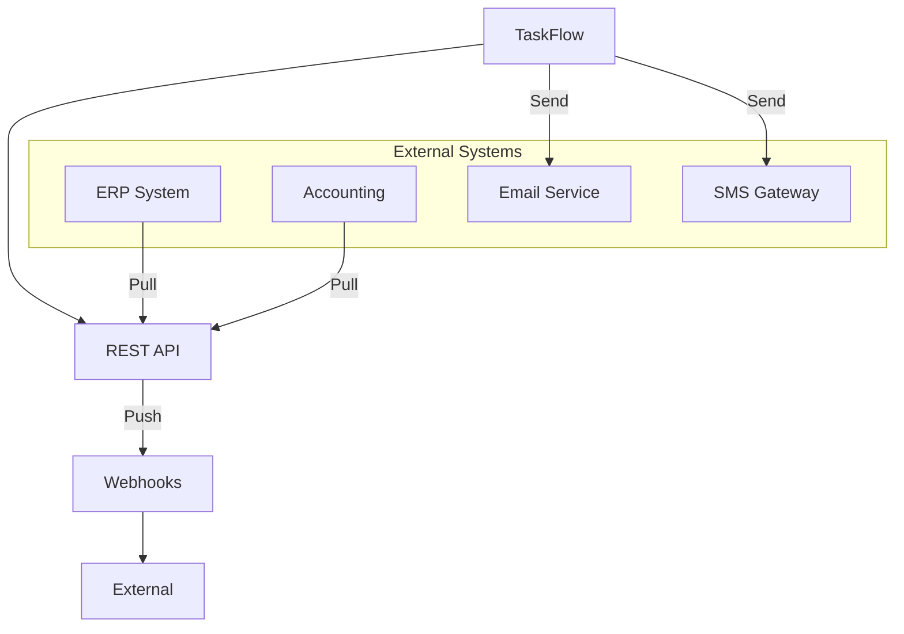

# Integration & API

## Epic Information
- **Epic ID**: TM-86
- **Priority**: Low
- **Estimated Story Points**: 37 SP
- **Dependencies**: All Core Modules

## Overview

REST API documentation, webhook support, OAuth2 authentication, dan integration connectors untuk menghubungkan TaskFlow dengan sistem eksternal seperti ERP, accounting software, dan third-party services.

## Business Flow



## Features

### 1. API Documentation
- OpenAPI/Swagger specification
- Interactive API documentation (Swagger UI)
- Code samples (curl, JavaScript, Python)
- Authentication guide
- Rate limiting info
- Error code reference

### 2. Authentication & Authorization
- OAuth2 Provider
- API Keys for server-to-server
- JWT with refresh tokens
- Scope-based permissions
- Token management UI
- Rate limiting per client

### 3. Webhook System
- Webhook registration
- Event types subscription
- Payload customization
- Retry mechanism with exponential backoff
- Webhook logs
- Signature verification
- Test endpoint

### 4. Data Export/Import
- CSV export for all major entities
- Excel export with formatting
- Bulk CSV import with validation
- Import templates
- Data migration tools
- Scheduled exports

### 5. Pre-built Connectors
- ERP Integration (SAP, Oracle - connector framework)
- Accounting (QuickBooks, Xero - framework)
- Email (SMTP, SendGrid, SES)
- SMS (Twilio, AWS SNS)
- File Storage (S3, Azure Blob)
- LDAP/Active Directory

## API Specification

### OpenAPI Structure

```yaml
openapi: 3.0.3
info:
  title: TaskFlow API
  description: Factory Management System API
  version: 1.0.0
  contact:
    email: api@taskflow.com

servers:
  - url: https://api.taskflow.com/v1
    description: Production
  - url: https://staging-api.taskflow.com/v1
    description: Staging

security:
  - OAuth2: []
  - ApiKey: []

tags:
  - name: Authentication
  - name: Tickets
  - name: Assets
  - name: Production
  - name: Maintenance
  - name: Inventory
  - name: Users
  - name: Webhooks

paths:
  /auth/token:
    post:
      summary: Get access token
      tags: [Authentication]
      requestBody:
        content:
          application/json:
            schema:
              type: object
              properties:
                grant_type:
                  type: string
                  enum: [client_credentials, refresh_token]
                client_id:
                  type: string
                client_secret:
                  type: string
      responses:
        200:
          description: Access token
          content:
            application/json:
              schema:
                $ref: '#/components/schemas/TokenResponse'

  /tickets:
    get:
      summary: List tickets
      tags: [Tickets]
      parameters:
        - name: status
          in: query
          schema:
            type: string
        - name: page
          in: query
          schema:
            type: integer
        - name: limit
          in: query
          schema:
            type: integer
            default: 20
      responses:
        200:
          description: List of tickets
          content:
            application/json:
              schema:
                type: object
                properties:
                  data:
                    type: array
                    items:
                      $ref: '#/components/schemas/Ticket'
                  pagination:
                    $ref: '#/components/schemas/Pagination'

components:
  securitySchemes:
    OAuth2:
      type: oauth2
      flows:
        clientCredentials:
          tokenUrl: /auth/token
          scopes:
            read: Read access
            write: Write access
            admin: Admin access
    ApiKey:
      type: apiKey
      in: header
      name: X-API-Key

  schemas:
    TokenResponse:
      type: object
      properties:
        access_token:
          type: string
        token_type:
          type: string
          default: Bearer
        expires_in:
          type: integer
        refresh_token:
          type: string
        scope:
          type: string

    Ticket:
      type: object
      properties:
        id:
          type: integer
        ticket_key:
          type: string
        title:
          type: string
        description:
          type: string
        type:
          type: string
          enum: [bug, task, story, epic]
        status:
          type: string
        priority:
          type: string

    Pagination:
      type: object
      properties:
        page:
          type: integer
        limit:
          type: integer
        total:
          type: integer
        total_pages:
          type: integer
```

## Database Schema

```sql
-- API Clients (OAuth2)
CREATE TABLE api_clients (
    id INTEGER PRIMARY KEY,
    client_id TEXT UNIQUE NOT NULL,
    client_secret_hash TEXT NOT NULL,
    name TEXT NOT NULL,
    description TEXT,
    owner_id INTEGER REFERENCES users(id),
    redirect_uris TEXT,
    scopes TEXT DEFAULT 'read',
    rate_limit_per_hour INTEGER DEFAULT 1000,
    is_active BOOLEAN DEFAULT 1,
    created_at DATETIME DEFAULT CURRENT_TIMESTAMP,
    updated_at DATETIME DEFAULT CURRENT_TIMESTAMP
);

-- API Keys (simpler auth for server-to-server)
CREATE TABLE api_keys (
    id INTEGER PRIMARY KEY,
    key_hash TEXT UNIQUE NOT NULL,
    key_prefix TEXT NOT NULL,
    name TEXT NOT NULL,
    description TEXT,
    owner_id INTEGER REFERENCES users(id),
    scopes TEXT DEFAULT 'read',
    rate_limit_per_hour INTEGER DEFAULT 1000,
    last_used_at DATETIME,
    expires_at DATETIME,
    is_active BOOLEAN DEFAULT 1,
    created_at DATETIME DEFAULT CURRENT_TIMESTAMP
);

-- Access Tokens
CREATE TABLE access_tokens (
    id INTEGER PRIMARY KEY,
    token_hash TEXT UNIQUE NOT NULL,
    client_id INTEGER REFERENCES api_clients(id),
    user_id INTEGER REFERENCES users(id),
    scopes TEXT,
    expires_at DATETIME NOT NULL,
    created_at DATETIME DEFAULT CURRENT_TIMESTAMP
);

-- Refresh Tokens
CREATE TABLE refresh_tokens (
    id INTEGER PRIMARY KEY,
    token_hash TEXT UNIQUE NOT NULL,
    access_token_id INTEGER REFERENCES access_tokens(id),
    expires_at DATETIME NOT NULL,
    is_revoked BOOLEAN DEFAULT 0,
    created_at DATETIME DEFAULT CURRENT_TIMESTAMP
);

-- Webhooks
CREATE TABLE webhooks (
    id INTEGER PRIMARY KEY,
    name TEXT NOT NULL,
    url TEXT NOT NULL,
    secret TEXT NOT NULL,
    events TEXT NOT NULL,
    owner_id INTEGER REFERENCES users(id),
    is_active BOOLEAN DEFAULT 1,
    retry_count INTEGER DEFAULT 3,
    timeout_seconds INTEGER DEFAULT 30,
    created_at DATETIME DEFAULT CURRENT_TIMESTAMP,
    updated_at DATETIME DEFAULT CURRENT_TIMESTAMP
);

-- Webhook Deliveries
CREATE TABLE webhook_deliveries (
    id INTEGER PRIMARY KEY,
    webhook_id INTEGER REFERENCES webhooks(id),
    event_type TEXT NOT NULL,
    payload TEXT NOT NULL,
    request_headers TEXT,
    response_status INTEGER,
    response_body TEXT,
    response_time_ms INTEGER,
    attempt_number INTEGER DEFAULT 1,
    status TEXT DEFAULT 'pending',
    delivered_at DATETIME,
    created_at DATETIME DEFAULT CURRENT_TIMESTAMP
);

-- API Request Logs
CREATE TABLE api_request_logs (
    id INTEGER PRIMARY KEY,
    client_id INTEGER,
    api_key_id INTEGER,
    user_id INTEGER,
    method TEXT NOT NULL,
    path TEXT NOT NULL,
    query_params TEXT,
    request_body TEXT,
    response_status INTEGER,
    response_time_ms INTEGER,
    ip_address TEXT,
    user_agent TEXT,
    created_at DATETIME DEFAULT CURRENT_TIMESTAMP
);

-- Rate Limit Counters (cached/temp)
CREATE TABLE rate_limit_counters (
    id INTEGER PRIMARY KEY,
    identifier TEXT NOT NULL,
    window_start DATETIME NOT NULL,
    request_count INTEGER DEFAULT 0,
    UNIQUE(identifier, window_start)
);

-- Integration Configs
CREATE TABLE integration_configs (
    id INTEGER PRIMARY KEY,
    integration_type TEXT NOT NULL,
    name TEXT NOT NULL,
    config TEXT NOT NULL,
    credentials TEXT,
    is_active BOOLEAN DEFAULT 1,
    last_sync_at DATETIME,
    sync_status TEXT,
    created_by INTEGER REFERENCES users(id),
    created_at DATETIME DEFAULT CURRENT_TIMESTAMP,
    updated_at DATETIME DEFAULT CURRENT_TIMESTAMP
);

-- Export Jobs
CREATE TABLE export_jobs (
    id INTEGER PRIMARY KEY,
    export_type TEXT NOT NULL,
    entity_type TEXT NOT NULL,
    filters TEXT,
    format TEXT DEFAULT 'csv',
    status TEXT DEFAULT 'pending',
    file_url TEXT,
    file_size INTEGER,
    record_count INTEGER,
    started_at DATETIME,
    completed_at DATETIME,
    error_message TEXT,
    created_by INTEGER REFERENCES users(id),
    created_at DATETIME DEFAULT CURRENT_TIMESTAMP
);

-- Import Jobs
CREATE TABLE import_jobs (
    id INTEGER PRIMARY KEY,
    import_type TEXT NOT NULL,
    entity_type TEXT NOT NULL,
    file_url TEXT NOT NULL,
    original_filename TEXT,
    status TEXT DEFAULT 'pending',
    total_rows INTEGER,
    processed_rows INTEGER,
    success_count INTEGER DEFAULT 0,
    error_count INTEGER DEFAULT 0,
    error_details TEXT,
    started_at DATETIME,
    completed_at DATETIME,
    created_by INTEGER REFERENCES users(id),
    created_at DATETIME DEFAULT CURRENT_TIMESTAMP
);
```

## API Endpoints

```
Documentation:
GET    /api/docs                       - Swagger UI
GET    /api/docs/openapi.json          - OpenAPI spec
GET    /api/docs/openapi.yaml          - OpenAPI spec (YAML)

OAuth2:
POST   /api/oauth/token                - Get token
POST   /api/oauth/revoke               - Revoke token
GET    /api/oauth/userinfo             - Get user info

API Keys:
POST   /api/api-keys                   - Create API key
GET    /api/api-keys                   - List API keys
DELETE /api/api-keys/:id               - Revoke API key

Webhooks:
POST   /api/webhooks                   - Create webhook
GET    /api/webhooks                   - List webhooks
GET    /api/webhooks/:id               - Get webhook detail
PUT    /api/webhooks/:id               - Update webhook
DELETE /api/webhooks/:id               - Delete webhook
GET    /api/webhooks/:id/deliveries    - Delivery history
POST   /api/webhooks/:id/test          - Send test event
POST   /api/webhooks/:id/redeliver/:deliveryId - Retry delivery

Export:
POST   /api/export                     - Create export job
GET    /api/export/:id                 - Get export status
GET    /api/export/:id/download        - Download export file

Import:
POST   /api/import                     - Create import job
GET    /api/import/:id                 - Get import status
GET    /api/import/templates/:entity   - Download import template

Integrations:
GET    /api/integrations               - List available integrations
POST   /api/integrations/:type/connect - Configure integration
GET    /api/integrations/:type/status  - Check connection status
POST   /api/integrations/:type/sync    - Trigger manual sync
DELETE /api/integrations/:type         - Disconnect integration
```

## Webhook Events

```javascript
const WEBHOOK_EVENTS = {
  // Tickets
  'ticket.created': 'When a new ticket is created',
  'ticket.updated': 'When ticket details are updated',
  'ticket.status_changed': 'When ticket status changes',
  'ticket.assigned': 'When ticket is assigned',
  'ticket.commented': 'When comment is added',
  
  // Assets
  'asset.created': 'When a new asset is registered',
  'asset.status_changed': 'When asset status changes',
  
  // Production
  'production_order.created': 'When production order is created',
  'production_order.started': 'When production starts',
  'production_order.completed': 'When production completes',
  'production_output.recorded': 'When output is recorded',
  
  // Maintenance
  'work_order.created': 'When work order is created',
  'work_order.completed': 'When work order is completed',
  'downtime.started': 'When downtime starts',
  'downtime.ended': 'When downtime ends',
  
  // Safety
  'incident.reported': 'When incident is reported',
  'near_miss.reported': 'When near-miss is reported',
};
```

## Webhook Payload Example

```json
{
  "id": "evt_abc123",
  "event": "ticket.status_changed",
  "created_at": "2025-01-15T10:30:00Z",
  "data": {
    "ticket": {
      "id": 123,
      "ticket_key": "TM-123",
      "title": "Fix production issue",
      "previous_status": "in_progress",
      "new_status": "done"
    },
    "changed_by": {
      "id": 1,
      "name": "John Doe"
    }
  }
}
```

## UI Pages

| Page | Route | Description |
|------|-------|-------------|
| API Documentation | `/api-docs` | Swagger UI |
| API Keys | `/settings/api-keys` | Manage API keys |
| OAuth Clients | `/settings/oauth-clients` | Manage OAuth clients |
| Webhooks | `/settings/webhooks` | Webhook configuration |
| Webhook Detail | `/settings/webhooks/:id` | Delivery history |
| Integrations | `/settings/integrations` | Available integrations |
| Export | `/settings/export` | Data export |
| Import | `/settings/import` | Data import |

## Child Tickets

| Ticket | Title | Story Points |
|--------|-------|--------------|
| TM-87 | Buat OpenAPI/Swagger Documentation | 8 |
| TM-88 | Buat Webhook System | 8 |
| TM-89 | Buat OAuth2 Authentication | 8 |
| TM-90 | Buat Data Export/Import Tools | 5 |
| TM-91 | Buat Integration Connectors | 8 |

## Security Considerations

### API Key Security
- Keys are hashed before storage (bcrypt)
- Only prefix is displayed in UI
- Keys cannot be retrieved after creation
- Automatic expiration option

### Rate Limiting
- Per client/key limits
- Sliding window algorithm
- 429 response with retry-after header
- Separate limits for read/write operations

### Webhook Security
- HMAC-SHA256 signature
- Timestamp validation (5 min window)
- IP whitelist option
- TLS required for endpoints

## Acceptance Criteria

1. API documentation tersedia dengan Swagger UI
2. OAuth2 flow berfungsi untuk external clients
3. API keys dapat dibuat dan dikelola
4. Webhooks dapat dikonfigurasi per event type
5. Data export ke CSV/Excel berfungsi
6. Import dengan validation dan error reporting
7. Rate limiting ter-enforce dengan proper responses

