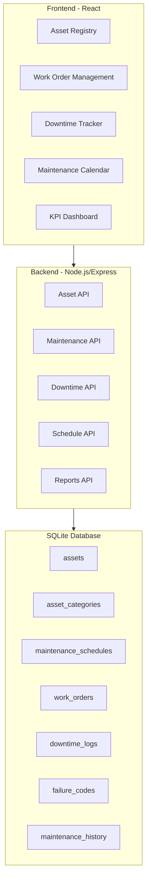
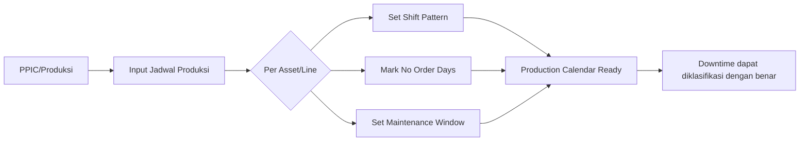
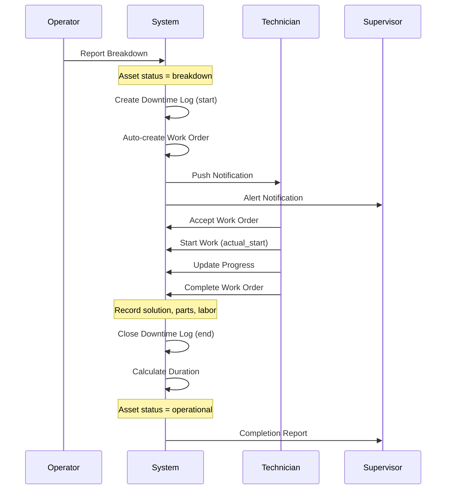
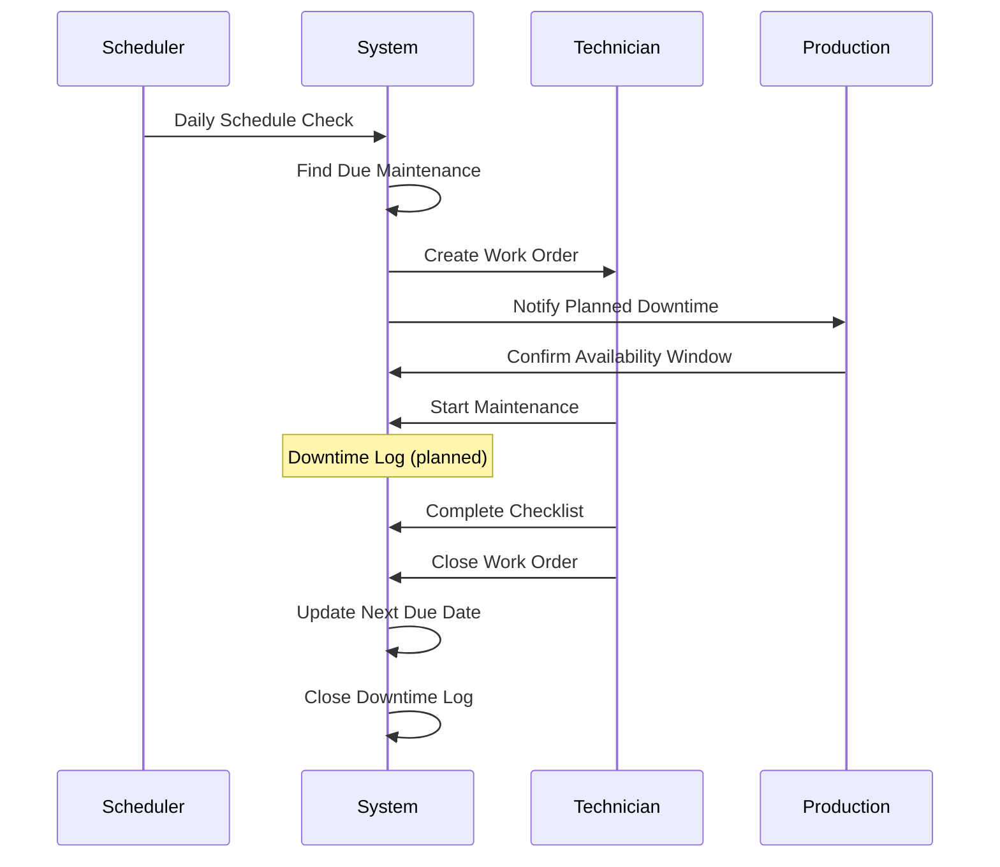

# Maintenance Management System untuk Pabrik Thermoforming

## Arsitektur Sistem



## Database Schema

### Tabel Baru yang Diperlukan

```sql
-- Kategori Asset (Thermoforming Machine, Mold, Conveyor, etc.)
CREATE TABLE asset_categories (
  id INTEGER PRIMARY KEY,
  name TEXT NOT NULL,
  description TEXT
);

-- Asset/Equipment Registry
CREATE TABLE assets (
  id INTEGER PRIMARY KEY,
  asset_code TEXT UNIQUE NOT NULL,      -- e.g., TF-001, MLD-001
  name TEXT NOT NULL,
  category_id INTEGER,
  location TEXT,
  manufacturer TEXT,
  model TEXT,
  serial_number TEXT,
  purchase_date DATE,
  warranty_expiry DATE,
  status TEXT DEFAULT 'operational',     -- operational, maintenance, breakdown, retired
  criticality TEXT DEFAULT 'medium',     -- low, medium, high, critical
  department_id INTEGER,
  created_at DATETIME DEFAULT CURRENT_TIMESTAMP,
  FOREIGN KEY (category_id) REFERENCES asset_categories(id),
  FOREIGN KEY (department_id) REFERENCES departments(id)
);

-- Failure Codes untuk kategorisasi masalah
CREATE TABLE failure_codes (
  id INTEGER PRIMARY KEY,
  code TEXT UNIQUE NOT NULL,             -- e.g., EL-001, MC-001
  category TEXT,                          -- Electrical, Mechanical, Hydraulic, etc.
  description TEXT NOT NULL
);

-- Maintenance Schedule (Preventive)
CREATE TABLE maintenance_schedules (
  id INTEGER PRIMARY KEY,
  asset_id INTEGER NOT NULL,
  title TEXT NOT NULL,
  description TEXT,
  frequency_type TEXT NOT NULL,           -- daily, weekly, monthly, quarterly, yearly, runtime_hours
  frequency_value INTEGER DEFAULT 1,
  runtime_hours_trigger INTEGER,          -- trigger after X hours of operation
  last_performed DATE,
  next_due DATE,
  estimated_duration_minutes INTEGER,
  assigned_to INTEGER,
  is_active BOOLEAN DEFAULT TRUE,
  created_at DATETIME DEFAULT CURRENT_TIMESTAMP,
  FOREIGN KEY (asset_id) REFERENCES assets(id),
  FOREIGN KEY (assigned_to) REFERENCES users(id)
);

-- Work Orders (extends existing tickets concept)
CREATE TABLE work_orders (
  id INTEGER PRIMARY KEY,
  wo_number TEXT UNIQUE NOT NULL,         -- WO-2024-0001
  asset_id INTEGER NOT NULL,
  type TEXT NOT NULL,                     -- preventive, corrective, emergency
  priority TEXT DEFAULT 'medium',
  status TEXT DEFAULT 'open',             -- open, in_progress, on_hold, completed, cancelled
  title TEXT NOT NULL,
  description TEXT,
  failure_code_id INTEGER,
  reported_by INTEGER,
  assigned_to INTEGER,
  scheduled_start DATETIME,
  scheduled_end DATETIME,
  actual_start DATETIME,
  actual_end DATETIME,
  root_cause TEXT,
  solution TEXT,
  parts_used TEXT,                        -- JSON array of parts
  labor_hours DECIMAL(5,2),
  created_at DATETIME DEFAULT CURRENT_TIMESTAMP,
  updated_at DATETIME DEFAULT CURRENT_TIMESTAMP,
  FOREIGN KEY (asset_id) REFERENCES assets(id),
  FOREIGN KEY (failure_code_id) REFERENCES failure_codes(id),
  FOREIGN KEY (reported_by) REFERENCES users(id),
  FOREIGN KEY (assigned_to) REFERENCES users(id)
);

-- Downtime Logs (UPDATED dengan classification)
CREATE TABLE downtime_logs (
  id INTEGER PRIMARY KEY,
  asset_id INTEGER NOT NULL,
  work_order_id INTEGER,
  downtime_type TEXT NOT NULL,            -- planned, unplanned
  classification_id INTEGER,              -- NEW: link ke downtime_classifications
  start_time DATETIME NOT NULL,
  end_time DATETIME,
  duration_minutes INTEGER,               -- calculated on end
  
  -- Time Context (NEW: untuk validasi apakah dalam jadwal produksi)
  was_scheduled_production BOOLEAN,       -- TRUE jika terjadi saat jadwal produksi
  production_schedule_id INTEGER,         -- Link ke schedule saat downtime terjadi
  
  reason TEXT,
  failure_code_id INTEGER,
  production_impact TEXT,                 -- JSON: units_lost, batch_affected
  logged_by INTEGER,
  created_at DATETIME DEFAULT CURRENT_TIMESTAMP,
  FOREIGN KEY (asset_id) REFERENCES assets(id),
  FOREIGN KEY (work_order_id) REFERENCES work_orders(id),
  FOREIGN KEY (classification_id) REFERENCES downtime_classifications(id),
  FOREIGN KEY (production_schedule_id) REFERENCES production_schedule(id),
  FOREIGN KEY (failure_code_id) REFERENCES failure_codes(id),
  FOREIGN KEY (logged_by) REFERENCES users(id)
);

-- Asset Runtime (untuk tracking operating hours)
CREATE TABLE asset_runtime (
  id INTEGER PRIMARY KEY,
  asset_id INTEGER NOT NULL,
  date DATE NOT NULL,
  operating_hours DECIMAL(5,2),
  idle_hours DECIMAL(5,2),
  downtime_hours DECIMAL(5,2),
  shifts_worked INTEGER DEFAULT 1,
  FOREIGN KEY (asset_id) REFERENCES assets(id),
  UNIQUE(asset_id, date)
);

-- =====================================================
-- PRODUCTION SCHEDULE (untuk menentukan waktu efektif)
-- =====================================================

-- Shift Definitions (pola shift kerja)
CREATE TABLE shift_patterns (
  id INTEGER PRIMARY KEY,
  name TEXT NOT NULL,              -- "Shift 1", "Shift 2", "Shift 3"
  start_time TIME NOT NULL,        -- 06:00
  end_time TIME NOT NULL,          -- 14:00
  break_minutes INTEGER DEFAULT 60,
  is_active BOOLEAN DEFAULT TRUE
);

-- Production Calendar (jadwal produksi harian per asset)
CREATE TABLE production_schedule (
  id INTEGER PRIMARY KEY,
  asset_id INTEGER NOT NULL,
  date DATE NOT NULL,
  shift_pattern_id INTEGER,
  status TEXT NOT NULL,            -- 'scheduled', 'no_order', 'holiday', 'maintenance_window'
  planned_start TIME,
  planned_end TIME,
  planned_production_minutes INTEGER,
  actual_production_minutes INTEGER,
  notes TEXT,
  created_by INTEGER,
  created_at DATETIME DEFAULT CURRENT_TIMESTAMP,
  FOREIGN KEY (asset_id) REFERENCES assets(id),
  FOREIGN KEY (shift_pattern_id) REFERENCES shift_patterns(id),
  FOREIGN KEY (created_by) REFERENCES users(id),
  UNIQUE(asset_id, date, shift_pattern_id)
);

-- Time Classification untuk Downtime
-- Ini menentukan apakah downtime "dihitung" atau tidak
CREATE TABLE downtime_classifications (
  id INTEGER PRIMARY KEY,
  code TEXT UNIQUE NOT NULL,
  name TEXT NOT NULL,
  description TEXT,
  counts_as_downtime BOOLEAN DEFAULT TRUE,  -- FALSE = tidak masuk perhitungan KPI
  category TEXT                              -- 'breakdown', 'planned_maintenance', 'idle', 'changeover'
);

-- Insert default classifications
INSERT INTO downtime_classifications (code, name, counts_as_downtime, category) VALUES
  ('BD-PROD', 'Breakdown during Production', TRUE, 'breakdown'),
  ('BD-IDLE', 'Breakdown during Idle (No Order)', FALSE, 'breakdown'),
  ('PM-PROD', 'Planned Maintenance during Production', TRUE, 'planned_maintenance'),
  ('PM-IDLE', 'Planned Maintenance during Idle', FALSE, 'planned_maintenance'),
  ('PM-WINDOW', 'Planned Maintenance in Maintenance Window', FALSE, 'planned_maintenance'),
  ('CO-PROD', 'Changeover/Setup during Production', TRUE, 'changeover'),
  ('IDLE-NO-ORDER', 'Idle - No Production Order', FALSE, 'idle'),
  ('IDLE-MATERIAL', 'Idle - Waiting Material', TRUE, 'idle'),
  ('IDLE-OPERATOR', 'Idle - No Operator', TRUE, 'idle');
```

## Alur Kerja (Workflow)

### 0. Production Schedule Management (Prerequisite)



**Penting:** Sebelum downtime dapat dihitung dengan akurat, jadwal produksi harus diinput terlebih dahulu.

### 1. Corrective Maintenance (Breakdown)



### 2. Preventive Maintenance



## Perhitungan KPI

### Konsep Waktu dalam Manufaktur

```
┌─────────────────────────────────────────────────────────────────────────┐
│                    TOTAL CALENDAR TIME (24 jam x 30 hari)               │
├─────────────────────────────────────────────────────────────────────────┤
│  ┌─────────────────────────────────────────────────────────────────┐   │
│  │              SCHEDULED PRODUCTION TIME                           │   │
│  │  (Waktu yang dijadwalkan untuk produksi berdasarkan order)       │   │
│  │                                                                   │   │
│  │  ┌─────────────────────────────────────────────────────────┐    │   │
│  │  │           ACTUAL AVAILABLE TIME                          │    │   │
│  │  │  (Scheduled - Planned Maintenance Window)                │    │   │
│  │  │                                                          │    │   │
│  │  │  ┌─────────────────────────────────────────────────┐   │    │   │
│  │  │  │         ACTUAL OPERATING TIME                    │   │    │   │
│  │  │  │  (Available - Unplanned Downtime)                │   │    │   │
│  │  │  └─────────────────────────────────────────────────┘   │    │   │
│  │  └─────────────────────────────────────────────────────────┘    │   │
│  └─────────────────────────────────────────────────────────────────┘   │
│                                                                         │
│  ░░░░░░░░░░░░░░░░░░░░░░░░░░░░░░░░░░░░░░░░░░░░░░░░░░░░░░░░░░░░░░░░░░   │
│  NON-SCHEDULED TIME (No Order, Holiday, Off-shift)                      │
│  → Downtime disini TIDAK DIHITUNG dalam KPI                             │
└─────────────────────────────────────────────────────────────────────────┘
```

### Klasifikasi Downtime

| Situasi | Klasifikasi | Hitung Downtime? | Alasan |

|---------|-------------|------------------|--------|

| Mesin rusak SAAT produksi jalan | BD-PROD | ✅ YA | Mengganggu produksi |

| Mesin rusak SAAT tidak ada order | BD-IDLE | ❌ TIDAK | Tidak ada impact produksi |

| PM dijadwalkan SAAT produksi | PM-PROD | ✅ YA | Mengurangi waktu produksi |

| PM dijadwalkan di maintenance window | PM-WINDOW | ❌ TIDAK | Sudah dialokasikan |

| PM dilakukan SAAT tidak ada order | PM-IDLE | ❌ TIDAK | Oportunistic maintenance |

| Idle karena tidak ada order | IDLE-NO-ORDER | ❌ TIDAK | Bukan masalah mesin |

| Idle karena menunggu material | IDLE-MATERIAL | ✅ YA | Loss time yang bisa dihindari |

### Rumus Downtime & Metrics (UPDATED)

```javascript
// ============================================
// 1. SCHEDULED PRODUCTION TIME
// ============================================
// Waktu yang seharusnya mesin berproduksi berdasarkan jadwal
scheduledProductionTime = SUM(production_schedule.planned_production_minutes) 
  WHERE asset_id = X 
  AND date BETWEEN startDate AND endDate
  AND status = 'scheduled'

// ============================================
// 2. ACTUAL DOWNTIME (yang dihitung untuk KPI)
// ============================================
// Hanya downtime yang terjadi SAAT jadwal produksi
actualDowntime = SUM(downtime_logs.duration_minutes)
  WHERE asset_id = X
  AND was_scheduled_production = TRUE
  AND classification.counts_as_downtime = TRUE

// Downtime yang TIDAK dihitung (untuk informasi saja)
nonCountedDowntime = SUM(downtime_logs.duration_minutes)
  WHERE asset_id = X
  AND (was_scheduled_production = FALSE OR classification.counts_as_downtime = FALSE)

// ============================================
// 3. AVAILABILITY (yang akurat)
// ============================================
// Availability = (Scheduled Time - Counted Downtime) / Scheduled Time * 100
Availability = ((scheduledProductionTime - actualDowntime) / scheduledProductionTime) * 100

// ============================================
// 4. MTBF (Mean Time Between Failures)
// ============================================
// Hanya hitung failure yang terjadi saat produksi
numberOfFailures = COUNT(downtime_logs) 
  WHERE was_scheduled_production = TRUE 
  AND downtime_type = 'unplanned'
  
operatingTime = scheduledProductionTime - actualDowntime
MTBF = operatingTime / numberOfFailures  // dalam jam

// ============================================
// 5. MTTR (Mean Time To Repair)
// ============================================
// Waktu repair rata-rata (semua repair dihitung)
totalRepairTime = SUM(work_orders.labor_hours) 
  WHERE type IN ('corrective', 'emergency')
  AND status = 'completed'
  
numberOfRepairs = COUNT(work_orders) WHERE ...
MTTR = totalRepairTime / numberOfRepairs

// ============================================
// 6. OEE (Overall Equipment Effectiveness)
// ============================================
// A = Availability (seperti di atas)
// P = Performance = Actual Output / Target Output
// Q = Quality = Good Units / Total Units

OEE = (A/100) * (P/100) * (Q/100) * 100
```

### Auto-Classification Logic

```javascript
// Saat membuat downtime log, sistem otomatis menentukan klasifikasi
function classifyDowntime(assetId, startTime, downtimeType) {
  // 1. Cek apakah ada jadwal produksi saat ini
  const schedule = getProductionSchedule(assetId, startTime);
  
  if (!schedule || schedule.status === 'no_order') {
    // Tidak ada jadwal produksi
    if (downtimeType === 'planned') {
      return 'PM-IDLE';  // PM saat idle - tidak dihitung
    } else {
      return 'BD-IDLE';  // Breakdown saat idle - tidak dihitung
    }
  }
  
  if (schedule.status === 'maintenance_window') {
    return 'PM-WINDOW';  // Di maintenance window - tidak dihitung
  }
  
  if (schedule.status === 'scheduled') {
    // Ada jadwal produksi aktif
    if (downtimeType === 'planned') {
      return 'PM-PROD';  // PM saat produksi - DIHITUNG
    } else {
      return 'BD-PROD';  // Breakdown saat produksi - DIHITUNG
    }
  }
}
```

## Struktur File Baru

### Backend

```
server/src/
├── routes/
│   ├── assets.js           # CRUD asset, status updates
│   ├── workOrders.js       # Work order management
│   ├── downtime.js         # Downtime logging & tracking
│   ├── maintenance.js      # Preventive schedules
│   └── reports.js          # KPI calculations
├── services/
│   ├── downtimeCalculator.js   # Downtime metrics
│   ├── kpiService.js           # MTBF, MTTR, OEE
│   └── scheduleService.js      # Auto-generate WO
└── database/
    └── setup.js            # Updated with new tables
```

### Frontend

```
client/src/
├── pages/
│   ├── Assets.tsx              # Asset registry list
│   ├── AssetDetail.tsx         # Single asset view + history
│   ├── WorkOrders.tsx          # Work order list
│   ├── WorkOrderDetail.tsx     # WO detail + downtime
│   ├── ProductionSchedule.tsx  # NEW: Calendar jadwal produksi
│   ├── MaintenanceCalendar.tsx # Schedule calendar view
│   ├── DowntimeTracker.tsx     # Active downtime monitor
│   └── MaintenanceKPI.tsx      # KPI Dashboard
├── components/
│   ├── DowntimeTimer.tsx       # Live downtime counter
│   ├── DowntimeLogModal.tsx    # NEW: Form downtime dengan auto-classification
│   ├── ScheduleCheckBadge.tsx  # NEW: Shows production status at time
│   ├── AssetStatusBadge.tsx    # Status indicator
│   ├── MaintenanceScheduleCard.tsx
│   ├── KPICard.tsx             # Metric display
│   └── DowntimeChart.tsx       # Visualizations
└── services/
    └── api.ts                  # New API endpoints
```

## UI Mockup - Production Schedule

```
┌─────────────────────────────────────────────────────────────────────────┐
│  PRODUCTION SCHEDULE - December 2024                    [+ Add Schedule]│
├─────────────────────────────────────────────────────────────────────────┤
│  Asset: [TF-001 ▼]    View: [Week ▼]    [◀ Week 50] [Week 51 ▶]       │
├─────────────────────────────────────────────────────────────────────────┤
│       │ Mon 16  │ Tue 17  │ Wed 18  │ Thu 19  │ Fri 20  │ Sat 21 │Sun│
│───────┼─────────┼─────────┼─────────┼─────────┼─────────┼────────┼───│
│Shift 1│ ████████│ ████████│ ████████│ ░░░░░░░░│ ████████│        │   │
│06-14  │ PROD    │ PROD    │ PROD    │ NO ORDER│ PROD    │  OFF   │OFF│
│───────┼─────────┼─────────┼─────────┼─────────┼─────────┼────────┼───│
│Shift 2│ ████████│ ████████│ ▓▓▓▓▓▓▓▓│ ░░░░░░░░│ ████████│        │   │
│14-22  │ PROD    │ PROD    │ PM WIN  │ NO ORDER│ PROD    │  OFF   │OFF│
│───────┼─────────┼─────────┼─────────┼─────────┼─────────┼────────┼───│
│Shift 3│         │         │         │         │         │        │   │
│22-06  │  OFF    │  OFF    │  OFF    │  OFF    │  OFF    │  OFF   │OFF│
└─────────────────────────────────────────────────────────────────────────┘
│ Legend: ████ = Scheduled Production  ░░░░ = No Order  ▓▓▓▓ = PM Window │
└─────────────────────────────────────────────────────────────────────────┘
```

## UI Mockup - Downtime Entry dengan Classification

```
┌─────────────────────────────────────────────────────────────────────────┐
│  LOG DOWNTIME                                                    [X]   │
├─────────────────────────────────────────────────────────────────────────┤
│  Asset:        [TF-001 - Thermoforming Machine 1 ▼]                    │
│                                                                         │
│  Start Time:   [2024-12-18] [09:30]                                    │
│  End Time:     [2024-12-18] [11:45]       Duration: 2h 15m             │
│                                                                         │
│  ┌───────────────────────────────────────────────────────────────────┐ │
│  │ ⚠️ SCHEDULE CHECK                                                  │ │
│  │                                                                    │ │
│  │ Status: 🟢 SCHEDULED PRODUCTION                                   │ │
│  │ Shift: Shift 1 (06:00 - 14:00)                                   │ │
│  │                                                                    │ │
│  │ ℹ️ Downtime ini akan DIHITUNG dalam KPI karena terjadi           │ │
│  │    saat jadwal produksi aktif.                                    │ │
│  └───────────────────────────────────────────────────────────────────┘ │
│                                                                         │
│  Type:         (●) Unplanned/Breakdown  ( ) Planned Maintenance        │
│                                                                         │
│  Classification: [BD-PROD - Breakdown during Production ▼]             │
│                  ✅ Counts as downtime                                  │
│                                                                         │
│  Failure Code: [EL-003 - Motor Overload ▼]                             │
│                                                                         │
│  Reason:       [___________________________________________]           │
│                                                                         │
│  Production Impact:                                                     │
│    Units Lost: [150]    Batch Affected: [BATCH-2024-1218]             │
│                                                                         │
│                              [Cancel]  [Save Downtime]                  │
└─────────────────────────────────────────────────────────────────────────┘
```

## UI Mockup - Downtime Entry SAAT TIDAK ADA ORDER

```
┌─────────────────────────────────────────────────────────────────────────┐
│  LOG DOWNTIME                                                    [X]   │
├─────────────────────────────────────────────────────────────────────────┤
│  Asset:        [TF-001 - Thermoforming Machine 1 ▼]                    │
│                                                                         │
│  Start Time:   [2024-12-19] [10:00]                                    │
│  End Time:     [2024-12-19] [14:30]       Duration: 4h 30m             │
│                                                                         │
│  ┌───────────────────────────────────────────────────────────────────┐ │
│  │ ℹ️ SCHEDULE CHECK                                                  │ │
│  │                                                                    │ │
│  │ Status: ⚪ NO PRODUCTION ORDER                                     │ │
│  │ Reason: Tidak ada order produksi untuk tanggal ini                │ │
│  │                                                                    │ │
│  │ ℹ️ Downtime ini TIDAK akan dihitung dalam KPI Availability        │ │
│  │    karena mesin memang tidak dijadwalkan untuk produksi.          │ │
│  │                                                                    │ │
│  │ 💡 Tip: Ini adalah waktu yang baik untuk melakukan                │ │
│  │         Preventive Maintenance (Opportunistic PM)                  │ │
│  └───────────────────────────────────────────────────────────────────┘ │
│                                                                         │
│  Type:         (●) Unplanned/Breakdown  ( ) Planned Maintenance        │
│                                                                         │
│  Classification: [BD-IDLE - Breakdown during Idle (No Order) ▼]        │
│                  ⚪ Does NOT count as downtime                          │
│                                                                         │
│  (rest of form...)                                                      │
└─────────────────────────────────────────────────────────────────────────┘
```

## UI Mockup - KPI Dashboard

```
┌─────────────────────────────────────────────────────────────────┐
│  MAINTENANCE KPI DASHBOARD                      [Last 30 Days ▼]│
├─────────────────────────────────────────────────────────────────┤
│  ┌──────────┐  ┌──────────┐  ┌──────────┐  ┌──────────┐        │
│  │ MTBF     │  │ MTTR     │  │ Avail.   │  │ Downtime │        │
│  │ 156 hrs  │  │ 2.4 hrs  │  │ 94.2%    │  │ 48.5 hrs │        │
│  │ ▲ +12%   │  │ ▼ -8%    │  │ ▲ +2.1%  │  │ ▼ -15%   │        │
│  └──────────┘  └──────────┘  └──────────┘  └──────────┘        │
│                                                                 │
│  ┌─────────────────────────────┐  ┌─────────────────────────┐  │
│  │ DOWNTIME BY ASSET           │  │ DOWNTIME TREND          │  │
│  │ ████████████ TF-001 (18h)   │  │     ╭─╮                 │  │
│  │ ████████ TF-002 (12h)       │  │   ╭─╯ ╰─╮    ╭─╮       │  │
│  │ █████ MLD-003 (8h)          │  │ ╭─╯     ╰────╯ ╰─╮     │  │
│  │ ███ CVY-001 (5h)            │  │ Week 1  2  3  4  5     │  │
│  └─────────────────────────────┘  └─────────────────────────┘  │
│                                                                 │
│  ┌─────────────────────────────────────────────────────────┐   │
│  │ RECENT WORK ORDERS                                      │   │
│  │ WO-2024-0045 │ TF-001 │ Corrective │ Completed │ 2.5h   │   │
│  │ WO-2024-0044 │ MLD-003│ Preventive │ In Progress│ -     │   │
│  │ WO-2024-0043 │ TF-002 │ Emergency  │ Completed │ 4.0h   │   │
│  └─────────────────────────────────────────────────────────┘   │
└─────────────────────────────────────────────────────────────────┘
```

## Fitur Khusus Thermoforming

Untuk pabrik thermoforming, perlu tracking khusus:

| Asset Type | Preventive Items | Common Failures |

|------------|------------------|-----------------|

| Thermoforming Machine | Heater inspection, Vacuum check, Pneumatic system | Heater failure, Vacuum leak, Forming issue |

| Mold/Die | Cleaning, Lubrication, Wear check | Surface damage, Alignment issue |

| Conveyor | Belt tension, Roller bearing | Belt slip, Motor overload |

| Chiller | Coolant level, Filter cleaning | Temperature fluctuation, Compressor issue |

| Compressor | Oil change, Filter replacement | Pressure drop, Overheating |

## Integrasi dengan Fitur Existing

- **Tickets** → Work Orders (extended version)
- **Assignees** → Technician assignment
- **Notifications** → Breakdown alerts, schedule reminders
- **Performance** → Technician KPI (MTTR per technician)
- **Timeline** → Maintenance schedule visualization
- **Departments** → Asset grouping by production line

## Estimasi Development

| Phase | Fitur | Estimasi |

|-------|-------|----------|

| Phase 1a | Database + Asset Registry | 2-3 hari |

| Phase 1b | Production Schedule (Shift, Calendar) | 1-2 hari |

| Phase 2 | Work Order Management | 2-3 hari |

| Phase 3 | Downtime Tracking + Auto Classification | 2-3 hari |

| Phase 4 | Preventive Maintenance Schedule | 2 hari |

| Phase 5 | KPI Dashboard (Accurate Calculation) | 2-3 hari |

| Phase 6 | Testing & Refinement | 2 hari |

| **Total** | | **13-18 hari** |