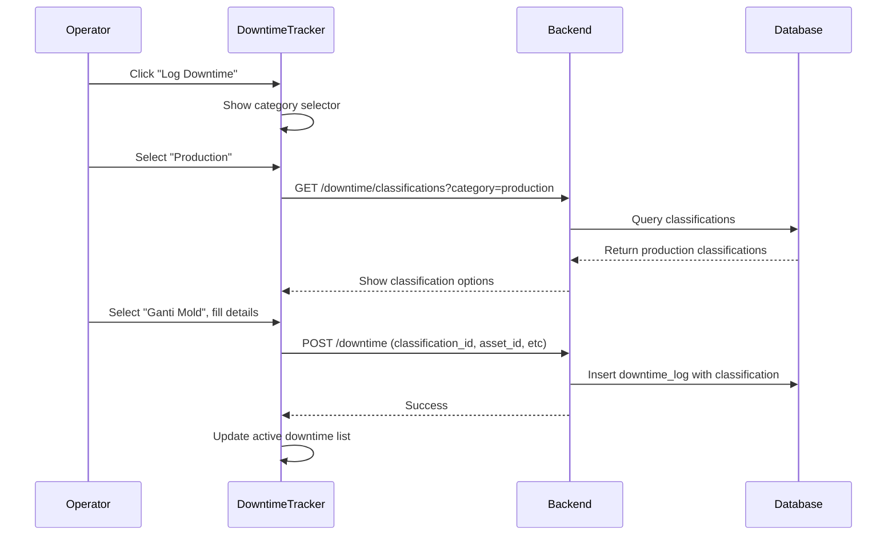

# Production Downtime Extension

## Summary

Extend the current downtime system by adding new production-specific classifications and updating the UI to allow operators to manually log production downtime events.

## Current System Analysis

The system already has:

- `downtime_logs` table with `downtime_type` (planned/unplanned) and `classification_id`
- `downtime_classifications` table with categories: `breakdown`, `planned_maintenance`, `changeover`, `idle`
- One changeover classification already exists: `CO-PROD`

## Changes Required

### 1. Database: Add New Production Classifications

Add new classifications to the `downtime_classifications` table via migration:

| Code | Name | Description | counts_as_downtime | Category |

|------|------|-------------|-------------------|----------|

| CO-PRODUCT | Ganti Produk | Changeover untuk ganti produk | 1 | production |

| CO-MOLD | Ganti Mold | Ganti mold/die | 1 | production |

| CO-SETUP | Setup Mesin | Setup awal atau adjustment | 1 | production |

| CO-COLOR | Ganti Warna | Changeover warna material | 1 | production |

| QC-REJECT | Quality Issue | Stop karena reject/rework | 1 | production |

| QC-INSPECT | Inspeksi QC | Stop untuk inspeksi kualitas | 0 | production |

| MAT-WAIT | Tunggu Material | Menunggu material/bahan baku | 1 | production |

| MAT-CHANGE | Ganti Material | Proses ganti material | 1 | production |

| OPR-BREAK | Istirahat Operator | Scheduled operator break | 0 | production |

| OPR-ABSENT | Operator Tidak Ada | Tidak ada operator tersedia | 1 | production |

| MINOR-ADJ | Minor Adjustment | Stop singkat untuk adjustment | 0 | production |

**File**: Create [`task-manager-server/src/database/migrations/add_production_downtime.ts`](task-manager-server/src/database/migrations/add_production_downtime.ts)

### 2. Backend: Update Types and Routes

Update [`task-manager-server/src/routes/downtime.ts`](task-manager-server/src/routes/downtime.ts):

- Modify `classifyDowntime()` to handle production category
- Add production downtime type to validation
- Update `/classifications/list` to support category filtering

Update [`task-manager-client/src/types/index.ts`](task-manager-client/src/types/index.ts):

- Add `'production'` to `DowntimeClassification.category` type

### 3. Frontend: Update DowntimeTracker UI

Update [`task-manager-client/src/pages/DowntimeTracker.tsx`](task-manager-client/src/pages/DowntimeTracker.tsx):

```
┌────────────────────────────────────────────┐
│  LOG DOWNTIME BARU                         │
├────────────────────────────────────────────┤
│  Kategori:                                 │
│  ○ Maintenance (breakdown/PM)              │
│  ○ Production (changeover/setup)           │
│                                            │
│  [If Production selected]                  │
│  Tipe:                                     │
│  ┌──────────────────────────────────────┐ │
│  │ ▼ Pilih Tipe Downtime...             │ │
│  │   • Ganti Produk                     │ │
│  │   • Ganti Mold                       │ │
│  │   • Setup Mesin                      │ │
│  │   • Tunggu Material                  │ │
│  │   • Quality Issue                    │ │
│  │   • ...                              │ │
│  └──────────────────────────────────────┘ │
│                                            │
│  [Form fields...]                          │
└────────────────────────────────────────────┘
```

Changes:

- Add category selection (Maintenance vs Production)
- Show relevant classifications based on category
- Add filter tabs: "Semua | Maintenance | Production"
- Update stats display to show production vs maintenance breakdown

### 4. Update Reports/KPI

Update [`task-manager-client/src/pages/MaintenanceKPI.tsx`](task-manager-client/src/pages/MaintenanceKPI.tsx):

- Add production downtime section
- Show breakdown by production category

## Data Flow



## Files to Modify

1. **[`task-manager-server/src/database/migrations/add_production_downtime.ts`](task-manager-server/src/database/migrations/add_production_downtime.ts)** (new) - Migration for new classifications
2. **[`task-manager-server/src/routes/downtime.ts`](task-manager-server/src/routes/downtime.ts)** - Add category filter for classifications endpoint
3. **[`task-manager-client/src/types/index.ts`](task-manager-client/src/types/index.ts)** - Update DowntimeClassification type
4. **[`task-manager-client/src/pages/DowntimeTracker.tsx`](task-manager-client/src/pages/DowntimeTracker.tsx)** - Add category selector and filter UI
5. **[`task-manager-client/src/services/api.ts`](task-manager-client/src/services/api.ts)** - Add category param to getClassifications