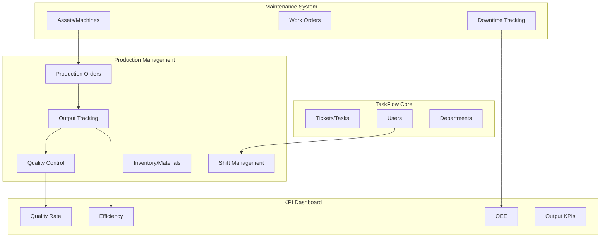

# Production Management System untuk TaskFlow

## Overview

Menambahkan modul Production Management yang terintegrasi dengan sistem TaskFlow dan MMS (Maintenance Management System) yang sudah direncanakan. Sistem ini akan membantu tracking produksi di pabrik thermoforming.

## Architecture



## Fitur yang Akan Ditambahkan

### 1. Production Orders

- Create/manage production orders (PO)
- Link ke machine/asset dari MMS
- Bill of Materials (BOM) sederhana
- Status tracking: Draft -> Scheduled -> In Progress -> Completed
- Target quantity vs actual output
- Due date dan priority

### 2. Output Tracking

- Record output per shift/jam
- Cycle time tracking
- Good output vs reject/scrap
- Real-time production counter
- Output history per machine

### 3. Quality Control (QC)

- Inspection records per batch/lot
- Defect categorization (visual, dimensional, functional)
- Reject reason tracking
- Quality hold management
- First Pass Yield (FPY) calculation

### 4. Shift Management

- Shift schedule (3 shifts: Pagi, Siang, Malam)
- Operator assignment per machine
- Shift handover notes
- Attendance simple tracking
- Shift production summary

### 5. Inventory/Materials (Basic)

- Raw material stock tracking
- Material consumption per PO
- Finished goods inventory
- Low stock alerts
- Material movement history

### 6. Production KPIs Dashboard

- Daily/Weekly/Monthly output summary
- OEE breakdown (Availability x Performance x Quality)
- Output per machine comparison
- Efficiency trends
- Quality metrics (defect rate, FPY, scrap rate)
- Target vs Actual comparison

## Database Schema

```sql
-- Production Orders
CREATE TABLE production_orders (
    id INTEGER PRIMARY KEY,
    po_number TEXT UNIQUE,
    product_name TEXT,
    asset_id INTEGER REFERENCES assets(id),
    target_quantity INTEGER,
    actual_quantity INTEGER DEFAULT 0,
    reject_quantity INTEGER DEFAULT 0,
    status TEXT DEFAULT 'draft',
    priority TEXT DEFAULT 'medium',
    scheduled_start DATETIME,
    scheduled_end DATETIME,
    actual_start DATETIME,
    actual_end DATETIME,
    notes TEXT,
    created_by INTEGER REFERENCES users(id),
    created_at DATETIME DEFAULT CURRENT_TIMESTAMP
);

-- Production Output (per shift/batch)
CREATE TABLE production_outputs (
    id INTEGER PRIMARY KEY,
    production_order_id INTEGER REFERENCES production_orders(id),
    asset_id INTEGER REFERENCES assets(id),
    shift_id INTEGER REFERENCES shifts(id),
    operator_id INTEGER REFERENCES users(id),
    good_quantity INTEGER,
    reject_quantity INTEGER,
    cycle_time_seconds REAL,
    start_time DATETIME,
    end_time DATETIME,
    notes TEXT,
    created_at DATETIME DEFAULT CURRENT_TIMESTAMP
);

-- Quality Inspections
CREATE TABLE quality_inspections (
    id INTEGER PRIMARY KEY,
    production_output_id INTEGER REFERENCES production_outputs(id),
    inspector_id INTEGER REFERENCES users(id),
    sample_size INTEGER,
    pass_quantity INTEGER,
    fail_quantity INTEGER,
    defect_type TEXT,
    defect_details TEXT,
    status TEXT DEFAULT 'pending',
    inspected_at DATETIME DEFAULT CURRENT_TIMESTAMP
);

-- Shifts
CREATE TABLE shifts (
    id INTEGER PRIMARY KEY,
    name TEXT,
    start_time TIME,
    end_time TIME,
    date DATE,
    supervisor_id INTEGER REFERENCES users(id),
    notes TEXT,
    status TEXT DEFAULT 'scheduled'
);

-- Shift Assignments
CREATE TABLE shift_assignments (
    id INTEGER PRIMARY KEY,
    shift_id INTEGER REFERENCES shifts(id),
    user_id INTEGER REFERENCES users(id),
    asset_id INTEGER REFERENCES assets(id),
    role TEXT DEFAULT 'operator'
);

-- Materials/Inventory
CREATE TABLE materials (
    id INTEGER PRIMARY KEY,
    code TEXT UNIQUE,
    name TEXT,
    unit TEXT,
    current_stock REAL DEFAULT 0,
    minimum_stock REAL DEFAULT 0,
    unit_cost REAL,
    category TEXT
);

-- Material Movements
CREATE TABLE material_movements (
    id INTEGER PRIMARY KEY,
    material_id INTEGER REFERENCES materials(id),
    movement_type TEXT,
    quantity REAL,
    production_order_id INTEGER REFERENCES production_orders(id),
    reference_note TEXT,
    created_by INTEGER REFERENCES users(id),
    created_at DATETIME DEFAULT CURRENT_TIMESTAMP
);
```

## UI Pages

| Page | Route | Description |

|------|-------|-------------|

| Production Dashboard | `/production` | Overview KPI, active orders, shift summary |

| Production Orders | `/production/orders` | List & manage production orders |

| Order Detail | `/production/orders/:id` | Detail PO dengan output tracking |

| Output Entry | `/production/output` | Quick entry untuk record output |

| Quality Control | `/production/quality` | QC inspections list |

| Shift Management | `/production/shifts` | Shift schedule & assignments |

| Inventory | `/production/inventory` | Material stock management |

## API Endpoints

```
Production Orders:
- GET/POST /api/production/orders
- GET/PUT/DELETE /api/production/orders/:id
- POST /api/production/orders/:id/start
- POST /api/production/orders/:id/complete

Output Tracking:
- GET/POST /api/production/outputs
- GET /api/production/outputs/by-order/:orderId
- GET /api/production/outputs/by-shift/:shiftId

Quality:
- GET/POST /api/production/quality
- PUT /api/production/quality/:id/approve
- PUT /api/production/quality/:id/reject

Shifts:
- GET/POST /api/production/shifts
- GET /api/production/shifts/today
- POST /api/production/shifts/:id/assignments

Inventory:
- GET/POST /api/production/materials
- POST /api/production/materials/:id/movement
- GET /api/production/materials/low-stock

Reports:
- GET /api/production/reports/daily
- GET /api/production/reports/oee
- GET /api/production/reports/output-summary
```

## Implementation Phases

### Phase 1: Foundation (Database + Basic API)

- Setup database tables
- Production Orders CRUD API
- Basic UI untuk orders list

### Phase 2: Output Tracking

- Output recording API
- Quick entry form UI
- Output history per order

### Phase 3: Quality Control

- QC inspection API
- Defect tracking
- QC dashboard

### Phase 4: Shift Management

- Shift scheduling
- Operator assignments
- Shift handover

### Phase 5: Inventory

- Material master
- Stock movements
- Low stock alerts

### Phase 6: KPI Dashboard

- Production dashboard UI
- OEE calculation (integrate with MMS downtime)
- Charts dan reports

## Integration Points

1. **With MMS (Assets)**: Production orders linked to machines/assets
2. **With MMS (Downtime)**: OEE calculation uses downtime data
3. **With TaskFlow (Users)**: Operators, supervisors, QC inspectors
4. **With TaskFlow (Tickets)**: Create tickets for production issues