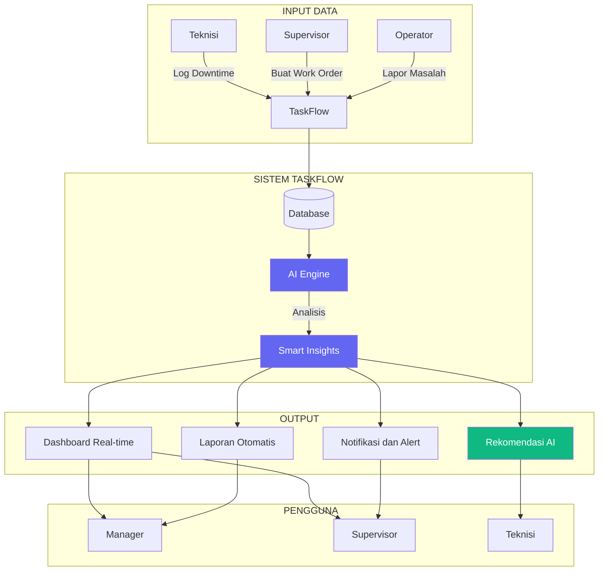
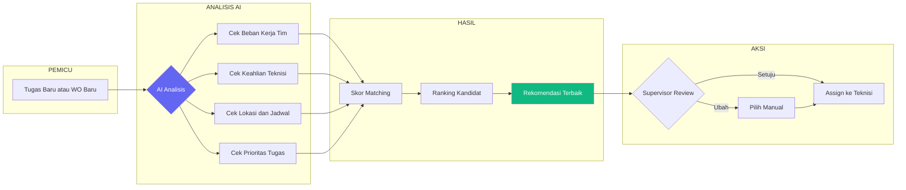
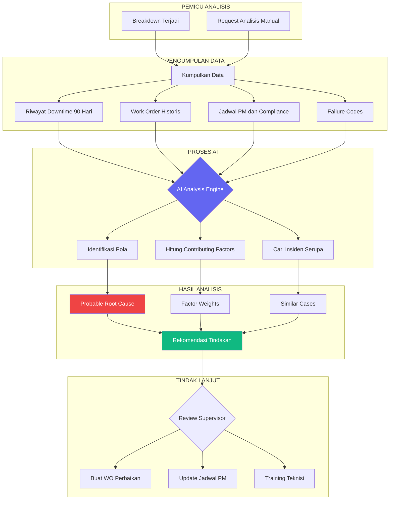
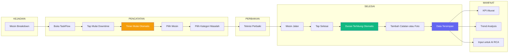
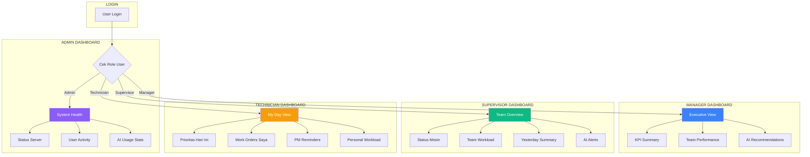
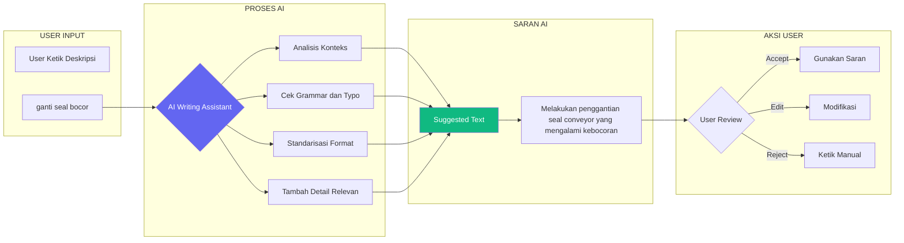
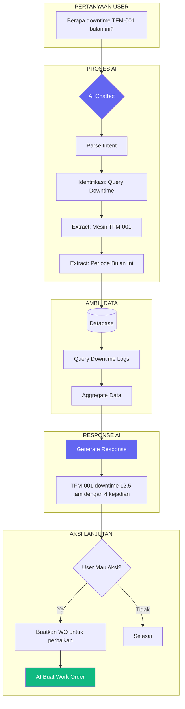
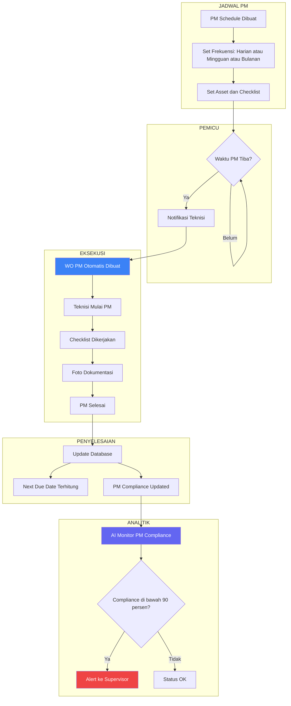
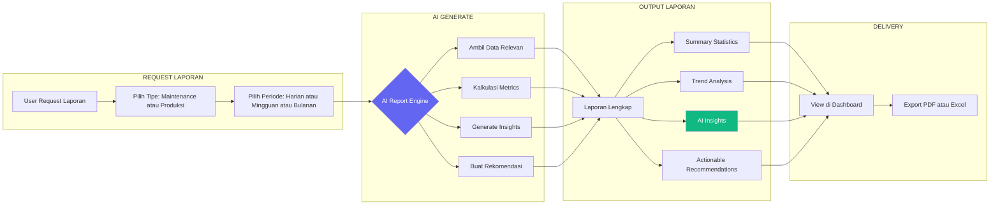

# Workflow Diagrams - TaskFlow Management System

Dokumen ini berisi diagram workflow yang dapat digunakan untuk presentasi.

---

## 1. Alur Sistem TaskFlow Secara Keseluruhan

---

## 2. Alur AI Smart Assignment - Penugasan Cerdas

---

## 3. Alur Root Cause Analysis - Analisis Akar Masalah

---

## 4. Alur Pencatatan Downtime

---

## 5. Alur Dashboard Berbasis Role

---

## 6. Alur AI Writing Assistant

---

## 7. Alur AI Chatbot

---

## 8. Alur Preventive Maintenance Workflow

---

## 9. Alur AI Report Generation

---

## 10. Overview: Manfaat AI untuk Setiap Role

```mermaid
flowchart TB
    subgraph CENTER["AI ENGINE"]
        AI[TaskFlow AI]
    end

    subgraph TECHNICIAN["TEKNISI"]
        T1[Writing Assistant]
        T2[Priority Suggestions]
        T3[Troubleshooting Tips]
    end

    subgraph SUPERVISOR["SUPERVISOR"]
        S1[Smart Assignment]
        S2[Team Workload Balancing]
        S3[Breakdown Alerts]
        S4[Root Cause Analysis]
    end

    subgraph MANAGER["MANAGER"]
        M1[Executive Reports]
        M2[KPI Insights]
        M3[Resource Recommendations]
        M4[Predictive Alerts]
    end

    subgraph ADMIN["ADMIN"]
        A1[AI Usage Analytics]
        A2[Cost Monitoring]
        A3[Feature Control]
    end

    AI --> T1
    AI --> T2
    AI --> T3
    AI --> S1
    AI --> S2
    AI --> S3
    AI --> S4
    AI --> M1
    AI --> M2
    AI --> M3
    AI --> M4
    AI --> A1
    AI --> A2
    AI --> A3

    style AI fill:#6366f1,color:#fff
    style T1 fill:#f59e0b,color:#fff
    style T2 fill:#f59e0b,color:#fff
    style T3 fill:#f59e0b,color:#fff
    style S1 fill:#10b981,color:#fff
    style S2 fill:#10b981,color:#fff
    style S3 fill:#10b981,color:#fff
    style S4 fill:#10b981,color:#fff
    style M1 fill:#3b82f6,color:#fff
    style M2 fill:#3b82f6,color:#fff
    style M3 fill:#3b82f6,color:#fff
    style M4 fill:#3b82f6,color:#fff
    style A1 fill:#8b5cf6,color:#fff
    style A2 fill:#8b5cf6,color:#fff
    style A3 fill:#8b5cf6,color:#fff
```

---

*Dokumen ini berisi 10 diagram workflow untuk keperluan presentasi sistem TaskFlow.*
