# Dokumentasi Proyek TaskFlow
**Untuk Tinjauan Manajemen**

---

## 1. Tujuan dan Latar Belakang

**TaskFlow** adalah sistem manajemen terintegrasi yang dirancang untuk mentransformasi operasional pabrik dari metode manual menjadi digital dan otomatis.

### Tujuan Utama:
1.  **Digitalisasi Proses**: Menggantikan pencatatan kertas/Excel dengan sistem database terpusat.
2.  **Efisiensi Operasional**: Mengurangi downtime mesin dengan Preventive Maintenance (PM) yang terjadwal dan terintegrasi.
3.  **Transparansi Data**: Memberikan visibilitas real-time terhadap performa tim, status mesin, dan progres produksi.
4.  **Pengambilan Keputusan Berbasis Data**: Menyediakan laporan dan KPI (Key Performance Indicators) otomatis untuk manajemen.

---

## 2. Transformasi Operasional (Sebelum vs Sesudah)

Berikut adalah perbandingan kondisi operasional sebelum dan sesudah implementasi TaskFlow:

| Aspek | ❌ Sebelum TaskFlow | ✅ Sesudah TaskFlow (Target) |
| :--- | :--- | :--- |
| **Pencatatan Tugas** | Manual di kertas, whiteboard, atau Excel terpisah. | Tercatat digital, terpusat, dan mudah dilacak statusnya. |
| **Tracking Progress** | Sulit memantau progres harian tim; sering terjadi miskomunikasi. | Progress real-time; atasan dapat melihat status 'Todo', 'In Progress', atau 'Done' kapan saja. |
| **Maintenance Mesin** | Sering terjadi breakdown mendadak (Corrective Maintenance). | Fokus pada **Preventive Maintenance** terjadwal untuk mencegah kerusakan. |
| **Data Downtime** | Durasi dan penyebab mesin mati sering tidak tercatat akurat. | Downtime tercatat presisi dengan klasifikasi penyebab otomatis. |
| **Pelaporan** | Pembuatan laporan memakan waktu lama (rekap manual). | Laporan dan grafik KPI tersedia instan (otomatis). |
| **Koordinasi** | Komunikasi antar departemen (Produksi, Maintenance) terhambat. | Semua tim terintegrasi dalam satu platform yang sama. |

---

## 3. Fitur Unggulan dan Kelebihan

TaskFlow menawarkan fitur komprehensif yang mencakup empat pilar utama operasional pabrik:

### A. 📋 Task Management (Manajemen Tugas)
*   **Kanban Board**: Visualisasi tugas (seperti Trello/Jira) untuk memudahkan pemantauan aliran kerja (Todo → In Progress → Done).
*   **Ticket System**: Pembuatan tiket perbaikan dengan prioritas (Critical, High, Medium, Low) dan notifikasi penugasan.
*   **Timeline (Gantt Chart)**: Visualisasi jadwal proyek dalam bentuk timeline untuk melihat dependensi antar tugas dan perencanaan resource.
*   **Sprint & Epic**: Perencanaan kerja periodik (mingguan/bulanan) untuk manajemen proyek jangka panjang.

### B. 🔧 Maintenance Management (Pemeliharaan)
*   **Preventive Maintenance (PM) dengan LOOP**: Fitur jadwal otomatis yang mampu meng-generate jadwal perawatan berulang (harian/bulanan) hingga akhir tahun dalam sekali klik.
*   **Auto-Reminder**: Notifikasi otomatis kepada teknisi sebelum jadwal jatuh tempo.
*   **Asset Management**: Database lengkap sejarah mesin, spesifikasi, lokasi, dan riwayat perbaikan per mesin.
*   **Integrasi Downtime**: Setiap perbaikan otomatis tercatat sebagai downtime untuk kalkulasi KPI.

### C. 🏭 Production Monitoring (Produksi)
*   **Jadwal Produksi**: Sinkronisasi jadwal produksi dengan window maintenance.
*   **OEE Tracking (Overall Equipment Effectiveness)**: Pemantauan KPI produksi yang mencakup:
    *   *Availability*: Ketersediaan waktu mesin.
    *   *Performance*: Kecepatan produksi dibanding standar.
    *   *Quality*: Persentase produk bagus vs reject.

### D. 🤖 AI Assistant (Kecerdasan Buatan)
*   **Smart Checklist**: AI menyarankan checklist perawatan berdasarkan riwayat kerusakan mesin.
*   **Analisis Downtime**: Identifikasi pola kerusakan berulang untuk rekomendasi tindakan preventif.

---

## 4. Arsitektur Sistem (High Level)

TaskFlow dibangun dengan arsitektur modular yang modern, memisahkan lapisan platform, logika bisnis, kecerdasan buatan, dan manajemen data untuk skalabilitas maksimal.

```mermaid
graph TD
    subgraph PLATFORM ["🖥️ TASKFLOW PLATFORM"]
        direction TB
        UI[Web Interface & Mobile PWA]
    end

    subgraph MODULES ["📦 CORE MODULES"]
        direction LR
        TASK[Task Management]
        MAINT[Maintenance Mgmt]
        PROD[Production Monitoring]
    end

    subgraph AI ["🧠 AI AGENT LAYER"]
        direction TB
        AILogic[AI Logic Processor]
        Predict[Predictive Engine] 
        NLP[Natural Language Processing]
    end

    subgraph DB ["💾 DATABASE & ANALYTICS"]
        direction TB
        SQL[(Primary Database)]
        Metric[(Analytics Data)]
    end

    UI --> MODULES
    MODULES <--> AI
    MODULES <--> DB
    AI <--> DB

    style PLATFORM fill:#e3f2fd,stroke:#2196f3,stroke-width:2px
    style MODULES fill:#fff3e0,stroke:#ff9800,stroke-width:2px
    style AI fill:#f3e5f5,stroke:#9c27b0,stroke-width:2px
    style DB fill:#e8f5e9,stroke:#4caf50,stroke-width:2px
```

---

## 5. Manfaat bagi Manajemen

1.  **Visibilitas Penuh**: Dashboard eksekutif yang menampilkan kesehatan operasional pabrik secara real-time.
2.  **Cost Reduction**: Mengurangi biaya perbaikan darurat dan lembur akibat kerusakan mesin yang tidak terduga.
3.  **Akuntabilitas**: Jejak audit yang jelas siapa mengerjakan apa dan kapan.
4.  **Strategic Planning**: Data historis yang akurat membantu dalam penganggaran dan perencanaan kapasitas jangka panjang.

---

## 6. Alur Kerja Sistem (Flowchart)

Berikut adalah visualisasi alur kerja utama dalam sistem TaskFlow menggunakan diagram alir.

### A. Alur Kerja Harian (Daily Workflow)
Proses standar operasional dari pengecekan pagi hingga pelaporan sore.

### B. Alur Preventive Maintenance (PM)
Siklus pemeliharaan mesin terencana untuk mencegah kerusakan.

---

## 7. Detail Fungsi Kecerdasan Buatan (AI) & Alur per Fitur

Berikut adalah penjelasan mendalam mengenai peran AI (Artificial Intelligence) dan visualisasi alur kerja pada setiap modul utama sistem.

### A. Fitur Maintenance & Smart Work Order
*   **Smart WO Generation**: Pembuatan *Work Order* lengkap secara otomatis hanya dari deskripsi singkat (misal: "mesin berisik"). AI mengekstrak aset, tipe perbaikan, dan prioritas.
*   **Predictive Maintenance**: Skor risiko mesin (0-100) yang dihitung dari frekuensi kerusakan dan usia aset untuk memprediksi *breakdown* sebelum terjadi.
*   **Auto-Suggest Failure Codes**: AI menyarankan kode kerusakan standar industri berdasarkan deskripsi teknisi untuk akurasi data laporan.

### B. Fitur Task Prioritization & Assignment
*   **AI Task Scoring**: Mengurutkan ratusan tugas berdasarkan urgensi produksi dan ketersediaan teknisi.
*   **Smart Assignment**: Rekomendasi teknisi paling cocok berdasarkan beban kerja (*workload*), keahlian, dan histori keberhasilan perbaikan mesin serupa.
*   **Duplicate Detection**: Mendeteksi jika ada laporan kerusakan yang sama yang sudah diinput sebelumnya untuk menghindari tumpang tindih pekerjaan (pemborosan *man-hour*).

### C. Fitur Business Intelligence & Chat Agent
*   **Smart Chat Service**: *Interface* berbasis percakapan yang memungkinkan manajemen bertanya langsung (misal: "Apa penyebab *downtime* tertinggi minggu ini?") dan mendapatkan jawaban berbasis data.
*   **Automated Insights**: AI secara proaktif memberikan tren kesehatan aset dan beban kerja tim setiap hari.
*   **Text Enhancement**: Memperbaiki kualitas laporan teknisi yang singkat menjadi deskripsi yang profesional dan informatif.

**🔄 Visualisasi Alur Tiket Cerdas:**

### D. Mekanisme Teknis AI (How It Works)

Sistem kecerdasan buatan dalam TaskFlow bekerja melalui siklus **Data-Learning-Action**. Berikut adalah detail teknis bagaimana "otak" sistem memproses informasi:

**1. Data Collection & Preprocessing (Input)**
*   **Structured Data**: Log mesin, durasi downtime, history penggantian sparepart.
*   **Unstructured Data**: Deskripsi kerusakan (teks), rekaman suara teknisi, foto kerusakan.
*   **Normalization**: Sistem membersihkan data noise dan menstandarisasi format (misal: "mesin mati", "breakdown", "stop" disatukan menjadi kategori "Machine Failure").

**2. AI Engine Processing (The Brain)**
*   **Natural Language Processing (NLP)**:
    *   Menggunakan model transformer untuk memahami konteks keluhan.
    *   *Contoh*: Input "Ada bunyi cit cit di motor" -> Diterjemahkan menjadi Tag: `Issue: Bearing/Belt`, `Location: Motor`, `Severity: Medium`.
*   **Predictive Model (Machine Learning)**:
    *   Menggunakan algoritma *Random Forest* atau *Regression* pada data *Time-Series*.
    *   Menganalisis pola MTBF (Mean Time Between Failure). Jika mesin X rata-rata rusak setiap 500 jam, dan sekarang sudah 480 jam, probabilitas kerusakan naik menjadi >90%.

**3. Decision & Output (Actionable Tools)**
*   **Predictive Maintenance Service**: Menghasilkan skor risiko (Risk Level: Low/Med/High).
*   **Smart WO Generator**: Secara otomatis membuat objek *Work Order* dengan bidang terisi (Asset, Type, Priority).
*   **AITools Integration**: Memungkinkan AI berinteraksi dengan database (misal: "Tampilkan semua tiket terbuka untuk mesin Thermo 1").

---

## 8. Skenario Penggunaan Nyata (Real-world Use Cases)

Untuk memahami bagaimana sistem bekerja dalam situasi sehari-hari, berikut adalah beberapa skenario penggunaan utama:

### **Skenario 1: Penanganan Kerusakan & Smart Work Order**
**Situasi**: Teknisi menemukan kebocoran oli pada mesin *TF*.
1.  **Aksi**: Teknisi membuka aplikasi dan menggunakan fitur **Smart WO**. Ia cukup mengetik: *"Oli bocor dari seal utama mesin Printing."*
2.  **AI Analysis**:
    *   **Auto-Detection**: Mengenali aset (Printing) dan masalah (Leakage).
    *   **Duplicate Check**: Memberitahu bahwa tiket serupa sudah dibuat jam lalu oleh tim shift pagi (Menghindari *Double Entry*).
    *   **Auto-Fill**: Menyarankan *Failure Code* `F-102: Fluid Leak` dan prioritas **High**.
3.  **Smart Assign**: Supervisor menerima notifikasi dan menekan tombol **"Get Recommended Technician"**. AI menyarankan "Anton" karena ia baru menyelesaikan tugas di area yang sama dan ahli dalam perbaikan hidrolik.

### **Skenario 2: Pencegahan Berbasis Prediksi (Predictive Action)**
**Situasi**: Sistem menjalankan analisis harian secara otomatis (*Background Job*).
1.  **Deteksi**: AI menemukan bahwa Mesin *Main Conveyor* memiliki skor risiko **85%** karena tren *MTBF* yang memburuk.
2.  **Alert**: Supervisor Maintenance menerima notifikasi: *"High Risk Alert: Mesin Conveyor diprediksi gagal dalam 3-5 hari ke depan."*
3.  **Tindakan**: Supervisor membuat *Work Order* preventif sebelum mesin benar-benar rusak.
4.  **Hasil**: Produksi tidak terhenti, menghindari kerugian *downtime*.

### **Skenario 3: Tanya Jawab Data Management (Management Interactive Chat)**
**Situasi**: Manager ingin mengetahui performa tim di tengah rapat mingguan.
1.  **Aksi**: Manager membuka fitur **Smart Chat** dan bertanya: *"Tampilkan ringkasan beban kerja tim maintenance saat ini."*
2.  **Respon AI**: AI memproses data *Workload* secara real-time dan menjawab: *"Saat ini tim Maintenance memiliki 12 WO aktif. Teknisi Fandra memiliki beban tertinggi (4 tugas), sedangkan Teknisi Jafar tersedia untuk penugasan baru."*
3.  **Insight**: Manager kemudian bertanya: *"Kenapa OEE Line 1 turun minggu ini?"* -> AI menganalisis log downtime dan menyimpulkan: *"Penyebab utama adalah micro-stop pada Aset X (Total 5 jam minggu ini)."*

---

---

## 9. Estimasi Dampak Bisnis (Target ROI)

TaskFlow ditargetkan memberikan dampak terukur sebagai berikut:

| Metrik Kinerja | Target Peningkatan | Dampak ke Operasional |
| :--- | :--- | :--- |
| **Unplanned Downtime** | ⬇️ **Turun 30-40%** | Mesin lebih produktif, mengurangi kerugian stop produksi. |
| **Waktu Administratif** | ⬇️ **Turun 50-60%** | Staff fokus ke perbaikan, bukan menulis laporan manual. |
| **Preventive Compliance** | ⬆️ **Naik ke 90%+** | Perawatan rutin terlaksana disiplin (sebelumnya ~60%). |
| **Kecepatan Respon (MTTR)** | ⬇️ **Turun 25-35%** | Penanganan kerusakan lebih cepat karena notifikasi & diagnosa AI. |
| **Akurasi Data** | ⬆️ **Naik ke 95%+** | Keputusan manajemen berdasarkan data riil, bukan estimasi kasar. |

---

## 10. Pengembangan Masa Depan (Future Roadmap)

TaskFlow dirancang sebagai modular platform yang akan meluas melampaui manajemen tugas dan pemeliharaan. Berdasarkan rencana strategis, berikut adalah modul-modul yang akan dikembangkan:

### A. Operasi Inti (Core Operations)
*   **Sales & Order Management**: Integrasi manajemen pelanggan, kuotasi, dan pelacakan pesanan penjualan langsung ke jadwal produksi.
*   **Procurement / Purchasing**: Otomatisasi permintaan pembelian (PR) dan pesanan pembelian (PO) berdasarkan stok minimum atau kebutuhan sparepart hasil analisa AI.
*   **Warehouse & Logistics**: Manajemen stok multi-lokasi dengan pelacakan barcode untuk material dan barang jadi.

### B. Keunggulan Operasional (Operational Excellence)
*   **Safety & Incident**: Pelaporan insiden K3 (Kesehatan dan Keselamatan Kerja), near-miss, dan investigasi 5-Why otomatis.
*   **HR & Training**: Matriks kompetensi karyawan, pelacakan sertifikat keahlian, dan jadwal pelatihan teknis.
*   **Costing & Finance**: Analisis biaya BOM (Bill of Materials) dan alokasi biaya overhead per unit produksi secara real-time.

### C. Optimasi & Kultur
*   **Continuous Improvement**: Sistem saran karyawan (Kaizen) dan audit 5S digital dengan sistem poin/penghargaan.
*   **Document Management**: Kontrol versi untuk SOP, instruksi kerja, dan gambar teknik agar selalu mutakhir di lapangan.
*   **Integration & API**: Koneksi ke sistem ERP eksternal melalui REST API dan Webhook yang aman.

**Visualisasi Roadmap Ekspansi:**

---

## 11. Implementasi (Roadmap Strategy)

Roadmap di bawah ini menunjukkan tahapan pengembangan yang sedang berjalan dan yang akan segera datang untuk modul utama (MMS & Production):

---

## 12. Keamanan & Hak Akses

TaskFlow menerapkan **Role-Based Access Control (RBAC)** untuk memastikan keamanan data:

*   **Super Admin**: Akses penuh ke seluruh sistem dan konfigurasi.
*   **Manager (Prod/Maint)**: Hak persetujuan (approval) tiket dan jadwal.
*   **Supervisor**: Mengatur tim, assign tugas, dan validasi laporan lapangan.
*   **Technician/Operator**: Akses fokus untuk mengerjakan tugas dan input laporan lapangan.
*   **QC Inspector**: Validasi kualitas hasil pekerjaan sebelum tiket ditutup.

---

## 13. FAQ (Pertanyaan Umum)

Berikut adalah jawaban atas pertanyaan yang sering diajukan mengenai implementasi sistem:

**Q: Apakah sistem memerlukan koneksi internet?**
> Sistem dirancang untuk berjalan di jaringan lokal (intranet) intranet perusahaan untuk keamanan maksimal. Koneksi internet hanya dibutuhkan secara opsional untuk fitur update AI Assistant.

**Q: Apakah bisa diakses dari Smartphone/Tablet?**
> Ya, antarmuka TaskFlow bersifat **Responsive & Mobile-Friendly**. Teknisi dan supervisor dapat mengakses sistem, menginput laporan, atau melihat dashboard langsung dari browser HP/Tablet mereka di lapangan.

**Q: Bagaimana keamanan datanya?**
> Data tersimpan di server lokal perusahaan dengan mekanisme backup rutin. Akses pengguna dibatasi secara ketat menggunakan sistem *Role-Based Access Control* (hanya user berwenang yang bisa melihat data sensitif).

**Q: Bagaimana jika terjadi masalah teknis pada sistem?**
> TaskFlow dilengkapi fitur *Diagnostic* dan log aktivitas. Tim support tersedia untuk *troubleshooting*, dan sistem dikembangkan dengan standar industri yang memudahkan pemeliharaan oleh tim IT internal kedepannya.

---
*Dokumen ini disusun untuk keperluan tinjauan manajemen dan perencanaan pengembangan sistem TaskFlow.*
