# PLAN DIGITALISASI OPERASIONAL

## Sistem TaskFlow - Factory Management System dengan AI Agent

---

## EXECUTIVE SUMMARY

Dokumen ini menyajikan rencana implementasi sistem **TaskFlow** - sebuah platform digitalisasi operasional pabrik yang mengintegrasikan manajemen tugas, pemeliharaan mesin (maintenance), dan monitoring produksi dalam satu sistem terpadu. Keunggulan utama sistem ini adalah penerapan **AI Agent** yang mampu memberikan rekomendasi cerdas, prediksi kerusakan mesin, dan automasi proses bisnis.

**Nilai Strategis:**

- Mengurangi downtime mesin hingga 30-40% melalui predictive maintenance
- Meningkatkan efisiensi operasional dengan automasi dan tracking real-time
- Menyediakan data-driven decision making untuk management
- Menstandarisasi proses kerja dan dokumentasi

---

## 1. LATAR BELAKANG

### 1.1 Kondisi Saat Ini (Hasil Observasi Lapangan)

Berdasarkan observasi di lapangan, ditemukan beberapa tantangan operasional:

| No | Masalah                                             | Dampak                                    |
| -- | --------------------------------------------------- | ----------------------------------------- |
| 1  | **Pencatatan manual dengan kertas/Excel**     | Data tersebar, sulit dicari, rawan hilang |
| 2  | **Tidak ada sistem tracking tugas terpusat**  | Tugas terlewat, tidak ada accountability  |
| 3  | **Jadwal maintenance tidak terstruktur**      | Mesin rusak mendadak, produksi terganggu  |
| 4  | **Komunikasi antar shift kurang efektif**     | Informasi tidak sampai, masalah berulang  |
| 5  | **Tidak ada data historis yang terorganisir** | Sulit analisis trend dan pola kerusakan   |
| 6  | **Pengambilan keputusan berdasarkan intuisi** | Tidak optimal, tidak konsisten            |
| 7  | **Laporan dibuat manual**                     | Memakan waktu, rentan kesalahan           |
| 8  | **Sulit melacak performa tim**                | Tidak ada metrik objektif                 |

### 1.2 Kebutuhan Digitalisasi

Industri manufaktur modern memerlukan:

- **Visibility** - Melihat status operasional secara real-time
- **Traceability** - Melacak histori pekerjaan dan masalah
- **Accountability** - Mengetahui siapa mengerjakan apa
- **Predictability** - Mengantisipasi masalah sebelum terjadi
- **Efficiency** - Mengurangi waktu administratif

---

## 2. SOLUSI: SISTEM TASKFLOW

### 2.1 Arsitektur Sistem

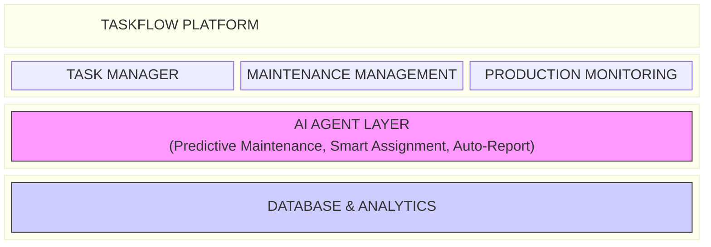

### 2.2 Modul Utama

#### A. MODUL TASK MANAGEMENT

| Fitur                     | Deskripsi                                            | Manfaat                           |
| ------------------------- | ---------------------------------------------------- | --------------------------------- |
| **Dashboard**       | Tampilan ringkas semua aktivitas                     | Quick overview untuk supervisor   |
| **Ticket System**   | Pencatatan tugas/masalah dengan prioritas            | Tidak ada tugas terlewat          |
| **Kanban Board**    | Visualisasi alur kerja (Todo → In Progress → Done) | Mudah tracking progress           |
| **Sprint Planning** | Perencanaan kerja mingguan/bulanan                   | Target kerja terukur              |
| **Epic Tracking**   | Pengelompokan project besar                          | Monitoring project jangka panjang |
| **Timeline/Gantt**  | Jadwal visual dengan dependensi                      | Koordinasi antar tim              |

#### B. MODUL MAINTENANCE MANAGEMENT

| Fitur                      | Deskripsi                                        | Manfaat                       |
| -------------------------- | ------------------------------------------------ | ----------------------------- |
| **Asset Database**   | Master data mesin lengkap (spec, lokasi, status) | Inventaris terorganisir       |
| **Work Order (WO)**  | Sistem perintah kerja digital                    | Dokumentasi perbaikan lengkap |
| **Downtime Tracker** | Pencatatan waktu mesin berhenti                  | Data untuk analisis OEE       |
| **PM Calendar**      | Jadwal preventive maintenance otomatis           | Mesin terawat terjadwal       |
| **Maintenance KPI**  | MTBF, MTTR, Availability                         | Ukuran performa maintenance   |

#### C. MODUL PRODUCTION

| Fitur                         | Deskripsi                                              | Manfaat                          |
| ----------------------------- | ------------------------------------------------------ | -------------------------------- |
| **SPK Digital**         | Surat Perintah Kerja produksi dengan approval workflow | Proses order terstruktur         |
| **Product Master**      | Database produk (material, berat, packaging)           | Data produk terpusat             |
| **Production Schedule** | Jadwal produksi harian/mingguan                        | Koordinasi dengan maintenance    |
| **Production Downtime** | Quick action logging                                   | Pencatatan cepat saat mesin stop |
| **OEE Dashboard**       | Availability × Performance × Quality                 | Ukuran efektivitas produksi      |

---

## 3. KEUNGGULAN AI AGENT

### 3.1 Fitur AI yang Tersedia

| AI Feature                       | Fungsi                                                 | Manfaat Bisnis                              |
| -------------------------------- | ------------------------------------------------------ | ------------------------------------------- |
| **Smart Chatbot**          | Asisten virtual untuk query data dan FAQ               | Akses informasi cepat tanpa training khusus |
| **AI Assignment**          | Rekomendasi penugasan berdasarkan workload & expertise | Distribusi kerja optimal                    |
| **Smart Work Order**       | Generate WO lengkap dari deskripsi singkat             | Hemat waktu administrasi                    |
| **Predictive Maintenance** | Prediksi risiko kerusakan mesin                        | Cegah breakdown mendadak                    |
| **Root Cause Analysis**    | Analisis 5-Why otomatis                                | Identifikasi akar masalah                   |
| **AI Report Generator**    | Laporan maintenance & produksi otomatis                | Laporan akurat tanpa effort                 |
| **Duplicate Detection**    | Deteksi ticket/masalah serupa                          | Hindari duplikasi kerja                     |

### 3.2 Contoh Penggunaan AI

**Skenario 1: Predictive Maintenance**

```
AI menganalisis data:
- Mesin A sudah 45 hari tanpa PM (standar 30 hari)
- 3x breakdown dalam 2 bulan terakhir
- MTBF menurun 20%

AI Output:
⚠️ RISIKO TINGGI: Mesin A
Rekomendasi: Jadwalkan PM dalam 3 hari ke depan
Confidence: 85%
```

**Skenario 2: Smart Assignment**

```
Ticket baru: "Motor conveyor line 3 panas"

AI menganalisis:
- Kategori: Electrical/Mechanical
- Teknisi tersedia: Budi (2 WO aktif), Andi (0 WO aktif)
- Expertise match: Andi (electrical specialist)

AI Output:
✓ Rekomendasi: Assign ke Andi
  Alasan: Expertise match, workload rendah
```

**Skenario 3: Auto-Report**

```
User: "Buatkan laporan maintenance bulan ini"

AI Output:
📊 LAPORAN MAINTENANCE - JANUARI 2026
- Total Work Order: 47
- Completion Rate: 91%
- PM Compliance: 88%
- Top 3 Masalah: [Motor, Bearing, Sensor]
- Rekomendasi: Fokus PM pada Line 2
```

---

## 4. PERBANDINGAN SEBELUM & SESUDAH

### 4.1 Proses Kerja

| Aspek                            | SEBELUM (Manual)                        | SESUDAH (TaskFlow)              |
| -------------------------------- | --------------------------------------- | ------------------------------- |
| **Pencatatan tugas**       | Papan tulis, kertas, WhatsApp           | Digital ticket dengan tracking  |
| **Jadwal PM**              | Kalender manual, sering terlewat        | Otomatis dengan reminder        |
| **Laporan**                | Ketik manual di Excel, butuh berjam-jam | Generate otomatis via AI        |
| **Cari histori perbaikan** | Bongkar arsip fisik                     | Search dalam hitungan detik     |
| **Koordinasi shift**       | Briefing lisan, sering lupa             | Tercatat di sistem, bisa dibaca |
| **Lihat status mesin**     | Tanya ke operator                       | Dashboard real-time             |
| **Analisis kerusakan**     | Diskusi manual                          | AI bantu identifikasi pattern   |

### 4.2 Estimasi Dampak

| Metrik                   | Target Improvement     |
| ------------------------ | ---------------------- |
| Downtime tidak terencana | Turun 30-40%           |
| Waktu administratif      | Turun 50-60%           |
| PM Compliance            | Naik dari ~60% ke 90%+ |
| Response time perbaikan  | Turun 25-35%           |
| Data accuracy            | Naik dari ~70% ke 95%+ |
| Visibility management    | Dari 0 ke real-time    |

---

## 5. ALUR KERJA SISTEM

### 5.1 Alur Harian Operasional

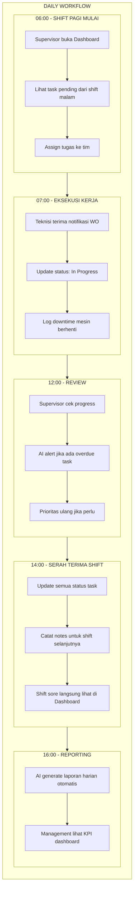

### 5.2 Alur Preventive Maintenance

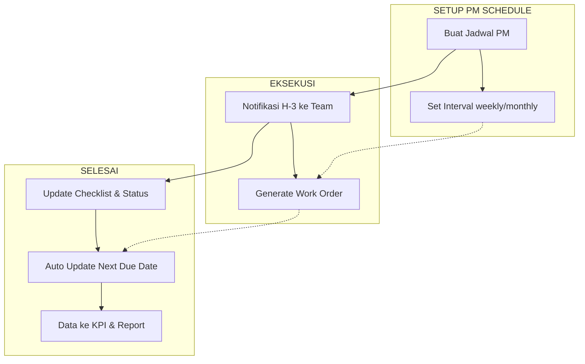

### 5.3 Alur Breakdown/Kerusakan

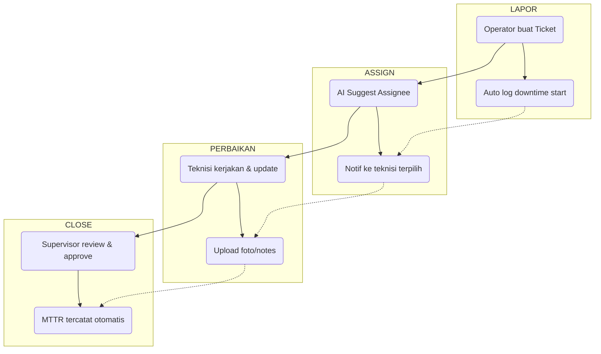

---

## 6. FITUR TAMBAHAN YANG DIREKOMENDASIKAN

Berdasarkan best practice industri, berikut fitur yang dapat ditambahkan:

### 6.1 Fitur Operasional

| Fitur                            | Deskripsi                                           | Prioritas |
| -------------------------------- | --------------------------------------------------- | --------- |
| **Spare Part Inventory**   | Tracking stok spare part dengan minimum level alert | Tinggi    |
| **QR Code Asset**          | Scan QR untuk akses cepat info mesin                | Tinggi    |
| **Shift Handover Digital** | Catatan serah terima shift terstruktur              | Tinggi    |
| **SOP Digital**            | Library SOP yang bisa diakses dari WO               | Sedang    |
| **Photo Documentation**    | Wajib foto before/after perbaikan                   | Sedang    |
| **Skill Matrix**           | Database kompetensi teknisi                         | Sedang    |

### 6.2 Fitur AI Lanjutan

| Fitur                                 | Deskripsi                                       | Prioritas |
| ------------------------------------- | ----------------------------------------------- | --------- |
| **Anomaly Detection**           | AI deteksi pola tidak normal dari sensor        | Tinggi    |
| **Failure Pattern Recognition** | AI identifikasi pola kerusakan berulang         | Tinggi    |
| **Optimal PM Interval**         | AI rekomendasikan interval PM optimal per mesin | Sedang    |
| **Cost Prediction**             | Prediksi biaya maintenance berdasarkan trend    | Sedang    |
| **Natural Language Query**      | Tanya data pakai bahasa biasa                   | Sedang    |

### 6.3 Fitur Management

| Fitur                          | Deskripsi                               | Prioritas |
| ------------------------------ | --------------------------------------- | --------- |
| **Executive Dashboard**  | Summary KPI untuk top management        | Tinggi    |
| **Benchmark Comparison** | Bandingkan performa antar line/shift    | Sedang    |
| **Budget Tracking**      | Monitoring budget vs actual maintenance | Sedang    |
| **Audit Trail**          | Log semua perubahan untuk compliance    | Sedang    |

---

## 7. ROADMAP PENGEMBANGAN

### Phase 1: Foundation (Bulan 1-3)

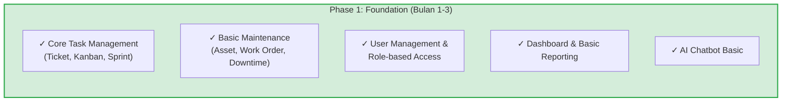

### Phase 2: Enhancement (Bulan 4-6)

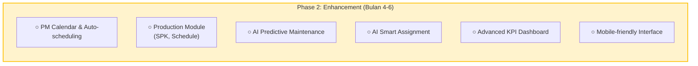

### Phase 3: Advanced (Bulan 7-12)

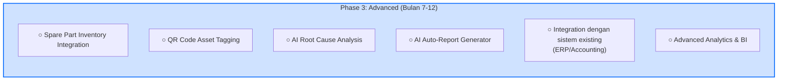

### Phase 4: Expansion (Tahun 2+)

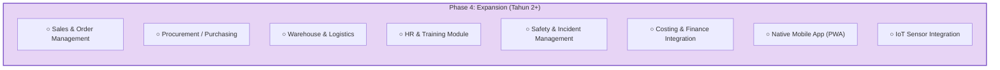

---

## 8. TEKNOLOGI YANG DIGUNAKAN

### 8.1 Stack Teknologi

| Layer               | Teknologi             | Keterangan                       |
| ------------------- | --------------------- | -------------------------------- |
| **Frontend**  | React 18 + TypeScript | Modern, responsive, maintainable |
| **Backend**   | Node.js + Express     | Scalable, industry standard      |
| **Database**  | SQLite → PostgreSQL  | Mulai ringan, bisa scale         |
| **AI Engine** | OpenAI GPT-4          | State-of-the-art language model  |
| **Hosting**   | Lokal                 | Fleksibel sesuai kebijakan       |

### 8.2 Keunggulan Teknis

- **Web-based**: Akses dari browser, tidak perlu install
- **Responsive**: Bisa diakses dari PC, tablet, HP
- **Bahasa Indonesia**: Interface dan AI dalam Bahasa Indonesia
- **Role-based Access**: Hak akses sesuai jabatan
- **Dark/Light Mode**: Nyaman untuk berbagai kondisi
- **Offline Capable**: Bisa diakses meski koneksi terbatas (planned)---

## 10. KESIMPULAN & REKOMENDASI

### 10.1 Kesimpulan

Sistem **TaskFlow** menawarkan solusi digitalisasi menyeluruh untuk operasional pabrik dengan keunggulan:

1. **Integrasi Lengkap** - Task, Maintenance, dan Production dalam satu platform
2. **AI-Powered** - Bukan sekadar digitalisasi, tapi automasi cerdas
3. **User-Friendly** - Desain intuitif, bahasa Indonesia
4. **Scalable** - Mulai dari basic, bisa berkembang sesuai kebutuhan
5. **Data-Driven** - Semua keputusan berbasis data, bukan intuisi

### 10.2 Rekomendasi

1. **Mulai dengan pilot project** di satu area/line produksi
2. **Prioritaskan** modul yang memberikan dampak langsung (Maintenance)
3. **Libatkan user** sejak awal untuk memastikan adoption
4. **Ukur baseline** KPI sebelum implementasi untuk perbandingan
5. **Iterasi** berdasarkan feedback lapangan

---

## LAMPIRAN

### A. Daftar Fitur Lengkap

#### MODUL 1: TASK MANAGEMENT

| No  | Fitur                     | Sub-Fitur           | Deskripsi Detail                                                                     |
| --- | ------------------------- | ------------------- | ------------------------------------------------------------------------------------ |
| 1.1 | **Dashboard**       | Overview Cards      | Ringkasan jumlah task (Total, Active, Completed, Overdue)                            |
|     |                           | Recent Activities   | Timeline aktivitas terbaru dari seluruh tim                                          |
|     |                           | Quick Actions       | Tombol cepat untuk Create Task, View Calendar, Reports                               |
|     |                           | Team Workload Chart | Grafik distribusi beban kerja per anggota tim                                        |
| 1.2 | **Ticket System**   | Create Ticket       | Form pembuatan ticket dengan field: Title, Description, Priority, Category, Due Date |
|     |                           | Priority Levels     | Critical, High, Medium, Low dengan warna berbeda                                     |
|     |                           | Status Tracking     | New, In Progress, On Hold, Resolved, Closed                                          |
|     |                           | Assignment          | Assign ke user atau tim tertentu                                                     |
|     |                           | Comments & History  | Thread diskusi dan log perubahan status                                              |
|     |                           | Attachments         | Upload file/foto pendukung (max 10MB per file)                                       |
|     |                           | Tags                | Label custom untuk kategorisasi fleksibel                                            |
| 1.3 | **Kanban Board**    | Swimlanes           | Kolom: Backlog, Todo, In Progress, Review, Done                                      |
|     |                           | Drag & Drop         | Pindahkan card antar kolom dengan drag                                               |
|     |                           | Card Preview        | Lihat detail tanpa buka full page                                                    |
|     |                           | Filter & Search     | Filter by user, priority, tag, date                                                  |
|     |                           | WIP Limit           | Batasi jumlah task di "In Progress"                                                  |
| 1.4 | **Sprint Planning** | Sprint Creation     | Buat sprint dengan start/end date dan goal                                           |
|     |                           | Backlog Grooming    | Prioritas dan estimate task sebelum sprint                                           |
|     |                           | Capacity Planning   | Lihat available hours vs planned work                                                |
|     |                           | Burndown Chart      | Grafik progress sprint harian                                                        |
|     |                           | Sprint Review       | Summary achievement di akhir sprint                                                  |
| 1.5 | **Epic Tracking**   | Epic Hierarchy      | Group multiple tasks ke dalam Epic                                                   |
|     |                           | Epic Progress       | % completion berdasarkan child tasks                                                 |
|     |                           | Timeline View       | Gantt chart untuk lihat durasi epic                                                  |
|     |                           | Milestone Markers   | Tandai pencapaian penting dalam epic                                                 |
| 1.6 | **Notifications**   | In-App Alerts       | Pop-up notification dalam sistem                                                     |
|     |                           | Email Digest        | Ringkasan daily/weekly via email                                                     |
|     |                           | @Mentions           | Tag user dalam comment untuk notifikasi                                              |
|     |                           | Due Date Reminder   | Alert H-1 dan H-day untuk deadline                                                   |

#### MODUL 2: MAINTENANCE MANAGEMENT

| No  | Fitur                      | Sub-Fitur              | Deskripsi Detail                                            |
| --- | -------------------------- | ---------------------- | ----------------------------------------------------------- |
| 2.1 | **Asset Database**   | Asset Registry         | Master data: Asset ID, Name, Model, Serial Number, Location |
|     |                            | Asset Hierarchy        | Parent-child relationship (Line → Machine → Component)    |
|     |                            | Specifications         | Technical specs, capacity, year of manufacture              |
|     |                            | Documentation          | Manual, drawings, certificates (PDF storage)                |
|     |                            | Asset Status           | Operational, Under Maintenance, Breakdown, Decommissioned   |
|     |                            | QR Code                | Generate QR per asset untuk scan cepat                      |
| 2.2 | **Work Order (WO)**  | WO Creation            | Auto-generate WO number dengan prefix (WO-YYYYMM-XXXX)      |
|     |                            | WO Types               | Preventive Maintenance, Corrective, Breakdown, Inspection   |
|     |                            | Task Checklist         | Daftar pekerjaan yang harus dilakukan                       |
|     |                            | Parts Used             | Record spare part yang digunakan + quantity                 |
|     |                            | Labor Hours            | Catat jam kerja teknisi                                     |
|     |                            | Before/After Photos    | Dokumentasi visual kondisi asset                            |
|     |                            | Approval Workflow      | Request → Approval → Execution → Review → Close         |
|     |                            | WO History             | Lihat semua WO historis per asset                           |
| 2.3 | **Downtime Tracker** | Quick Logging          | Tombol cepat log downtime (mulai/selesai)                   |
|     |                            | Downtime Categories    | Mechanical, Electrical, No Material, No Operator, dll       |
|     |                            | Duration Calculation   | Otomatis hitung durasi downtime                             |
|     |                            | Downtime Analysis      | Pareto chart untuk top causes                               |
|     |                            | Shift Report           | Summary downtime per shift                                  |
| 2.4 | **PM Calendar**      | PM Scheduling          | Atur interval PM (days, weeks, months, running hours)       |
|     |                            | Auto-Generation        | Sistem otomatis create WO saat PM due                       |
|     |                            | Calendar View          | Visual kalender dengan PM markers                           |
|     |                            | Reminder System        | Alert H-7, H-3, H-day sebelum PM                            |
|     |                            | PM Compliance Tracking | % PM yang dilakukan on-time                                 |
|     |                            | Skip/Postpone Log      | Record jika PM ditunda dengan alasan                        |
| 2.5 | **Maintenance KPI**  | MTBF                   | Mean Time Between Failures per asset                        |
|     |                            | MTTR                   | Mean Time To Repair per asset                               |
|     |                            | Availability           | % waktu mesin available untuk produksi                      |
|     |                            | PM vs CM Ratio         | Perbandingan Preventive vs Corrective maintenance           |
|     |                            | Cost Tracking          | Total biaya maintenance (parts + labor)                     |
|     |                            | Trend Analysis         | Grafik trend KPI bulanan/tahunan                            |

#### MODUL 3: PRODUCTION MONITORING

| No  | Fitur                         | Sub-Fitur               | Deskripsi Detail                                                       |
| --- | ----------------------------- | ----------------------- | ---------------------------------------------------------------------- |
| 3.1 | **SPK Digital**         | SPK Creation            | Form: Customer, Product, Quantity, Due Date, Priority                  |
|     |                               | Material Requirements   | Auto-calculate kebutuhan material dari product master                  |
|     |                               | Production Route        | Sequence proses produksi (Line 1 → QC → Packing)                     |
|     |                               | Approval Chain          | Sales → Production Manager → Plant Manager                           |
|     |                               | SPK Status              | Pending, Approved, In Production, Completed, Cancelled                 |
|     |                               | Print SPK               | Generate PDF SPK untuk shop floor                                      |
| 3.2 | **Product Master**      | Product Database        | Product Code, Name, Description, Category                              |
|     |                               | BOM (Bill of Materials) | Daftar raw material + quantity per unit                                |
|     |                               | Production Standards    | Standard time, yield rate, quality specs                               |
|     |                               | Packaging Info          | Packaging type, box size, pallet quantity                              |
|     |                               | Product Variants        | Different size/color/grade dari same product                           |
| 3.3 | **Production Schedule** | Weekly Planner          | Drag-drop SPK ke slot waktu produksi                                   |
|     |                               | Capacity Check          | Validasi apakah capacity cukup                                         |
|     |                               | Material Availability   | Check stock material sebelum schedule                                  |
|     |                               | Coordination with PM    | Highlight slot PM untuk avoid conflict                                 |
|     |                               | Schedule Changes Log    | Record semua perubahan jadwal                                          |
| 3.4 | **Production Downtime** | Quick Action Button     | Tombol "Mesin Stop" langsung dari dashboard                            |
|     |                               | Downtime Form           | Minimal input: Mesin, Start Time, Reason                               |
|     |                               | Auto-Calculate          | Durasi dihitung otomatis saat resolved                                 |
|     |                               | Escalation Alert        | Notif ke supervisor jika downtime >30 menit                            |
| 3.5 | **OEE Dashboard**       | Availability            | (Planned Production Time - Downtime) / Planned Production Time × 100% |
|     |                               | Performance             | (Actual Output / Target Output) × 100%                                |
|     |                               | Quality                 | (Good Units / Total Units) × 100%                                     |
|     |                               | OEE Score               | Availability × Performance × Quality                                 |
|     |                               | Benchmark               | Bandingkan dengan target atau periode sebelumnya                       |
|     |                               | Loss Analysis           | Breakdown 6 Big Losses                                                 |

#### MODUL 4: AI AGENT FEATURES

| No  | Fitur                            | Sub-Fitur              | Deskripsi Detail                                              |
| --- | -------------------------------- | ---------------------- | ------------------------------------------------------------- |
| 4.1 | **Smart Chatbot**          | Natural Language Query | Tanya dalam bahasa Indonesia biasa                            |
|     |                                  | Quick Data Access      | "Berapa total WO bulan ini?", "Mesin mana yang sering rusak?" |
|     |                                  | FAQ Assistant          | Jawab pertanyaan umum tentang sistem                          |
|     |                                  | Guided Workflow        | Bantu user step-by-step untuk task kompleks                   |
| 4.2 | **AI Assignment**          | Workload Analysis      | Hitung current workload per teknisi                           |
|     |                                  | Skill Matching         | Match task requirement dengan expertise teknisi               |
|     |                                  | Availability Check     | Cek jadwal/shift teknisi                                      |
|     |                                  | Recommendation Score   | Berikan confidence level (%) untuk suggestion                 |
| 4.3 | **Smart Work Order**       | Auto-Fill WO           | Generate WO lengkap dari deskripsi singkat                    |
|     |                                  | Suggested Checklist    | AI suggest task checklist berdasarkan problem type            |
|     |                                  | Parts Prediction       | Prediksi spare part yang mungkin dibutuhkan                   |
|     |                                  | Time Estimation        | Estimasi durasi perbaikan berdasarkan histori                 |
| 4.4 | **Predictive Maintenance** | Risk Scoring           | Skor risiko 0-100 untuk setiap asset                          |
|     |                                  | Failure Prediction     | Prediksi kemungkinan breakdown dalam X hari                   |
|     |                                  | Recommendation Engine  | Suggest tindakan preventif                                    |
|     |                                  | Confidence Level       | Tingkat keyakinan AI terhadap prediksi                        |
| 4.5 | **Root Cause Analysis**    | 5-Why Analysis         | AI guide untuk drill-down root cause                          |
|     |                                  | Pattern Recognition    | Deteksi pola dari masalah serupa di masa lalu                 |
|     |                                  | Correlation Finder     | Identifikasi faktor-faktor yang berkorelasi                   |
|     |                                  | Action Recommendation  | Suggest corrective action                                     |
| 4.6 | **AI Report Generator**    | Auto-Report            | Generate laporan dari command text                            |
|     |                                  | Custom Templates       | Pilih format: Daily, Weekly, Monthly, Custom                  |
|     |                                  | Insight Highlights     | AI tampilkan insight penting otomatis                         |
|     |                                  | Chart Generation       | Otomatis pilih chart type yang sesuai                         |
|     |                                  | Export Options         | PDF, Excel, PowerPoint                                        |
| 4.7 | **Duplicate Detection**    | Similarity Check       | Scan ticket baru vs existing tickets                          |
|     |                                  | Alert on Duplicate     | Notif jika ada ticket serupa (>80% similarity)                |
|     |                                  | Link Suggestions       | Suggest untuk link/merge tickets                              |
|     |                                  | Prevent Duplication    | Kurangi duplikasi effort                                      |

#### MODUL 5: REPORTING & ANALYTICS

| No  | Fitur                        | Sub-Fitur                 | Deskripsi Detail                                   |
| --- | ---------------------------- | ------------------------- | -------------------------------------------------- |
| 5.1 | **Standard Reports**   | Daily Production Report   | Output, downtime, OEE per shift                    |
|     |                              | Weekly Maintenance Report | WO completed, PM compliance, top issues            |
|     |                              | Monthly Summary           | KPI dashboard dengan trend analysis                |
|     |                              | Custom Report Builder     | User bisa buat report sendiri dengan query builder |
| 5.2 | **Data Visualization** | Interactive Charts        | Bar, line, pie, area charts dengan drill-down      |
|     |                              | Heat Maps                 | Visualisasi downtime by hour/day                   |
|     |                              | Pareto Analysis           | 80/20 rule untuk prioritas masalah                 |
|     |                              | Trend Lines               | Lihat trend jangka panjang                         |
| 5.3 | **Export & Share**     | Export Formats            | PDF, Excel, CSV, JSON                              |
|     |                              | Scheduled Reports         | Auto-send report via email setiap periode          |
|     |                              | Share Dashboard           | Share link read-only ke stakeholder                |
|     |                              | Print-Friendly            | Layout optimized untuk print                       |

#### MODUL 6: ADMINISTRATION

| No  | Fitur                        | Sub-Fitur              | Deskripsi Detail                                 |
| --- | ---------------------------- | ---------------------- | ------------------------------------------------ |
| 6.1 | **User Management**    | User Creation          | Create user dengan email, password, role         |
|     |                              | Role Assignment        | Admin, Manager, Supervisor, Technician, Operator |
|     |                              | Department/Team        | Group users by department                        |
|     |                              | Active/Inactive Status | Disable user tanpa delete data                   |
| 6.2 | **Permission Control** | Role-based Access      | Tiap role punya permission berbeda               |
|     |                              | Feature Toggle         | Enable/disable fitur per role                    |
|     |                              | Data Visibility        | Kontrol siapa bisa lihat data apa                |
| 6.3 | **System Settings**    | Company Profile        | Logo, name, address untuk reports                |
|     |                              | Working Hours          | Set jam kerja untuk shift                        |
|     |                              | Holiday Calendar       | Mark hari libur untuk planning                   |
|     |                              | Notification Settings  | Konfigurasi email/push notification              |
|     |                              | Data Retention         | Policy untuk archive/delete old data             |
| 6.4 | **Audit Log**          | Activity Tracking      | Log semua create/edit/delete actions             |
|     |                              | User Actions           | Siapa, kapan, action apa                         |
|     |                              | Change History         | Before/after value untuk edits                   |
|     |                              | Filter & Search        | Cari log by user, date, action type              |

#### MODUL 7: MOBILE & INTEGRATION

| No  | Fitur                        | Sub-Fitur          | Deskripsi Detail                                |
| --- | ---------------------------- | ------------------ | ----------------------------------------------- |
| 7.1 | **Mobile-Responsive**  | Responsive Design  | Auto-adjust layout untuk mobile/tablet          |
|     |                              | Touch-Optimized    | Buttons dan inputs mudah di-tap                 |
|     |                              | Offline Mode       | Cache data untuk akses tanpa internet (Phase 3) |
| 7.2 | **Barcode/QR Scanner** | Camera Scan        | Scan QR asset dari smartphone                   |
|     |                              | Quick Access       | Langsung buka asset detail/create WO            |
| 7.3 | **API Integration**    | REST API           | API untuk integrate dengan sistem lain          |
|     |                              | Webhook            | Event notification ke external system           |
|     |                              | Data Import/Export | Bulk import dari Excel template                 |

---

### B. User Role & Permission Matrix

#### Hierarki Role dalam Sistem

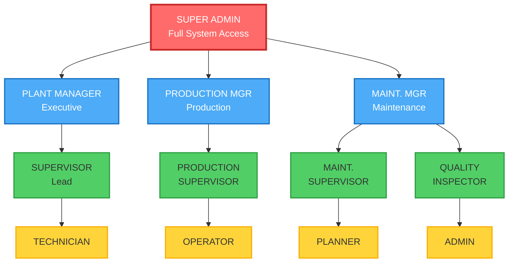

#### Detail Permission per Role

| Modul/Fitur                | Super Admin | Plant Manager | Production Mgr | Maintenance Mgr | Supervisor | Technician | Operator | Planner | QC Inspector |
| -------------------------- | :---------: | :-----------: | :------------: | :-------------: | :--------: | :--------: | :------: | :-----: | :----------: |
| **DASHBOARD**        |            |              |                |                |            |            |          |        |              |
| View Executive Dashboard   |     ✓     |      ✓      |       ✓       |       ✓       |     ○     |     ○     |    ○    |   ○   |      ○      |
| View Team Dashboard        |     ✓     |      ✓      |       ✓       |       ✓       |     ✓     |     ✓     |    ✓    |   ✓   |      ✓      |
| View Personal Dashboard    |     ✓     |      ✓      |       ✓       |       ✓       |     ✓     |     ✓     |    ✓    |   ✓   |      ✓      |
| **TASK MANAGEMENT**  |            |              |                |                |            |            |          |        |              |
| Create Ticket              |     ✓     |      ✓      |       ✓       |       ✓       |     ✓     |     ✓     |    ✓    |   ✓   |      ✓      |
| Edit Own Ticket            |     ✓     |      ✓      |       ✓       |       ✓       |     ✓     |     ✓     |    ✓    |   ✓   |      ✓      |
| Edit Any Ticket            |     ✓     |      ✓      |       ✓       |       ✓       |     ✓     |     ○     |    ○    |   ○   |      ○      |
| Delete Ticket              |     ✓     |      ✓      |       ○       |       ○       |     ○     |     ○     |    ○    |   ○   |      ○      |
| Assign Task to Others      |     ✓     |      ✓      |       ✓       |       ✓       |     ✓     |     ○     |    ○    |   ✓   |      ○      |
| Close/Resolve Ticket       |     ✓     |      ✓      |       ✓       |       ✓       |     ✓     |     ✓     |    ○    |   ○   |      ✓      |
| View All Tickets           |     ✓     |      ✓      |       ✓       |       ✓       |     ✓     |     ○     |    ○    |   ✓   |      ○      |
| View Team Tickets Only     |      -      |       -       |       -       |        -        |     -     |     ✓     |    ✓    |    -    |      ✓      |
| Sprint Planning            |     ✓     |      ✓      |       ✓       |       ✓       |     ✓     |     ○     |    ○    |   ✓   |      ○      |
| Epic Management            |     ✓     |      ✓      |       ✓       |       ✓       |     ○     |     ○     |    ○    |   ○   |      ○      |
| **MAINTENANCE**      |            |              |                |                |            |            |          |        |              |
| View Asset Database        |     ✓     |      ✓      |       ✓       |       ✓       |     ✓     |     ✓     |    ✓    |   ✓   |      ✓      |
| Add/Edit Asset             |     ✓     |      ✓      |       ○       |       ✓       |     ○     |     ○     |    ○    |   ○   |      ○      |
| Delete Asset               |     ✓     |      ✓      |       ○       |       ✓       |     ○     |     ○     |    ○    |   ○   |      ○      |
| Create Work Order          |     ✓     |      ✓      |       ✓       |       ✓       |     ✓     |     ✓     |    ✓    |   ✓   |      ○      |
| Edit WO                    |     ✓     |      ✓      |       ○       |       ✓       |     ✓     |     ✓     |    ○    |   ○   |      ○      |
| Approve WO                 |     ✓     |      ✓      |       ○       |       ✓       |     ✓     |     ○     |    ○    |   ○   |      ○      |
| Close WO                   |     ✓     |      ✓      |       ○       |       ✓       |     ✓     |     ○     |    ○    |   ○   |      ○      |
| Log Downtime               |     ✓     |      ✓      |       ✓       |       ✓       |     ✓     |     ✓     |    ✓    |   ○   |      ○      |
| View Downtime Reports      |     ✓     |      ✓      |       ✓       |       ✓       |     ✓     |     ○     |    ○    |   ✓   |      ○      |
| Create PM Schedule         |     ✓     |      ✓      |       ○       |       ✓       |     ✓     |     ○     |    ○    |   ✓   |      ○      |
| Edit PM Schedule           |     ✓     |      ✓      |       ○       |       ✓       |     ✓     |     ○     |    ○    |   ✓   |      ○      |
| Skip/Postpone PM           |     ✓     |      ✓      |       ○       |       ✓       |     ○     |     ○     |    ○    |   ○   |      ○      |
| View Maintenance KPI       |     ✓     |      ✓      |       ✓       |       ✓       |     ✓     |     ○     |    ○    |   ○   |      ○      |
| **PRODUCTION**       |            |              |                |                |            |            |          |        |              |
| Create SPK                 |     ✓     |      ✓      |       ✓       |       ○       |     ○     |     ○     |    ○    |   ✓   |      ○      |
| Edit SPK                   |     ✓     |      ✓      |       ✓       |       ○       |     ○     |     ○     |    ○    |   ✓   |      ○      |
| Approve SPK (L1)           |      -      |       -       |       ✓       |        -        |     -     |     -     |    -    |    -    |      -      |
| Approve SPK (L2)           |      -      |      ✓      |       -       |        -        |     -     |     -     |    -    |    -    |      -      |
| Delete SPK                 |     ✓     |      ✓      |       ○       |       ○       |     ○     |     ○     |    ○    |   ○   |      ○      |
| View Production Schedule   |     ✓     |      ✓      |       ✓       |       ✓       |     ✓     |     ✓     |    ✓    |   ✓   |      ✓      |
| Edit Production Schedule   |     ✓     |      ✓      |       ✓       |       ○       |     ○     |     ○     |    ○    |   ✓   |      ○      |
| Log Production Output      |     ✓     |      ✓      |       ✓       |       ○       |     ✓     |     ○     |    ✓    |   ○   |      ○      |
| Log Quality Data           |     ✓     |      ✓      |       ✓       |       ○       |     ○     |     ○     |    ○    |   ○   |      ✓      |
| View OEE Dashboard         |     ✓     |      ✓      |       ✓       |       ✓       |     ✓     |     ○     |    ○    |   ✓   |      ○      |
| Edit Product Master        |     ✓     |      ✓      |       ✓       |       ○       |     ○     |     ○     |    ○    |   ✓   |      ○      |
| **AI FEATURES**      |            |              |                |                |            |            |          |        |              |
| Use AI Chatbot             |     ✓     |      ✓      |       ✓       |       ✓       |     ✓     |     ✓     |    ✓    |   ✓   |      ✓      |
| AI Smart Assignment        |     ✓     |      ✓      |       ✓       |       ✓       |     ✓     |     ○     |    ○    |   ○   |      ○      |
| AI Smart WO Generator      |     ✓     |      ✓      |       ✓       |       ✓       |     ✓     |     ✓     |    ○    |   ○   |      ○      |
| AI Predictive Maintenance  |     ✓     |      ✓      |       ○       |       ✓       |     ✓     |     ○     |    ○    |   ○   |      ○      |
| AI Root Cause Analysis     |     ✓     |      ✓      |       ✓       |       ✓       |     ✓     |     ✓     |    ○    |   ○   |      ○      |
| AI Report Generator        |     ✓     |      ✓      |       ✓       |       ✓       |     ✓     |     ○     |    ○    |   ○   |      ○      |
| **REPORTING**        |            |              |                |                |            |            |          |        |              |
| View Standard Reports      |     ✓     |      ✓      |       ✓       |       ✓       |     ✓     |     ○     |    ○    |   ✓   |      ○      |
| Create Custom Reports      |     ✓     |      ✓      |       ✓       |       ✓       |     ○     |     ○     |    ○    |   ○   |      ○      |
| Export Reports (PDF/Excel) |     ✓     |      ✓      |       ✓       |       ✓       |     ✓     |     ○     |    ○    |   ✓   |      ○      |
| Schedule Auto-Reports      |     ✓     |      ✓      |       ✓       |       ✓       |     ○     |     ○     |    ○    |   ○   |      ○      |
| Share Dashboard Link       |     ✓     |      ✓      |       ✓       |       ✓       |     ○     |     ○     |    ○    |   ○   |      ○      |
| **ADMINISTRATION**   |            |              |                |                |            |            |          |        |              |
| User Management            |     ✓     |      ○      |       ○       |       ○       |     ○     |     ○     |    ○    |   ○   |      ○      |
| Role Assignment            |     ✓     |      ○      |       ○       |       ○       |     ○     |     ○     |    ○    |   ○   |      ○      |
| System Settings            |     ✓     |      ○      |       ○       |       ○       |     ○     |     ○     |    ○    |   ○   |      ○      |
| View Audit Log             |     ✓     |      ✓      |       ○       |       ○       |     ○     |     ○     |    ○    |   ○   |      ○      |
| Company Profile Settings   |     ✓     |      ○      |       ○       |       ○       |     ○     |     ○     |    ○    |   ○   |      ○      |
| Backup & Restore           |     ✓     |      ○      |       ○       |       ○       |     ○     |     ○     |    ○    |   ○   |      ○      |

**Legend:**

- ✓ = Full Access (Create, Read, Update, Delete sesuai fitur)
- ○ = No Access
- \- = Not Applicable

#### Detail Deskripsi Role

| Role                          | Deskripsi                         | Tanggung Jawab Utama                                           | Typical Users                            |
| ----------------------------- | --------------------------------- | -------------------------------------------------------------- | ---------------------------------------- |
| **Super Admin**         | Kontrol penuh sistem              | Setup sistem, user management, backup, security                | IT Staff, System Administrator           |
| **Plant Manager**       | Executive level dengan akses luas | Monitor overall plant performance, approve strategic decisions | General Manager, Plant Director          |
| **Production Manager**  | Mengelola operasional produksi    | Production planning, SPK approval, target achievement          | Production Manager                       |
| **Maintenance Manager** | Mengelola maintenance             | PM planning, asset management, maintenance budget              | Maintenance Manager, Engineering Manager |
| **Supervisor**          | Supervisi tim di lapangan         | Assign tasks, monitor team, approve WO, close tickets          | Shift Leader, Section Chief              |
| **Technician**          | Eksekusi perbaikan                | Execute WO, update status, log findings                        | Mechanic, Electrician, Instrument Tech   |
| **Operator**            | Operasional mesin produksi        | Log downtime, report issues, production logging                | Machine Operator                         |
| **Planner**             | Perencanaan kerja                 | Create SPK, schedule production/maintenance                    | Production Planner, Maintenance Planner  |
| **QC Inspector**        | Quality control                   | Inspect quality, log defects, approve/reject product           | Quality Inspector, QC Staff              |

#### Data Visibility Rules

| Role                          | Dapat Melihat Data                                   |
| ----------------------------- | ---------------------------------------------------- |
| **Super Admin**         | Semua data di sistem                                 |
| **Plant Manager**       | Semua data operational                               |
| **Production Manager**  | Semua data production + related maintenance          |
| **Maintenance Manager** | Semua data maintenance + asset + related production  |
| **Supervisor**          | Data tim/shift sendiri + assigned tasks              |
| **Technician**          | Task assigned ke diri sendiri + asset yang di-handle |
| **Operator**            | Mesin/line yang di-operate + task sendiri            |
| **Planner**             | Semua schedule, SPK, dan planning data               |
| **QC Inspector**        | Production data, quality data, inspection tasks      |

#### Approval Workflow Matrix

| Item                             | Level 1 Approval       | Level 2 Approval    | Final Approval |
| -------------------------------- | ---------------------- | ------------------- | -------------- |
| **SPK (nilai < 50 juta)**  | Production Supervisor  | Production Manager  | -              |
| **SPK (nilai ≥ 50 juta)** | Production Manager     | Plant Manager       | -              |
| **Work Order Routine**     | Maintenance Supervisor | -                   | -              |
| **Work Order Major**       | Maintenance Supervisor | Maintenance Manager | -              |
| **PM Schedule Changes**    | Maintenance Supervisor | Maintenance Manager | -              |
| **Asset Addition**         | -                      | Department Manager  | Plant Manager  |
| **User Creation**          | -                      | -                   | Super Admin    |
| **Budget Request**         | Supervisor             | Department Manager  | Plant Manager  |

#### Notification Preferences per Role

| Event Type          |  Super Admin  |    Managers    |   Supervisor   |  Technician  | Operator |
| ------------------- | :------------: | :------------: | :------------: | :-----------: | :------: |
| New Ticket Created  |  Email Digest  |  Email Digest  | In-App + Email |    In-App    |  In-App  |
| Task Assigned to Me | In-App + Email | In-App + Email | In-App + Email | In-App + Push |  In-App  |
| Task Overdue        |  Email Digest  |  Email + SMS  | In-App + Email |    In-App    |    -    |
| WO Approved         |       -       |     In-App     |     In-App     |    In-App    |    -    |
| Downtime > 30 min   |  Email + SMS  |  Email + SMS  | In-App + Email |       -       |    -    |
| PM Due in 3 Days    |  Email Digest  |  Email Digest  | In-App + Email |    In-App    |    -    |
| SPK Approved        |       -       |     In-App     |     In-App     |       -       |    -    |
| System Maintenance  |  Email + SMS  |     Email     |     Email     |     Email     |  Email  |

---

### C. Data Flow Diagram

#### DFD Level 0: Context Diagram

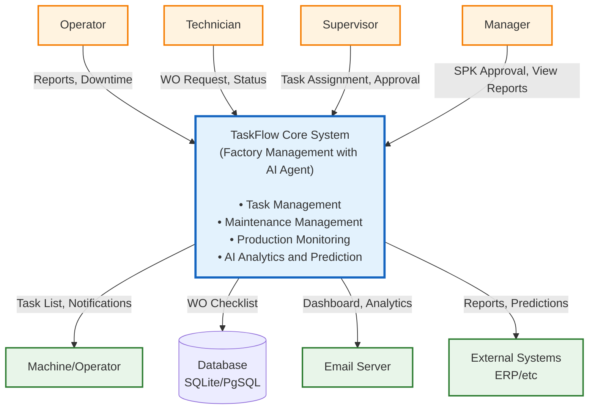

#### DFD Level 1: Main System Processes

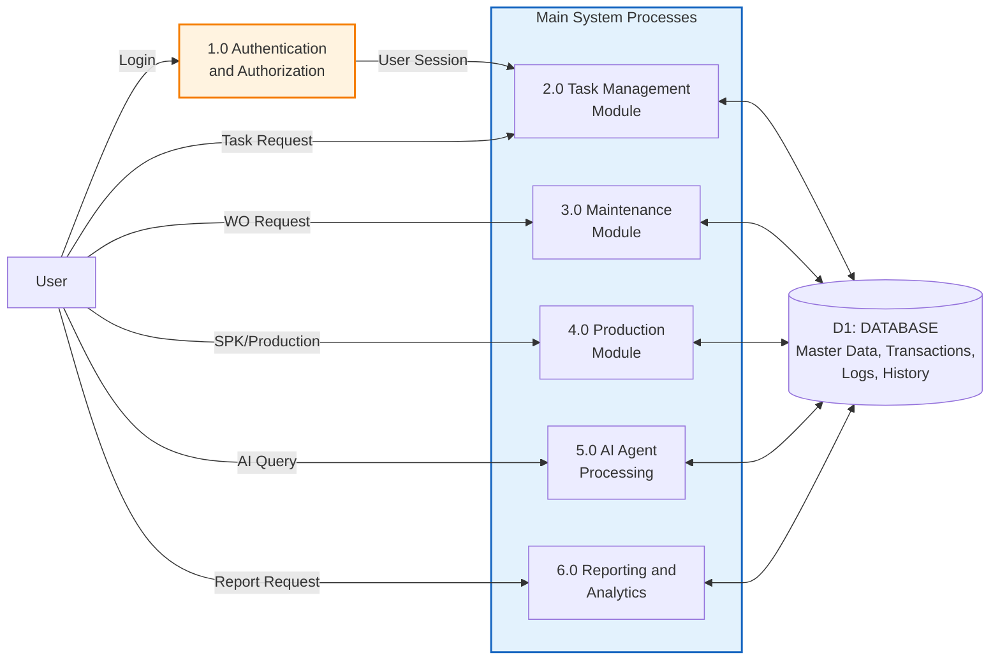

#### DFD Level 2: Maintenance Module Detail

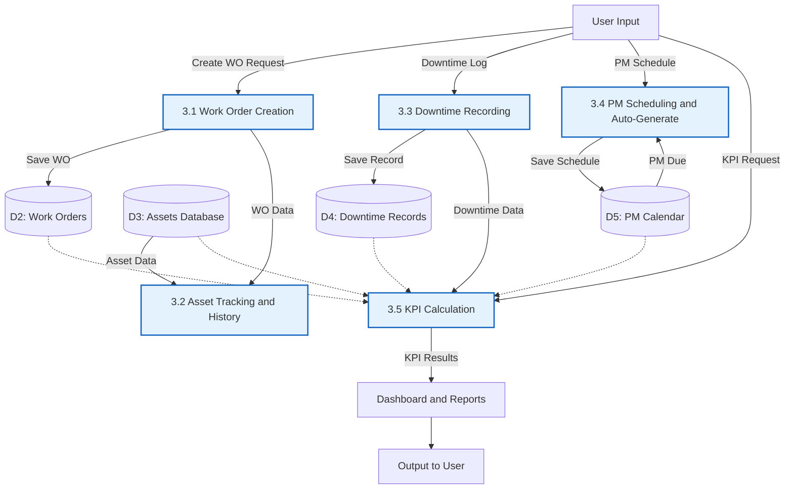

#### DFD Level 2: AI Agent Processing Detail

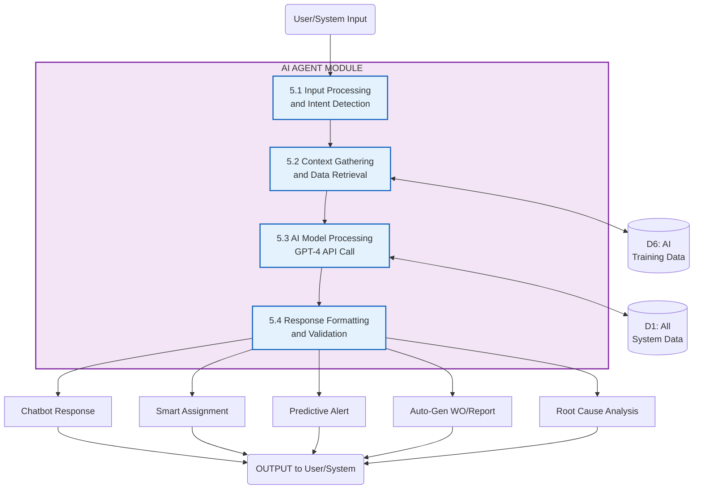

#### Data Flow: Complete Work Order Lifecycle

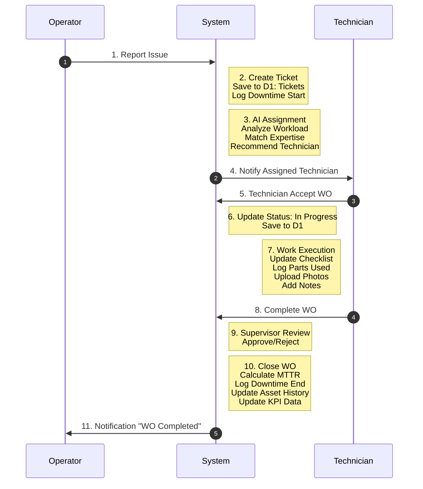

#### Data Storage Schema Overview

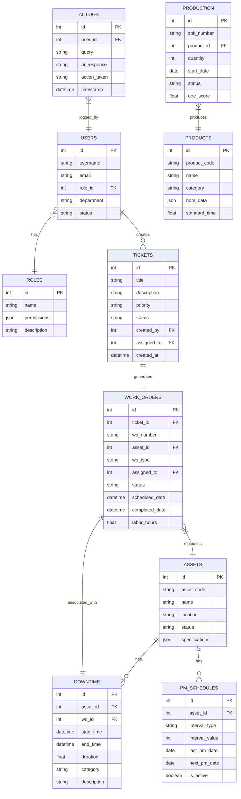

---

### D. Screen Mockups

Berikut adalah mockup wireframe untuk layar-layar utama sistem TaskFlow:

#### 1. Dashboard Utama (Home)

```
┌────────────────────────────────────────────────────────────────────────────┐
│ [≡] TaskFlow                   🔔 [3]  👤 Budi Santoso (Supervisor)  [⚙]  │
├────────────────────────────────────────────────────────────────────────────┤
│                                                                            │
│  📊 DASHBOARD OVERVIEW                              📅 Rabu, 22 Jan 2026  │
│  ────────────────────────────────────────────────────────────────────────  │
│                                                                            │
│  ┌──────────────┐  ┌──────────────┐  ┌──────────────┐  ┌──────────────┐  │
│  │   TASKS      │  │   WORK       │  │   MACHINES   │  │   OEE        │  │
│  │              │  │   ORDERS     │  │   DOWN       │  │   TODAY      │  │
│  │     24       │  │     12       │  │      2       │  │    78%       │  │
│  │              │  │              │  │              │  │              │  │
│  │  +3 vs yday  │  │  5 Pending   │  │  ⚠ Line 3   │  │  ↑ 5% vs avg │  │
│  └──────────────┘  └──────────────┘  └──────────────┘  └──────────────┘  │
│                                                                            │
│  ┌────────────────────────────────────┐  ┌────────────────────────────┐  │
│  │  🔥 CRITICAL ALERTS                │  │  📋 MY TASKS TODAY         │  │
│  ├────────────────────────────────────┤  ├────────────────────────────┤  │
│  │  ⚠ Mesin Mixer Line 3 Down         │  │  ☐ PM Motor Conveyor #A12  │  │
│  │     Started: 08:15 (2h 45m ago)    │  │     Due: 14:00 | High      │  │
│  │     Assigned: Andi (Electrical)    │  │                            │  │
│  │     [View WO]                      │  │  ☐ Inspect Bearing Line 2  │  │
│  │                                    │  │     Due: 16:00 | Medium    │  │
│  │  🔔 AI Alert: PM Overdue           │  │                            │  │
│  │     Asset: Compressor #C05         │  │  ✓ Check Oil Level Pump#3  │  │
│  │     Overdue by: 5 days             │  │     Completed: 09:30       │  │
│  │     Risk Score: 85/100             │  │                            │  │
│  │     [Schedule Now]                 │  │  [+ New Task]              │  │
│  └────────────────────────────────────┘  └────────────────────────────┘  │
│                                                                            │
│  ┌─────────────────────────────────────────────────────────────────────┐  │
│  │  📈 DOWNTIME TRENDS (Last 7 Days)                                   │  │
│  ├─────────────────────────────────────────────────────────────────────┤  │
│  │   Hours                                                             │  │
│  │    8 │                                                              │  │
│  │    6 │     ▇▇                                                       │  │
│  │    4 │     ▇▇  ▇▇           ▇▇                                     │  │
│  │    2 │ ▇▇  ▇▇  ▇▇  ▇▇  ▇▇  ▇▇  ▇▇                                 │  │
│  │    0 └─────────────────────────────                                │  │
│  │       Mon Tue Wed Thu Fri Sat Sun                                  │  │
│  │                                                                     │  │
│  │   Top Causes: Mechanical (45%) | Electrical (30%) | No Material (15%)│  │
│  └─────────────────────────────────────────────────────────────────────┘  │
│                                                                            │
│  [View Full Reports] [Production Schedule] [Maintenance Calendar]         │
│                                                                            │
└────────────────────────────────────────────────────────────────────────────┘
```

#### 2. Kanban Board (Task Management)

```
┌────────────────────────────────────────────────────────────────────────────┐
│ [≡] TaskFlow › Task Management › Kanban Board                             │
├────────────────────────────────────────────────────────────────────────────┤
│                                                                            │
│  Filters: [All Teams ▾] [All Priorities ▾] [This Sprint ▾]  🔍 Search...  │
│                                                                            │
│  ┌──────────────┬──────────────┬──────────────┬──────────────┬─────────┐  │
│  │   BACKLOG    │     TODO     │ IN PROGRESS  │    REVIEW    │   DONE  │  │
│  │      8       │      12      │      5       │      3       │    47   │  │
│  ├──────────────┼──────────────┼──────────────┼──────────────┼─────────┤  │
│  │              │              │              │              │         │  │
│  │ ┌──────────┐ │ ┌──────────┐ │ ┌──────────┐ │ ┌──────────┐ │┌──────┐│  │
│  │ │🔴 #T-234 │ │ │🟠 #T-189 │ │ │🔴 #T-156 │ │ │🟢 #T-145 │ ││#T-123││  │
│  │ │PM Motor  │ │ │Replace   │ │ │Fix Conv. │ │ │Inspect   │ │└──────┘│  │
│  │ │Line 3    │ │ │Bearing   │ │ │Belt      │ │ │Sensor    │ │        │  │
│  │ │          │ │ │Line 2    │ │ │          │ │ │          │ │┌──────┐│  │
│  │ │👤 Andi   │ │ │          │ │ │👤 Budi   │ │ │👤 Candra │ ││#T-122││  │
│  │ │📅 Jan 23 │ │ │👤 Andi   │ │ │📅 Today  │ │ │📅 Today  │ │└──────┘│  │
│  │ │          │ │ │📅 Jan 24 │ │ │⏱ 2h 15m │ │ │          │ │        │  │
│  │ └──────────┘ │ └──────────┘ │ └──────────┘ │ └──────────┘ │        │  │
│  │              │              │              │              │         │  │
│  │ ┌──────────┐ │ ┌──────────┐ │ ┌──────────┐ │              │        │  │
│  │ │🟡 #T-235 │ │ │🟢 #T-190 │ │ │🟡 #T-157 │ │              │        │  │
│  │ │Check Oil │ │ │Clean     │ │ │Update    │ │              │        │  │
│  │ │Comp. #5  │ │ │Filter    │ │ │SOP Doc   │ │              │        │  │
│  │ │          │ │ │          │ │ │          │ │              │        │  │
│  │ │👤 Unass. │ │ │👤 Dewi   │ │ │👤 Eko    │ │              │        │  │
│  │ │📅 Jan 25 │ │ │📅 Jan 24 │ │ │📅 Jan 23 │ │              │        │  │
│  │ └──────────┘ │ └──────────┘ │ └──────────┘ │              │        │  │
│  │              │              │              │              │         │  │
│  │              │              │  WIP Limit:  │              │         │  │
│  │ [+ Add Card] │ [+ Add Card] │    5/7       │              │         │  │
│  │              │              │              │              │         │  │
│  └──────────────┴──────────────┴──────────────┴──────────────┴─────────┘  │
│                                                                            │
│  Legend: 🔴 Critical  🟠 High  🟡 Medium  🟢 Low                           │
│                                                                            │
└────────────────────────────────────────────────────────────────────────────┘
```

#### 3. Work Order Detail Page

```
┌────────────────────────────────────────────────────────────────────────────┐
│ [≡] TaskFlow › Maintenance › Work Order Detail                            │
├────────────────────────────────────────────────────────────────────────────┤
│                                                                            │
│  ← Back to WO List                            [Edit] [Print] [Delete]     │
│                                                                            │
│  ┌────────────────────────────────────────────────────────────────────┐   │
│  │  WORK ORDER #WO-202601-0156                                        │   │
│  │  Status: 🟡 IN PROGRESS                    Priority: 🔴 CRITICAL   │   │
│  ├────────────────────────────────────────────────────────────────────┤   │
│  │                                                                    │   │
│  │  Asset: MIXER LINE 3 (#MX-L3-001)          Location: Production    │   │
│  │  Type: Corrective Maintenance              Category: Mechanical    │   │
│  │                                                                    │   │
│  │  Requested By: Operator Shift A (Joko)     Date: 22 Jan 2026 08:15│   │
│  │  Assigned To: Budi Santoso (Mech. Tech)    Due: 22 Jan 2026 14:00 │   │
│  │  Approved By: Supv. Hendra                 Approval: 22 Jan 08:30 │   │
│  │                                                                    │   │
│  │  ──────────────────────────────────────────────────────────────   │   │
│  │  PROBLEM DESCRIPTION:                                              │   │
│  │  Mesin mixer tiba-tiba mati saat operasi. Terdengar bunyi aneh    │   │
│  │  sebelum mati. Sudah dicoba restart berkali-kali tapi tidak bisa  │   │
│  │  nyala. Production stopped.                                        │   │
│  │                                                                    │   │
│  │  🤖 AI SUGGESTION:                                                 │   │
│  │  Based on symptoms, likely causes:                                 │   │
│  │  • Motor overload (60% probability)                                │   │
│  │  • Belt slippage/broken (25% probability)                          │   │
│  │  • Sensor malfunction (15% probability)                            │   │
│  │                                                                    │   │
│  │  Similar incidents: 3 times in last 6 months                       │   │
│  │  Avg repair time: 3.5 hours                                        │   │
│  │  ──────────────────────────────────────────────────────────────   │   │
│  │                                                                    │   │
│  │  WORK CHECKLIST:                                        Progress:  │   │
│  │  ✓ Inspect motor condition                               60%      │   │
│  │  ✓ Check belt tension                                              │   │
│  │  ✓ Test electrical connection                                      │   │
│  │  ☐ Replace damaged parts                                           │   │
│  │  ☐ Run test operation                                              │   │
│  │  ☐ Final inspection & sign-off                                     │   │
│  │                                                                    │   │
│  │  PARTS USED:                                                       │   │
│  │  • V-Belt Type A #54   (Qty: 2)    [Stock: ✓ Available]           │   │
│  │  • Bearing 6205        (Qty: 1)    [Stock: ✓ Available]           │   │
│  │                                             [+ Add Part]           │   │
│  │                                                                    │   │
│  │  LABOR:                                                            │   │
│  │  Budi Santoso    Start: 08:45    Current: 11:00    Hrs: 2.25h     │   │
│  │                                                                    │   │
│  │  PHOTOS:                                                           │   │
│  │  ┌────────┐ ┌────────┐ ┌────────┐                                 │   │
│  │  │[BEFORE]│ │[DAMAGE]│ │ [ADD+] │                                 │   │
│  │  │ Photo  │ │ Photo  │ │        │                                 │   │
│  │  └────────┘ └────────┘ └────────┘                                 │   │
│  │                                                                    │   │
│  │  TECHNICIAN NOTES:                                                 │   │
│  │  ┌──────────────────────────────────────────────────────────────┐ │   │
│  │  │ Found that motor belt putus karena sudah aus. Bearing juga   │ │   │
│  │  │ sudah berbunyi. Sedang ganti belt dan bearing sekarang...    │ │   │
│  │  └──────────────────────────────────────────────────────────────┘ │   │
│  │                                                                    │   │
│  │  ──────────────────────────────────────────────────────────────   │   │
│  │  DOWNTIME TRACKING:                                                │   │
│  │  Start: 22 Jan 2026 08:15                                          │   │
│  │  End: [Still ongoing]               Duration: 2h 45m (and counting)│   │
│  │                                                                    │   │
│  │  Estimated Production Loss: Rp 5,500,000                           │   │
│  │  ──────────────────────────────────────────────────────────────   │   │
│  │                                                                    │   │
│  │           [Save Draft]  [Complete WO]  [Request Help]             │   │
│  │                                                                    │   │
│  └────────────────────────────────────────────────────────────────────┘   │
│                                                                            │
└────────────────────────────────────────────────────────────────────────────┘
```

#### 4. Asset Database / Asset Profile

```
┌────────────────────────────────────────────────────────────────────────────┐
│ [≡] TaskFlow › Assets › Asset Detail                                      │
├────────────────────────────────────────────────────────────────────────────┤
│                                                                            │
│  ← Back to Assets List                   📱 [QR Code] [Edit] [Export]     │
│                                                                            │
│  ┌──────────────────┐  ┌───────────────────────────────────────────────┐  │
│  │                  │  │  MIXER LINE 3                                 │  │
│  │   [QR CODE]      │  │  Asset ID: MX-L3-001                          │  │
│  │                  │  │  Status: 🔴 UNDER MAINTENANCE                 │  │
│  │   [Scan Me]      │  │  Location: Production Floor - Line 3          │  │
│  │                  │  │  Category: Production Equipment               │  │
│  └──────────────────┘  └───────────────────────────────────────────────┘  │
│                                                                            │
│  ┌─────────────────────────────────── SPECIFICATIONS ──────────────────┐  │
│  │  Manufacturer: Pabrik Mesin Jaya       Model: MX-3000-Pro           │  │
│  │  Serial Number: MX3K-2019-08752        Year: 2019                   │  │
│  │  Capacity: 500 kg/batch                Power: 15 kW (3-phase)       │  │
│  │  Dimensions: 2.5m x 1.8m x 2.2m        Weight: 1,200 kg             │  │
│  └──────────────────────────────────────────────────────────────────────┘  │
│                                                                            │
│  ┌─────────────────────── KEY PERFORMANCE INDICATORS ──────────────────┐  │
│  │  ┌──────────────┐  ┌──────────────┐  ┌──────────────┐              │  │
│  │  │ AVAILABILITY │  │     MTBF     │  │     MTTR     │              │  │
│  │  │              │  │              │  │              │              │  │
│  │  │    82.5%     │  │   156 hrs    │  │   3.2 hrs    │              │  │
│  │  │ ↓ -5% vs avg │  │ ↓ -12% trend │  │ ↑ +8% trend  │              │  │
│  │  └──────────────┘  └──────────────┘  └──────────────┘              │  │
│  │                                                                      │  │
│  │  Last PM: 15 Jan 2026 (7 days ago)    Next PM: 15 Feb 2026 (in 24d)│  │
│  │  PM Compliance: 85% (17/20 on-time)   PM Interval: 30 days          │  │
│  └──────────────────────────────────────────────────────────────────────┘  │
│                                                                            │
│  ┌───────────────────────── MAINTENANCE HISTORY ───────────────────────┐  │
│  │                                                                      │  │
│  │  📅 22 Jan 2026  [WO-202601-0156]  Corrective - Motor belt broken   │  │
│  │                 Status: In Progress  |  Downtime: 2h 45m (ongoing)  │  │
│  │                                                                      │  │
│  │  📅 15 Jan 2026  [WO-202601-0098]  Preventive Maintenance           │  │
│  │                 Status: Completed  |  Duration: 2h 15m  |  Cost: 450K│ │
│  │                                                                      │  │
│  │  📅 28 Dec 2025  [WO-202512-0234]  Corrective - Bearing noise       │  │
│  │                 Status: Completed  |  Downtime: 4h 30m  |  Cost: 1.2M│ │
│  │                                                                      │  │
│  │  📅 15 Dec 2025  [WO-202512-0145]  Preventive Maintenance           │  │
│  │                 Status: Completed  |  Duration: 2h 00m  |  Cost: 400K│ │
│  │                                                                      │  │
│  │                                              [View All History ▾]   │  │
│  └──────────────────────────────────────────────────────────────────────┘  │
│                                                                            │
│  ┌───────────────────────── 🤖 AI INSIGHTS ─────────────────────────────┐  │
│  │                                                                      │  │
│  │  ⚠ RISK ALERT: High failure risk detected                           │  │
│  │                                                                      │  │
│  │  • Pattern: Belt failures increased 3x in last 3 months             │  │
│  │  • Recommendation: Consider upgrading to heavy-duty belt type       │  │
│  │  • Predicted next failure: ~45 days (if not addressed)              │  │
│  │  • Suggested action: Schedule inspection + preventive replacement   │  │
│  │                                                                      │  │
│  │  Cost Analysis:                                                      │  │
│  │  • Reactive repairs (last 3 months): Rp 4,800,000                   │  │
│  │  • Proactive upgrade cost: Rp 2,500,000 (save ~48% yearly)          │  │
│  │                                                                      │  │
│  │                                      [Schedule PM] [View Details]   │  │
│  └──────────────────────────────────────────────────────────────────────┘  │
│                                                                            │
│  [📄 View Manuals]  [📊 Full Report]  [🛠 Create WO]  [🗓 Schedule PM]    │
│                                                                            │
└────────────────────────────────────────────────────────────────────────────┘
```

#### 5. AI Chatbot Interface

```
┌────────────────────────────────────────────────────────────────────────────┐
│ [≡] TaskFlow › AI Assistant                                          [✕]  │
├────────────────────────────────────────────────────────────────────────────┤
│                                                                            │
│  🤖 AI Assistant - TaskFlow                                                │
│  Saya siap membantu Anda dengan data, analisis, dan rekomendasi           │
│  ──────────────────────────────────────────────────────────────────────    │
│                                                                            │
│  👤 User (10:23):                                                          │
│  ┌──────────────────────────────────────────────────────────────────────┐ │
│  │ Berapa total downtime bulan ini untuk Line 3?                        │ │
│  └──────────────────────────────────────────────────────────────────────┘ │
│                                                                            │
│  🤖 AI Assistant (10:23):                                                  │
│  ┌──────────────────────────────────────────────────────────────────────┐ │
│  │ Berdasarkan data dari 1-22 Januari 2026:                            │ │
│  │                                                                      │ │
│  │ Total Downtime Line 3: 47 jam 35 menit                              │ │
│  │                                                                      │ │
│  │ Breakdown per kategori:                                              │ │
│  │ • Mechanical: 28h 15m (59%)                                          │ │
│  │ • Electrical: 12h 40m (27%)                                          │ │
│  │ • No Material: 4h 20m (9%)                                           │ │
│  │ • Other: 2h 20m (5%)                                                 │ │
│  │                                                                      │ │
│  │ Top 3 masalah:                                                       │ │
│  │ 1. Mixer Motor (18h 30m) - 5 incidents                              │ │
│  │ 2. Conveyor Belt (8h 45m) - 3 incidents                             │ │
│  │ 3. Sensor failure (6h 10m) - 7 incidents                            │ │
│  │                                                                      │ │
│  │ Vs target: -12% (target max 42 hours/month)                         │ │
│  │                                                                      │ │
│  │ [📊 View Chart] [📄 Full Report] [🔍 Analyze Root Cause]            │ │
│  └──────────────────────────────────────────────────────────────────────┘ │
│                                                                            │
│  👤 User (10:25):                                                          │
│  ┌──────────────────────────────────────────────────────────────────────┐ │
│  │ Buatkan rekomendasi untuk mengurangi downtime mixer motor           │ │
│  └──────────────────────────────────────────────────────────────────────┘ │
│                                                                            │
│  🤖 AI Assistant (10:25):                                                  │
│  ┌──────────────────────────────────────────────────────────────────────┐ │
│  │ Analisis AI untuk Mixer Motor Line 3:                               │ │
│  │                                                                      │ │
│  │ Root Cause Analysis:                                                 │ │
│  │ • 60% kegagalan terkait belt aus/putus                               │ │
│  │ • 30% bearing rusak/bunyi                                            │ │
│  │ • 10% electrical connection                                          │ │
│  │                                                                      │ │
│  │ Rekomendasi Immediate (1-2 minggu):                                  │ │
│  │ 1. ✅ Upgrade ke heavy-duty V-belt (tipe XPA, 25% lebih kuat)       │ │
│  │    Estimasi biaya: Rp 850,000                                        │ │
│  │    Expected reduction: 40% downtime                                  │ │
│  │                                                                      │ │
│  │ 2. ✅ Implement weekly visual inspection checklist                  │ │
│  │    Resource: 15 min/week per teknisi                                 │ │
│  │    Catch issues early sebelum breakdown                              │ │
│  │                                                                      │ │
│  │ Rekomendasi Long-term (1-3 bulan):                                   │ │
│  │ 3. ⚙ Install vibration sensor untuk predictive monitoring           │ │
│  │    Estimasi biaya: Rp 3,500,000                                      │ │
│  │    ROI: ~6 bulan based on downtime cost                              │ │
│  │                                                                      │ │
│  │ 4. 📅 Reduce PM interval dari 30 hari ke 21 hari                    │ │
│  │    (khusus mesin ini karena high utilization)                        │ │
│  │                                                                      │ │
│  │ Projected Impact:                                                    │ │
│  │ • Downtime reduction: 50-65%                                         │ │
│  │ • Cost savings/year: ~Rp 45,000,000                                  │ │
│  │                                                                      │ │
│  │ [📋 Create Action Plan] [📅 Schedule PM] [💰 Cost-Benefit Analysis] │ │
│  └──────────────────────────────────────────────────────────────────────┘ │
│                                                                            │
│  ──────────────────────────────────────────────────────────────────────    │
│  ┌──────────────────────────────────────────────────────────────────────┐ │
│  │  Tanya sesuatu...                                              [Send]│ │
│  └──────────────────────────────────────────────────────────────────────┘ │
│                                                                            │
│  💡 Saran pertanyaan:                                                      │
│  • "Siapa teknisi dengan completion rate tertinggi?"                      │
│  • "Prediksi kebutuhan spare part bulan depan"                            │
│  • "Bandingkan OEE semua line production"                                 │
│                                                                            │
└────────────────────────────────────────────────────────────────────────────┘
```

#### 6. Maintenance Calendar View

```
┌────────────────────────────────────────────────────────────────────────────┐
│ [≡] TaskFlow › Maintenance › PM Calendar                                  │
├────────────────────────────────────────────────────────────────────────────┤
│                                                                            │
│  📅 PREVENTIVE MAINTENANCE CALENDAR - January 2026                         │
│                                                                            │
│  View: [Month ▾]   Filter: [All Lines ▾] [All Types ▾]    [+ Schedule PM] │
│                                                                            │
│  ┌────────────────────────────────────────────────────────────────────┐   │
│  │                       ◀ JANUARY 2026 ▶                             │   │
│  ├────┬────┬────┬────┬────┬────┬────┬────┬────┬────┬────┬────┬────┬──┤   │
│  │ Su │ Mo │ Tu │ We │ Th │ Fr │ Sa │ Su │ Mo │ Tu │ We │ Th │ Fr │ Sa│   │
│  ├────┼────┼────┼────┼────┼────┼────┼────┼────┼────┼────┼────┼────┼──┤   │
│  │    │    │    │  1 │  2 │  3 │  4 │  5 │  6 │  7 │  8 │  9 │ 10 │11│   │
│  │    │    │    │    │    │🟢PM│    │    │🟡PM│    │    │    │    │  │   │
│  │    │    │    │    │    │ #3 │    │    │ #2 │    │    │    │    │  │   │
│  ├────┼────┼────┼────┼────┼────┼────┼────┼────┼────┼────┼────┼────┼──┤   │
│  │ 12 │ 13 │ 14 │ 15 │ 16 │ 17 │ 18 │ 19 │ 20 │ 21 │ 22 │ 23 │ 24 │25│   │
│  │    │    │    │🟢PM│    │    │    │    │    │    │ ⭐ │    │🟡PM│  │   │
│  │    │    │    │ #5 │    │    │    │    │    │    │TODAY│    │ #1 │  │   │
│  │    │    │    │✓   │    │    │    │    │    │    │🔴CM│    │    │  │   │
│  ├────┼────┼────┼────┼────┼────┼────┼────┼────┼────┼────┼────┼────┼──┤   │
│  │ 26 │ 27 │ 28 │ 29 │ 30 │ 31 │    │    │    │    │    │    │    │  │   │
│  │🟡PM│    │    │🟡PM│    │🟢PM│    │    │    │    │    │    │    │  │   │
│  │ #4 │    │    │ #2 │    │ #6 │    │    │    │    │    │    │    │  │   │
│  └────┴────┴────┴────┴────┴────┴────┴────┴────┴────┴────┴────┴────┴──┘   │
│                                                                            │
│  Legend:  🟢 PM Scheduled  🟡 PM Due Soon  🔴 Corrective/Breakdown  ✓ Done │
│                                                                            │
│  ┌─────────────────────────── TODAY'S SCHEDULE ──────────────────────┐    │
│  │                                                                    │    │
│  │  📋 Scheduled PMs for Wednesday, 22 January 2026:                 │    │
│  │                                                                    │    │
│  │  ✓ [Completed] PM-001 - Compressor Line 1                         │    │
│  │     Assigned: Andi  |  Completed: 09:30  |  Duration: 1h 45m      │    │
│  │                                                                    │    │
│  │  🔵 [In Progress] PM-002 - Mixer Motor Line 3                     │    │
│  │     Assigned: Budi  |  Started: 10:15  |  Progress: 60%           │    │
│  │     Checklist: 6/10 done  |  Est. completion: 13:00               │    │
│  │                                                                    │    │
│  │  ⏰ [Upcoming] PM-003 - Conveyor Inspection Line 2                │    │
│  │     Assigned: Candra  |  Scheduled: 14:00 - 16:00                 │    │
│  │                                                                    │    │
│  │  ──────────────────────────────────────────────────────────────   │    │
│  │                                                                    │    │
│  │  🚨 Overdue PMs (Need Action):                                    │    │
│  │                                                                    │    │
│  │  ⚠ PM-099 - Pump #C05 Maintenance                                 │    │
│  │     Originally due: 17 Jan  |  Overdue by: 5 days                 │    │
│  │     Risk score: 85/100 (AI)  |  [Schedule Now]                    │    │
│  │                                                                    │    │
│  │  ⚠ PM-087 - Electrical Panel Inspection L4                        │    │
│  │     Originally due: 19 Jan  |  Overdue by: 3 days                 │    │
│  │     Risk score: 62/100 (AI)  |  [Schedule Now]                    │    │
│  │                                                                    │    │
│  └────────────────────────────────────────────────────────────────────┘    │
│                                                                            │
│  ┌────────────────── UPCOMING PMs (Next 7 Days) ──────────────────────┐   │
│  │  23 Jan: PM-004, PM-005  (2 PMs)                                   │   │
│  │  24 Jan: PM-006, PM-007, PM-008  (3 PMs)                           │   │
│  │  26 Jan: PM-009  (1 PM)                                            │   │
│  │  29 Jan: PM-010, PM-011  (2 PMs)                                   │   │
│  │                                                          [View All]│   │
│  └────────────────────────────────────────────────────────────────────┘   │
│                                                                            │
│  [Export Schedule] [Auto-Assign PMs] [PM Compliance Report]                │
│                                                                            │
└────────────────────────────────────────────────────────────────────────────┘
```

---

### E. Technical Architecture Detail

#### 1. System Architecture Overview

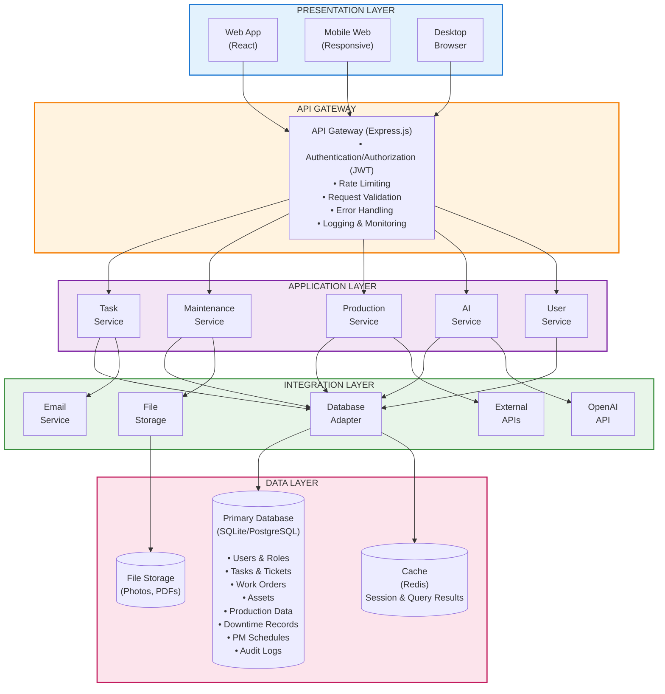

#### 2. Technology Stack Detail

##### Frontend Technologies

| Component                  | Technology               | Version | Purpose                                  |
| -------------------------- | ------------------------ | ------- | ---------------------------------------- |
| **Framework**        | React                    | 18.x    | UI component library, virtual DOM        |
| **Language**         | TypeScript               | 5.x     | Type safety, better developer experience |
| **State Management** | Zustand / Redux Toolkit  | Latest  | Global state management                  |
| **Routing**          | React Router             | v6      | Client-side routing                      |
| **UI Components**    | Ant Design / Material-UI | Latest  | Pre-built components, consistent design  |
| **Charts**           | Recharts / Chart.js      | Latest  | Data visualization                       |
| **Forms**            | React Hook Form          | Latest  | Form handling with validation            |
| **HTTP Client**      | Axios                    | Latest  | API communication                        |
| **Date Handling**    | date-fns                 | Latest  | Date manipulation (lightweight)          |
| **Icons**            | Lucide React / Heroicons | Latest  | Consistent iconography                   |
| **CSS Framework**    | Tailwind CSS             | 3.x     | Utility-first styling                    |
| **Build Tool**       | Vite                     | Latest  | Fast build & hot reload                  |
| **Testing**          | Vitest + Testing Library | Latest  | Unit & integration testing               |

##### Backend Technologies

| Component                   | Technology           | Version | Purpose                        |
| --------------------------- | -------------------- | ------- | ------------------------------ |
| **Runtime**           | Node.js              | 20 LTS  | JavaScript runtime             |
| **Framework**         | Express.js           | 4.x     | Web application framework      |
| **Language**          | TypeScript           | 5.x     | Type safety                    |
| **ORM**               | Prisma / TypeORM     | Latest  | Database abstraction           |
| **Database**          | SQLite → PostgreSQL | Latest  | Relational database            |
| **Authentication**    | JWT + bcrypt         | Latest  | Secure authentication          |
| **Validation**        | Zod / Joi            | Latest  | Request validation             |
| **File Upload**       | Multer               | Latest  | File handling                  |
| **Scheduler**         | node-cron            | Latest  | Scheduled tasks (PM reminders) |
| **Email**             | Nodemailer           | Latest  | Email notifications            |
| **Logging**           | Winston              | Latest  | Application logging            |
| **API Documentation** | Swagger / OpenAPI    | 3.x     | API documentation              |
| **Testing**           | Jest / Supertest     | Latest  | Unit & integration testing     |

##### AI & External Services

| Component           | Technology           | Purpose                                     |
| ------------------- | -------------------- | ------------------------------------------- |
| **AI Engine** | OpenAI GPT-4 API     | Natural language processing, predictions    |
| **AI SDK**    | LangChain (optional) | Orchestration for complex AI workflows      |
| **Vector DB** | In-memory / ChromaDB | For similarity search (duplicate detection) |

##### Infrastructure & DevOps

| Component                  | Technology               | Purpose                           |
| -------------------------- | ------------------------ | --------------------------------- |
| **Containerization** | Docker                   | Consistent deployment environment |
| **Reverse Proxy**    | Nginx                    | Load balancing, SSL termination   |
| **Process Manager**  | PM2                      | Keep Node.js app running          |
| **Backup**           | pg_dump / rsync          | Database & file backup            |
| **Monitoring**       | Uptime Kuma / Prometheus | Application monitoring            |
| **Version Control**  | Git                      | Source code management            |

#### 3. Database Schema Design

##### Core Tables

```sql
-- Users & Authentication
CREATE TABLE users (
    id                  INTEGER PRIMARY KEY AUTOINCREMENT,
    username            VARCHAR(50) UNIQUE NOT NULL,
    email               VARCHAR(100) UNIQUE NOT NULL,
    password_hash       VARCHAR(255) NOT NULL,
    full_name           VARCHAR(100),
    role_id             INTEGER REFERENCES roles(id),
    department          VARCHAR(50),
    phone               VARCHAR(20),
    is_active           BOOLEAN DEFAULT 1,
    created_at          DATETIME DEFAULT CURRENT_TIMESTAMP,
    updated_at          DATETIME DEFAULT CURRENT_TIMESTAMP
);

CREATE TABLE roles (
    id                  INTEGER PRIMARY KEY AUTOINCREMENT,
    name                VARCHAR(50) UNIQUE NOT NULL,
    permissions         TEXT, -- JSON array of permissions
    description         TEXT,
    created_at          DATETIME DEFAULT CURRENT_TIMESTAMP
);

-- Task Management
CREATE TABLE tickets (
    id                  INTEGER PRIMARY KEY AUTOINCREMENT,
    ticket_number       VARCHAR(50) UNIQUE NOT NULL,
    title               VARCHAR(200) NOT NULL,
    description         TEXT,
    priority            VARCHAR(20), -- critical, high, medium, low
    status              VARCHAR(20), -- new, in_progress, on_hold, resolved, closed
    category            VARCHAR(50),
    tags                TEXT, -- JSON array
    created_by          INTEGER REFERENCES users(id),
    assigned_to         INTEGER REFERENCES users(id),
    due_date            DATETIME,
    resolved_at         DATETIME,
    closed_at           DATETIME,
    created_at          DATETIME DEFAULT CURRENT_TIMESTAMP,
    updated_at          DATETIME DEFAULT CURRENT_TIMESTAMP
);

CREATE TABLE ticket_comments (
    id                  INTEGER PRIMARY KEY AUTOINCREMENT,
    ticket_id           INTEGER REFERENCES tickets(id),
    user_id             INTEGER REFERENCES users(id),
    comment             TEXT NOT NULL,
    attachments         TEXT, -- JSON array of file paths
    created_at          DATETIME DEFAULT CURRENT_TIMESTAMP
);

-- Assets
CREATE TABLE assets (
    id                  INTEGER PRIMARY KEY AUTOINCREMENT,
    asset_code          VARCHAR(50) UNIQUE NOT NULL,
    name                VARCHAR(100) NOT NULL,
    category            VARCHAR(50),
    location            VARCHAR(100),
    status              VARCHAR(20), -- operational, maintenance, breakdown, decommissioned
    manufacturer        VARCHAR(100),
    model               VARCHAR(100),
    serial_number       VARCHAR(100),
    year_of_manufacture INTEGER,
    purchase_date       DATE,
    specifications      TEXT, -- JSON
    qr_code             VARCHAR(255),
    created_at          DATETIME DEFAULT CURRENT_TIMESTAMP,
    updated_at          DATETIME DEFAULT CURRENT_TIMESTAMP
);

-- Work Orders
CREATE TABLE work_orders (
    id                  INTEGER PRIMARY KEY AUTOINCREMENT,
    wo_number           VARCHAR(50) UNIQUE NOT NULL,
    ticket_id           INTEGER REFERENCES tickets(id),
    asset_id            INTEGER REFERENCES assets(id),
    wo_type             VARCHAR(20), -- preventive, corrective, breakdown, inspection
    priority            VARCHAR(20),
    status              VARCHAR(20), -- pending, approved, in_progress, completed, cancelled
    description         TEXT,
    requested_by        INTEGER REFERENCES users(id),
    assigned_to         INTEGER REFERENCES users(id),
    approved_by         INTEGER REFERENCES users(id),
    scheduled_date      DATETIME,
    start_date          DATETIME,
    completed_date      DATETIME,
    labor_hours         DECIMAL(10,2),
    parts_cost          DECIMAL(10,2),
    total_cost          DECIMAL(10,2),
    checklist           TEXT, -- JSON array of tasks
    notes               TEXT,
    created_at          DATETIME DEFAULT CURRENT_TIMESTAMP,
    updated_at          DATETIME DEFAULT CURRENT_TIMESTAMP
);

CREATE TABLE wo_parts_used (
    id                  INTEGER PRIMARY KEY AUTOINCREMENT,
    wo_id               INTEGER REFERENCES work_orders(id),
    part_name           VARCHAR(100),
    part_code           VARCHAR(50),
    quantity            INTEGER,
    unit_cost           DECIMAL(10,2),
    total_cost          DECIMAL(10,2),
    created_at          DATETIME DEFAULT CURRENT_TIMESTAMP
);

CREATE TABLE wo_attachments (
    id                  INTEGER PRIMARY KEY AUTOINCREMENT,
    wo_id               INTEGER REFERENCES work_orders(id),
    file_name           VARCHAR(255),
    file_path           VARCHAR(500),
    file_type           VARCHAR(50),
    file_size           INTEGER,
    uploaded_by         INTEGER REFERENCES users(id),
    created_at          DATETIME DEFAULT CURRENT_TIMESTAMP
);

-- Downtime
CREATE TABLE downtime_records (
    id                  INTEGER PRIMARY KEY AUTOINCREMENT,
    asset_id            INTEGER REFERENCES assets(id),
    wo_id               INTEGER REFERENCES work_orders(id),
    start_time          DATETIME NOT NULL,
    end_time            DATETIME,
    duration_minutes    INTEGER,
    category            VARCHAR(50), -- mechanical, electrical, no_material, etc
    description         TEXT,
    reported_by         INTEGER REFERENCES users(id),
    created_at          DATETIME DEFAULT CURRENT_TIMESTAMP
);

-- PM Schedules
CREATE TABLE pm_schedules (
    id                  INTEGER PRIMARY KEY AUTOINCREMENT,
    asset_id            INTEGER REFERENCES assets(id),
    schedule_name       VARCHAR(100),
    interval_type       VARCHAR(20), -- days, weeks, months, running_hours
    interval_value      INTEGER,
    last_pm_date        DATE,
    next_pm_date        DATE,
    is_active           BOOLEAN DEFAULT 1,
    checklist_template  TEXT, -- JSON
    created_by          INTEGER REFERENCES users(id),
    created_at          DATETIME DEFAULT CURRENT_TIMESTAMP,
    updated_at          DATETIME DEFAULT CURRENT_TIMESTAMP
);

-- Production
CREATE TABLE production_spk (
    id                  INTEGER PRIMARY KEY AUTOINCREMENT,
    spk_number          VARCHAR(50) UNIQUE NOT NULL,
    product_id          INTEGER REFERENCES products(id),
    customer            VARCHAR(100),
    quantity            INTEGER,
    unit                VARCHAR(20),
    priority            VARCHAR(20),
    status              VARCHAR(20), -- pending, approved, in_production, completed, cancelled
    scheduled_date      DATE,
    start_date          DATETIME,
    completion_date     DATETIME,
    approved_by_prod    INTEGER REFERENCES users(id),
    approved_by_plant   INTEGER REFERENCES users(id),
    notes               TEXT,
    created_by          INTEGER REFERENCES users(id),
    created_at          DATETIME DEFAULT CURRENT_TIMESTAMP,
    updated_at          DATETIME DEFAULT CURRENT_TIMESTAMP
);

CREATE TABLE products (
    id                  INTEGER PRIMARY KEY AUTOINCREMENT,
    product_code        VARCHAR(50) UNIQUE NOT NULL,
    name                VARCHAR(100) NOT NULL,
    category            VARCHAR(50),
    bom                 TEXT, -- JSON: Bill of Materials
    standard_time       DECIMAL(10,2), -- minutes per unit
    yield_rate          DECIMAL(5,2), -- percentage
    packaging_info      TEXT, -- JSON
    is_active           BOOLEAN DEFAULT 1,
    created_at          DATETIME DEFAULT CURRENT_TIMESTAMP,
    updated_at          DATETIME DEFAULT CURRENT_TIMESTAMP
);

CREATE TABLE production_logs (
    id                  INTEGER PRIMARY KEY AUTOINCREMENT,
    spk_id              INTEGER REFERENCES production_spk(id),
    asset_id            INTEGER REFERENCES assets(id),
    shift               VARCHAR(20),
    date                DATE,
    quantity_produced   INTEGER,
    quantity_good       INTEGER,
    quantity_defect     INTEGER,
    downtime_minutes    INTEGER,
    oee_availability    DECIMAL(5,2),
    oee_performance     DECIMAL(5,2),
    oee_quality         DECIMAL(5,2),
    oee_score           DECIMAL(5,2),
    logged_by           INTEGER REFERENCES users(id),
    created_at          DATETIME DEFAULT CURRENT_TIMESTAMP
);

-- AI Logs
CREATE TABLE ai_interaction_logs (
    id                  INTEGER PRIMARY KEY AUTOINCREMENT,
    user_id             INTEGER REFERENCES users(id),
    query               TEXT NOT NULL,
    ai_response         TEXT,
    action_taken        VARCHAR(100), -- e.g., "created_wo", "generated_report"
    confidence_score    DECIMAL(5,2),
    processing_time_ms  INTEGER,
    created_at          DATETIME DEFAULT CURRENT_TIMESTAMP
);

-- Audit Trail
CREATE TABLE audit_logs (
    id                  INTEGER PRIMARY KEY AUTOINCREMENT,
    user_id             INTEGER REFERENCES users(id),
    action              VARCHAR(50), -- create, update, delete
    table_name          VARCHAR(50),
    record_id           INTEGER,
    old_values          TEXT, -- JSON
    new_values          TEXT, -- JSON
    ip_address          VARCHAR(45),
    user_agent          TEXT,
    created_at          DATETIME DEFAULT CURRENT_TIMESTAMP
);
```

#### 4. API Endpoint Structure

##### RESTful API Design

```
Base URL: https://taskflow.company.com/api/v1

AUTHENTICATION
POST   /auth/login              - User login
POST   /auth/logout             - User logout
POST   /auth/refresh-token      - Refresh JWT token
GET    /auth/me                 - Get current user info

USERS
GET    /users                   - List all users
GET    /users/:id               - Get user detail
POST   /users                   - Create new user
PUT    /users/:id               - Update user
DELETE /users/:id               - Delete user
GET    /users/:id/stats         - Get user performance stats

TASKS / TICKETS
GET    /tickets                 - List tickets (with filters)
GET    /tickets/:id             - Get ticket detail
POST   /tickets                 - Create new ticket
PUT    /tickets/:id             - Update ticket
DELETE /tickets/:id             - Delete ticket
POST   /tickets/:id/comments    - Add comment
GET    /tickets/:id/history     - Get change history

ASSETS
GET    /assets                  - List assets
GET    /assets/:id              - Get asset detail
POST   /assets                  - Create asset
PUT    /assets/:id              - Update asset
DELETE /assets/:id              - Delete asset
GET    /assets/:id/history      - Get maintenance history
GET    /assets/:id/kpi          - Get asset KPIs

WORK ORDERS
GET    /work-orders             - List work orders
GET    /work-orders/:id         - Get WO detail
POST   /work-orders             - Create WO
PUT    /work-orders/:id         - Update WO
DELETE /work-orders/:id         - Delete WO
POST   /work-orders/:id/approve - Approve WO
POST   /work-orders/:id/complete- Complete WO
POST   /work-orders/:id/parts   - Add parts used
POST   /work-orders/:id/upload  - Upload attachment

DOWNTIME
GET    /downtime                - List downtime records
POST   /downtime                - Log new downtime
PUT    /downtime/:id            - Update downtime
GET    /downtime/stats          - Get downtime statistics
GET    /downtime/pareto         - Get pareto analysis

PM SCHEDULES
GET    /pm-schedules            - List PM schedules
GET    /pm-schedules/:id        - Get PM detail
POST   /pm-schedules            - Create PM schedule
PUT    /pm-schedules/:id        - Update PM schedule
DELETE /pm-schedules/:id        - Delete PM schedule
GET    /pm-schedules/calendar   - Get PM calendar view
POST   /pm-schedules/:id/skip   - Skip/postpone PM

PRODUCTION
GET    /production/spk          - List SPK
GET    /production/spk/:id      - Get SPK detail
POST   /production/spk          - Create SPK
PUT    /production/spk/:id      - Update SPK
POST   /production/spk/:id/approve - Approve SPK
GET    /production/schedule     - Get production schedule
POST   /production/logs         - Log production data
GET    /production/oee          - Get OEE dashboard data

AI SERVICES
POST   /ai/chat                 - AI chatbot interaction
POST   /ai/suggest-assignment   - Get AI assignment suggestion
POST   /ai/generate-wo          - Generate WO from description
POST   /ai/predict-maintenance  - Get predictive maintenance alerts
POST   /ai/root-cause-analysis  - Get root cause analysis
POST   /ai/generate-report      - Generate AI report
POST   /ai/detect-duplicate     - Check for duplicate tickets

REPORTS
GET    /reports/daily           - Daily production report
GET    /reports/weekly          - Weekly maintenance report
GET    /reports/monthly         - Monthly summary
POST   /reports/custom          - Generate custom report
GET    /reports/export/:id      - Export report (PDF/Excel)

DASHBOARD
GET    /dashboard/overview      - Main dashboard data
GET    /dashboard/kpi           - KPI metrics
GET    /dashboard/alerts        - Critical alerts
GET    /dashboard/trends        - Trend data
```

#### 5. Security Architecture

##### Security Layers

```mermaid
graph TB
    subgraph Security["SECURITY LAYERS"]
        direction TB

        subgraph Network["1. NETWORK LEVEL"]
            N1["• Firewall rules (allow only necessary ports)"]
            N2["• SSL/TLS encryption (HTTPS only)"]
            N3["• VPN access for remote users (optional)"]
        end

        subgraph Application["2. APPLICATION LEVEL"]
            A1["• Authentication (JWT with expiry)"]
            A2["• Authorization (Role-based access control)"]
            A3["• Input validation (sanitize all inputs)"]
            A4["• SQL injection prevention (ORM parameterized queries)"]
            A5["• XSS protection (Content Security Policy)"]
            A6["• CSRF protection (tokens)"]
            A7["• Rate limiting (prevent DDoS)"]
        end

        subgraph DataSec["3. DATA LEVEL"]
            D1["• Password hashing (bcrypt, salt rounds: 12)"]
            D2["• Sensitive data encryption at rest"]
            D3["• Database access control (least privilege)"]
            D4["• Regular backups (encrypted)"]
        end

        subgraph Audit["4. AUDIT & MONITORING"]
            M1["• Comprehensive audit logging"]
            M2["• Failed login attempt tracking"]
            M3["• Suspicious activity alerts"]
            M4["• Regular security scans"]
        end

        Network --> Application
        Application --> DataSec
        DataSec --> Audit
    end

    style Security fill:#fff,stroke:#333,stroke-width:3px
    style Network fill:#ffebee,stroke:#c62828,stroke-width:2px
    style Application fill:#e3f2fd,stroke:#1565c0,stroke-width:2px
    style DataSec fill:#e8f5e9,stroke:#2e7d32,stroke-width:2px
    style Audit fill:#fff3e0,stroke:#ef6c00,stroke-width:2px
```

##### Authentication Flow

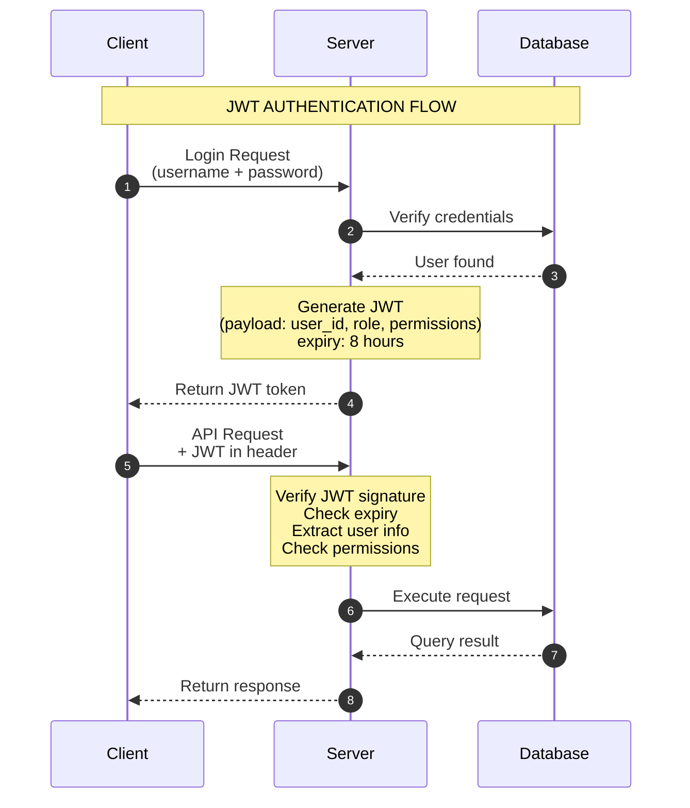

#### 6. Deployment Architecture

##### Production Deployment (On-Premise)

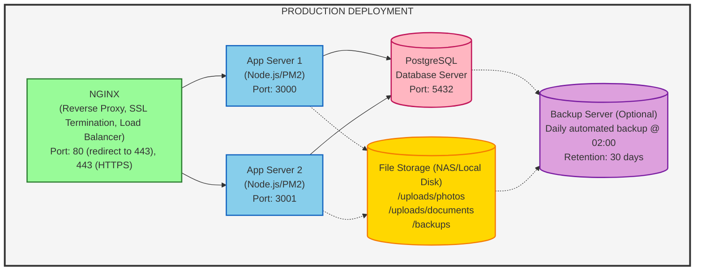

##### Recommended Server Specifications

| Component                 | Phase 1 (50 users) | Phase 2 (100 users) | Phase 3 (200+ users) |
| ------------------------- | ------------------ | ------------------- | -------------------- |
| **App Server**      | 4 CPU, 8GB RAM     | 8 CPU, 16GB RAM     | 16 CPU, 32GB RAM     |
| **Database Server** | 4 CPU, 16GB RAM    | 8 CPU, 32GB RAM     | 16 CPU, 64GB RAM     |
| **Storage**         | 500GB SSD          | 1TB SSD             | 2TB+ SSD             |
| **Network**         | 100 Mbps           | 1 Gbps              | 1 Gbps               |
| **OS**              | Ubuntu 22.04 LTS   | Ubuntu 22.04 LTS    | Ubuntu 22.04 LTS     |

#### 7. Scalability & Performance

##### Performance Optimization Strategies

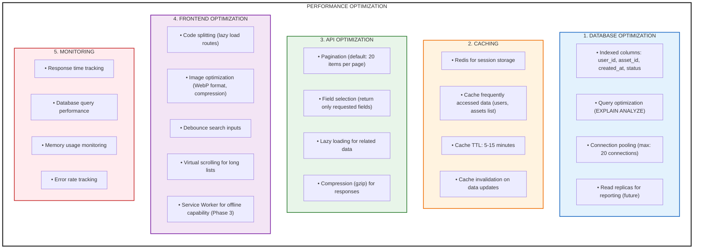

#### 8. Backup & Disaster Recovery

##### Backup Strategy

```mermaid
graph TB
    subgraph Backup["BACKUP STRATEGY"]
        direction TB

        subgraph Daily["DAILY BACKUPS (Automated @ 02:00)"]
            D1["├── Database dump (pg_dump)"]
            D2["├── File uploads directory"]
            D3["├── Configuration files"]
            D4["└── Retention: 7 days"]
        end

        subgraph Weekly["WEEKLY BACKUPS (Automated @ Sunday 03:00)"]
            W1["├── Full system backup"]
            W2["├── Compressed archive"]
            W3["└── Retention: 4 weeks"]
        end

        subgraph Monthly["MONTHLY BACKUPS (Automated @ 1st of month)"]
            MO1["├── Full system backup"]
            MO2["├── Off-site storage (external drive/cloud)"]
            MO3["└── Retention: 12 months"]
        end

        subgraph Verify["BACKUP VERIFICATION"]
            V1["├── Weekly restore test on staging environment"]
            V2["├── Checksum verification"]
            V3["└── Backup size monitoring"]
        end

        subgraph DR["DISASTER RECOVERY"]
            DR1["├── RTO (Recovery Time Objective): 4 hours"]
            DR2["├── RPO (Recovery Point Objective): 24 hours"]
            DR3["├── Documented recovery procedures"]
            DR4["└── Annual DR drill"]
        end
    end

    style Backup fill:#fff,stroke:#333,stroke-width:3px
    style Daily fill:#e3f2fd,stroke:#1565c0,stroke-width:2px
    style Weekly fill:#e8f5e9,stroke:#2e7d32,stroke-width:2px
    style Monthly fill:#fff3e0,stroke:#ef6c00,stroke-width:2px
    style Verify fill:#f3e5f5,stroke:#7b1fa2,stroke-width:2px
    style DR fill:#ffebee,stroke:#c62828,stroke-width:2px
```

---

**Versi**: 1.0
**Tanggal**: Januari 2026
**Status**: Draft
